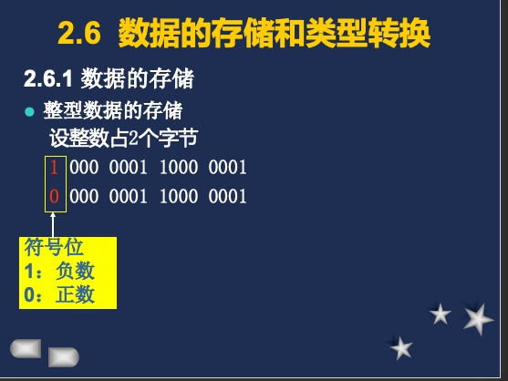
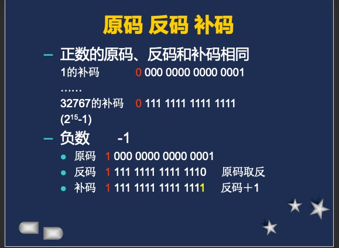
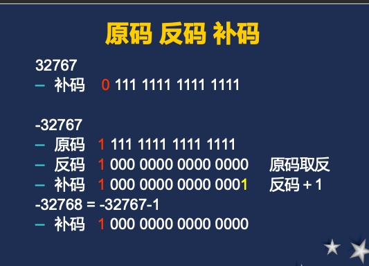
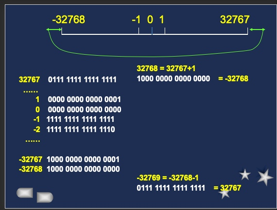

## 参考网址

http://poj.org/problemlist?volume=1&lang=zh-CN&change=true
http://acm.hdu.edu.cn
https://www.jiumodiary.com
https://cs50.harvard.edu
https://zhuanlan.zhihu.com/p/48009808

### 数据类型

**基本数据类型**

整型int
实型（浮点型）float   double
字符型char
构造数据类型
数组、结构、联合、枚举
指针类型
空类型

**常量（常数）：数据**

123 (整型）　4.56 (实型)　  ’A’ (字符型)
符号常量：用标识符表示的常量数据
π：PI
ε：EPS
通常用大写字母
变量：小写字母，int,float,double,char
整数类型:10、010、0x
实数类型:0.123,123e4,0.2e-1 float 4字节 double 8 bate
单精度   七位有效数字        ±(10-38 － 1038)
双精度   十六位有效数字     ±(10308 － 10308 )
字符类型:

## 变量和常量

ANSI标准定义的32个C语言的关键字

auto    break   case    char    const    continue  default
        do      double  else    enum    extern   float     for
        goto    if      int     long    register return    short
        signed  sizeof  static  struct  switch   typedef
        union   unsigned        void    volatile while

扩展关键字

asm    cdecl  _cs   _ds   _es    far  
        huge   interrupt    near  pascal _ss

### 整型

         整型是16位的，长整型是32位，短整型等价于整型。
         以下是几种整型变量的声明示例：
          long int Amount;      /*长整型*/
          long Amount;          /*长整型，等价于上面*/
          signed int Total;     /*有符号整型*/
          signed Total;         /*有符号整型，等价于上面*/
          unsigned int Offset;  /*无符号整型*/
          unsigned Offset;      /*无符号整型，等价于上面*/
          short int SmallAmt;   /*短整型*/
          short SmallAmt;       /*短整型，等价于上面*/
          unsigned short int Month; /*无符号短整型*/
          unsigned short Month;   /*无符号短整型，等价于上面*/

### 浮点

          float Amount;                 /*单精度型*/
          double BigAmount;             /*双精度型*/
          long double ReallyBigAmount;  /*长双精度型*/

    (四)、字符型变量
        字符型变量中所存放的字符是计算机字符集中的字符。对于PC机上运行的C系统，字符型数据用8位单字节的ASCII码表示。程序用类型说明符char来声明字符型变量：
            char ch;
        这条声明语句声明了一个字符型变量，标识符为ch。当以这种形式声明变量之后，程序可以在表达式中引用这个变量，关于语句和表达式的知识在后面将会介绍。
        字符数据类型事实上是8位的整型数据类型，可以用于数值表达式中，与其他的整型数据同样使用。在这种情况下，字符型变量可以是有符号的，也可以是无符号的。对于无符号的字符型变量可以声明为：
            unsigned char ch;
        除非声明为无符号型，否则在算术运算和比较运算中，字符型变量一般作为8位有符号整型变量处理。
        还有其他的如指针型变量，void型变量，以后再介绍。

二、常量
    常量的意思就是不可改变的量，是一个常数。同变量一样，常量也分为整型常量、浮点型常量、字符型常量，还有字符串常量、转义字符常量和地址常量。
    (一)、整型常量
        整型常量可以是长整型、短整型、有符号型、无符号型。在Tubbo C 2.0里有符号整型常量的范围从-32768到32767，无符号整型的为0到65535；有符号长整型的范围为-2147483648到2147483647。无符号长整型的范围为0到4294967295。短整型同字符型。
        可以指定一个整型常量为二进制、八进制或十六进制，如以下语句：
            -129, 0x12fe, 0177
        常量的前面有符号0x，这个符号表示该常量是十六进制表示。如果前面的符号只有一个字母0，那么表示该常量是八进制。
        有时我们在常量的后面加上符号L或者U，来表示该常量是长整型或者无符号整型：
            22388L, 0x4efb2L, 40000U
        后缀可以是大写，也可以是小写。
    (二)、浮点型常量
        一个浮点型常量由整数和小数两部分构成，中间用十进制的小数点隔开。有些浮点树非常大或者非常小，用普通方法不容易表示，可以用科学计数法或者指数方法表示。下面是一个实例：
            3.1416, 1.234E-30, 2.47E201
        注意在C语言中，数的大小也有一定的限制。对于float型浮点数，数的表示范围为-3.402823E38到3.402823E38，其中-1.401298E-45到1.401298E-45不可见。double型浮点型常数的表示范围为-1.79E308到1.79E308，其中-4.94E-324到4.94E-324不可见。
        在浮点型常量里我们也可以加上后缀。
            FloatNumber=1.6E10F;      /*有符号浮点型*/
            LongDoubleNumber=3.45L;   /*长双精度型*/
        后缀可大写也可小写。
        说明: 
          1. 浮点常数只有一种进制(十进制)。 
          2. 所有浮点常数都被默认为double。 
          3. 绝对值小于1的浮点数, 其小数点前面的零可以省略。如:0.22可写为.22, -0.0015E-3可写为-.0015E-3。 
          4. Turbo C默认格式输出浮点数时, 最多只保留小数点后六位
    (三)、字符型常量        
        字符型常量所表示的值是字符型变量所能包含的值。我们可以用ASCII表达式来表示一个字符型常量，或者用单引号内加反斜杠表示转义字符。
            'A', '\x2f', '\013';
        其中：\x表示后面的字符是十六进制数，\0表示后面的字符是八进制数。
        注意：在Turbo C 2.0中，字符型常量表示数的范围是-128到127，除非你把它声明为unsigned，这样就是0到255。
        (四)、字符串常量
        字符串常量就是一串字符,用双引号括起来表示。
            Hello,World!
            \nEnter selection:
            \aError!!!
        (五)、转义字符
        上面我们见到的\x,\n,\a等等都是叫转义字符，它告诉编译器需要用特殊的方式进行处理。下面给出所有的转义字符和所对应的意义：
          转义字符        描述
          \'          单引号
          \          双引号
          \\          反斜杠
          \0          空字符
          \0nnn         八进制数
          \a          声音符
          \b          退格符
          \f          换页符
          \n          换行符
          \r          回车符
          \t          水平制表符
          \v          垂直制表符
          \x          十六进制符
          \ddd  八进制ddd代表的字符
          \xhh 十进制hh代表的字符
        它们的具体用法我们到讲输出语句时再介绍。
        (六)、地址常量
        我们前面说的变量是存储数据的空间，它们在内存里都有对应的地址。在C语言里可以用地址常量来引用这些地址，如下：
            &Counter, &Sum;
        &是取地址符，作用是取出变量(或者函数)的地址。在后面的输入语句和指针里还会说明。
        这一节所讲到的变量和常量知识可以说是在一切程序中都要用到，特别是变量的声明和命名规则。

## 运算符

### 算术运算符

    在C语言中有两个单目和五个双目运算符。
       符号   功能
        +   单目正
        -   单目负
        *   乘法
        /   除法
        %   取模
        +   加法
        -   减法

### 逻辑运算符

        符号   功能
        &&    逻辑与
        ||    逻辑或
        !    逻辑非
        
### 关系运算符是对两个表达式进行比较，返回一个真/假值。
       
       符号   功能
        >    大于
        <    小于
        >=    大于等于
        <=    小于等于
        ==    等于
        !=    不等于

复合赋值运算符有下列这些：
       符号    功能
        +=    加法赋值
        -=    减法赋值
        *=    乘法赋值
        /=    除法赋值
        %=    模运算赋值
        <<=   左移赋值
        >>=   右移赋值
        &=    位逻辑与赋值
        |=    位逻辑或赋值
        ^=    位逻辑异或赋值

    优先级         运算符                  结合性
     (最高)        () [] -> .            自左向右
             ! ~ ++ -- + - * & sizeof    自右向左
                    * / %                自左向右
                     + -                 自左向右
                    << >>                自左向右
                  < <= > >=              自左向右
                    == !=                自左向右
                     &                   自左向右
                     ^                   自左向右
                     |                   自左向右
                     &&                  自左向右
                     ||                  自左向右
                     ?:                  自右向左
       = += -= *= /= %= &= ^= |= <<= >>= 自右向左
     (最低)          ,                   自左向右

类型转换：字符型-->整型-->长整型-->浮点型-->单精度型-->双精度型

## 表达式和语句

scanf()函数是格式化输入函数, 它从标准输入设备(键盘) 读取输入的信息。其调用格式为: 
    
    scanf(<格式化字符串>, <地址表>);
    
    scanf

格式控制说明  %… 
━━━━━━━━ 
              符号         作用 
                %d       十进制有符号整数 
                %e
            %lf: 以小数或指数形式输入一个双精度浮点数
%le 
               %u       十进制无符号整数 
               %f       浮点数 
               %s       字符串 
               %c       单个字符 
               %p       指针的值 
               %x,%X      无符号以十六进制表示的整数 
               %o       无符号以八进制表示的整数 
━━━━━━━━ 

printf()函数是格式化输出函数,一般用于向标准输出设备按规定格式输出信息。在编写程序时经常会用到此函数。printf()函数的调用格式为: 
                

    printf(<格式化字符串>, <参量表>); 
             符号         作用
              %e       指数形式的浮点数
              %g       自动选择合适的表示法
            ％d ：输出十进制整数
             ％f：输出十进制浮点数
            ％c：输出单个字符
             %o：以八进制形式输入、输出整数
             %x：以十六进制形式输入、输出整数
             %f：以小数形式输出浮点数，保留6位小数
            %e：以指数形式输出
            %u:以无符号十进制形式输出整数
            %s:输出字符串
            
L：用于长整型整数，可加在格式符d，o，x，u前面
M（代表一个正整数）：数据最小宽度
N（代表一个正整数）：对实数，表示输出n位小数；
                   对字符串，表示截取的字符个数

            
             ━━━━━━
               字符             作用
              
             ━━━━━━
                \n          换行
                \f          清屏并换页
                \r          回车
                \t          Tab符
                \xhh         表示一个ASCII码用16进表示
             ━━━━━━

## 变量的作用域

C程序的标识符作用域有三种：局部、全局、文件

static存储类型修饰符，这使得它们具有文件作用域，仅受定义它们的文件内可见。

    它们都没有存储类型修饰符，我们在声明时也可以通过存储类型修饰符来告诉编译器将要处理什么类型的变量。存储类型有以下四种：自动(auto)、静态(static)、外部(extern)、寄存器(regiser)。
    1.自动存储类型
        自动存储类型修饰符指定了一个局部变量为自动的，这意味着，每次执行到定义该变量的语句块时，都将会为该变量在内存中产生一个新的拷贝，并对其进行初始化。实际上，如果不特别指明，局部变量的存储类型就默认为自动的，因此，加不加auto都可以。

2.静态存储变量
        前面已经使用了static关键字，但是对于局部变量，静态存储类型的意义是不一样的，这时，它是和自动存储类型相对而言的。静态局部变量的作用域仍然近局限于声明它的语句块中，但是在语句块执行期间，变量将始终保持它的值。而且，初始化值只在语句块第一次执行是起作用。在随后的运行过程中，变量将保持语句块上一次执行时的值。

外部存储类型
        外部存储类型声明了程序将要用到的、但尚未定义的外部变量。通常，外部存储类型都是用于声明在另一个转换单元中定义的变量。下面举一个例子，这个例子包括两个文件。

             /*1.C*/
            void a();

            main()
            {
                extern int num;
                a();
                printf(%d\n,num);
            }

             /*2.C*/
            int num;

            void a()
            {
                num=5;
            }

        
        这两个程序是分别编译的，然后连接成一个执行文件。具体如何操作，可以查看一些手册，这儿我简单说了一下。把上面两个文件都编译好后，再制作一个.prj文件，里面的内容是：
            1.c
            2.c
        只有这两行，这可在编 辑状态下写成，存盘，取名为1.prj。
        然后选择project选项，选择project name，填入1.prj文件名，按F9后，即可生成1.exe文件

寄存器存储类型
        被声明为寄存器存储类型的变量，除了程序无法得到其地址外，其余都和自动变量一样。至于什么是变量地址，以后说指针时会详细介绍。

## 预处理

        指令             用途
         #           空指令，无任何效果
         #include    包含一个源代码文件
         #define     定义宏
         #undef      取消已定义的宏
         #if         如果给定条件为真，则编译下面代码
         #ifdef      如果宏已经定义，则编译下面代码
         #ifndef     如果宏没有定义，则编译下面代码
         #elif       如果前面的#if给定条件不为真，当前条件为真，则编译下面代码
         #endif      结束一个#if……#else条件编译块
         #error      停止编译并显示错误信息
         #else
         #error指令将使编译器显示一条错误信息，然后停止编译。
         #line指令可以改变编译器用来指出警告和错误信息的文件号和行号。
         #pragma指令没有正式的定义。编译器可以自定义其用途。典型的用法是禁止或允许某些烦人的警告信息。
    
        #ifndef MY_H
        #define MY_H
    

    在程序中包含头文件有两种格式：
        #include <my.h>
        #include "my.h"

第一种方法是用尖括号把头文件括起来。这种格式告诉预处理程序在编译器自带的或外部库的头文件中搜索被包含的头文件。第二种方法是用双引号把头文件括起来。这种格式告诉预处理程序在当前被编译的应用程序的源代码文件中搜索被包含的头文件，如果找不到，再搜索编译器自带的头文件。
    采用两种不同包含格式的理由在于，编译器是安装在公共子目录下的，而被编译的应用程序是在它们自己的私有子目录下的。一个应用程序既包含编译器提供的公共头文件，也包含自定义的私有头文件。采用两种不同的包含格式使得编译器能够在很多头文件中区别出一组公共的头文件。

## 指针

指针变量的一般定义为: 
类型标识符 *标识符; 

指针变量在定义中允许带初始化项。如: 
int i, *ip=&i; 

指针允许的运算方式有: 
      (1). 指针在一定条件下,可进行比较,这里所说的一定条件, 是指两个指针指向同一个对象才有意义, 例如两个指针变量p, q指向同一数组, 则<, >, >=,<=, ==等关系运算符都能正常进行。若p==q为真, 则表示p, q指向数组的同一元素; 若p<q为真, 则表示p所指向的数组元素在q所指向的数组元素之前(对于指向数组元素的指针在下面将作详细讨论)。 
      (2). 指针和整数可进行加、减运算。设p是指向某一数组元素的指针,开始时指向数组的第0号元素, 设n为一整数, 则p+n就表示指向数组的第n号元素(下标为n的元素)。不论指针变量指向何种数据类型, 指针和整数进行加、减运算时,编译程序总根据所指对象的数据长度对n放大, 在一般微机上, char放大因子为1, int、short放大因子为2, long和float放大因子为4, double放大因子为8。对于下面讲述到的结构或联合, 也仍然遵守这一原则。
      (3). 两个指针变量在一定条件下,可进行减法运算。设p, q指向同一数组,则p-q的绝对值表示p所指对象与q所指对象之间的元素个数。其相减的结果遵守对象类型的字节长度进行缩小的规则。

### 数组和指针

字符指针 
    我们已经知道,字符串常量是由双引号括起来的字符序列,例如: 
        a string 
    就是一个字符串常量,该字符串中因为字符a后面还有一个空格字符,所以它由8个字符序列组成。在程序中如出现字符串常量C编译程序就给字符串常量按排一存贮区域,这个区域是静态的,在整个程序运行的过程中始终占用, 平时所讲的字符串常量的长度是指该字符串的字符个数, 但在按排存贮区域时, C 编译程序还自动给该字符串序列的末尾加上一个空字符'\0',用来标志字符串的结束,因此一个字符串常量所占的存贮区域的字节数总比它的字符个数多一个字节。
    
###  指针数组 

因为指针是变量,因此可设想用指向同一数据类型的指针来构成一个数组, 这就是指针数组。数组中的每个元素都是指针变量,根据数组的定义,指针数组中每个元素都为指向同一数据类型的指针。指针数组的定义格式为: 
         类型标识\*数组名[整型常量表达式]; 
    例如: 
         int \*a[10]; 
    定义了一个指针数组,数组中的每个元素都是指向整型量的指针,该数组由10个元素组成,即a[0],a[1],a[2], ..., a[9],它们均为指针变量。a为该指针数组名,和数组一样，a是常量,不能对它进行增量运算。a为指针数组元素a[0]的地址,a+i为a[i]的地址,\*a就是a[0],*(a+i)就是a[i]。
    为什么要定义和使用指针数组呢?主要是由于指针数组对处理字符串提供了更大的方便和灵活,使用二维数组对处理长度不等的正文效率低，而指针数组由于其中每个元素都为指针变量,因此通过地址运算来操作正文行是十分方便的。
    指针数组和一般数组一样,允许指针数组在定义时初始化，但由于指针数组的每个元素是指针变量,它只能存放地址,所以对指向字符串的指针数组在说明赋初值时,是把存放字符串的首地址赋给指针数组的对应元素, 

## 指针函数

指针函数
    当一个函数声明其返回值为一个指针时，实际上就是返回一个地址给调用函数，以用于需要指针或地址的表达式中。
    格式：
         类型说明符 * 函数名(参数)
    当然了，由于返回的是一个地址，所以类型说明符一般都是int。

函数指针
    指向函数的指针包含了函数的地址，可以通过它来调用函数。声明格式如下：
        类型说明符 (*函数名)(参数)

指针的指针
    指针的指针看上去有些令人费解。它们的声明有两个星号。例如：
        char ** cp;

    通过指针的指针，不仅可以访问它指向的指针，还可以访问它指向的指针所指向的数据。下面就是几个这样的例子：
        char *p1=*cp;
        char c1=**cp;

指向指针数组的指针
    指针的指针另一用法旧处理指针数组。有些程序员喜欢用指针数组来代替多维数组，一个常见的用法就是处理字符串。

        char *Names[]=
        {
             Bill,
             Sam,
             Jim,
             Paul,
             Charles,
             0
        };

        main()
        {
            char **nm=Names;
            while(*nm!=0) printf(%s\n,*nm++);
        }

    先用字符型指针数组Names的地址来初始化指针nm。每次printf()的调用都首先传递指针nm指向的字符型指针，然后对nm进行自增运算使其指向数组的下一个元素(还是指针)。注意完成上述认为的语法为*nm++，它首先取得指针指向的内容，然后使指针自增。
    注意数组中的最后一个元素被初始化为0，while循环以次来判断是否到了数组末尾。具有零值的指针常常被用做循环数组的终止符。程序员称零值指针为空指针(NULL)。采用空指针作为终止符，在树种增删元素时，就不必改动遍历数组的代码，因为此时数组仍然以空指针作为结束。

### 函数

gets        字符串输入
strcopy 字符串复制
strcat  字符串链接
strcmp      字符串比较
strlen      字符串长度
strlwr  大写转小写
struper  小写转大写
fseek 一般用于二进制改变文件指针
ftell 得到流式文件中的当前位置，用相对于文件开头的位
移量来表示。
ferror 在调用一个输入输出函数后立即检查ferror函数的值，
否则信息会丢失。在执行fopen函数时，ferror函数
的初始值自动置为０。 
clearerr函数
clearerr(fp);
函数作用：
使文件错误标志和文件结束标志置为0。
只要出现错误标志，就一直保留，直到对同一文件
调用clearerr函数或rewind函数，或任何其他一个输
入输出函数。 

## 结构体

    struct 结构名
        { 
            类型  变量名;
            类型  变量名;
                ...
        } 结构变量;
    类型为第二节中所讲述的五种数据类型(整型、浮点型、字符型、指针型和无值型)
    
    结构数组就是具有相同结构类型的变量集合
    结构指针是指向结构的指针。它由一个加在结构变量名前的* 操作符来定义
    也可省略结构指针名只作结构说明, 然后再用下面的语句定义结构指针。
            struct string *student; 
        使用结构指针对结构成员的访问, 与结构变量对结构成员的访问在表达方式上有所不同。结构指针对结构成员的访问表示为:
            结构指针名->结构成员               
        其中->是两个符号-和>的组合,好象一个箭头指向结构成员。例如要给上面定义的结构中name和age赋值,可以用下面语句:
            strcpy(student->name, Lu G.C); 
            student->age=18; 
        实际上, student->name就是(*student).name的缩写形式。

## 联合(union)和枚举(enum)

        union 联合名
        { 
            数据类型 成员名; 
            数据类型 成员名; 
                 ... 
        }联合变量名; 

            联合访问其成员的方法与结构相同。同样联合变量也可以定义成数组或指针,但定义为指针时,也要用->符号, 此时联合访问成员可表示成:
        联合名->成员名 

若要访问结构变量y[1]中联合x的成员i, 可以写成:
        y[1].x.i; 
    若要访问结构变量y[2]中联合x的字符串指针ch的第一个字符可写成:
        \*y[2].x.ch; 
    若写成y[2].x.*ch;是错误的。

结构和联合的区别
    1. 结构和联合都是由多个不同的数据类型成员组成,但在任何同一时刻,联合中只存放了一个被选中的成员, 而结构的所有成员都存在。
    2. 对于联合的不同成员赋值,将会对其它成员重写,原来成员的值就不存在了,而对于结构的不同成员赋值互不影响的。

        enum 枚举名
        { 
            标识符[=整型常数], 
            标识符[=整型常数], 
                   ... 
            标识符[=整型常数], 
        }枚举变量; 
    类型说明的格式为: 
        typedef 类型 定义名; 
    类型说明只定义了一个数据类型的新名字而不是定义一种新的数据类型这里类型是Turbo C许可的任何一种数据类型定义名表示这个类型的新名字。
    例如: 用下面语句定义整型数的新名字:
        typedef int SIGNED_INT; 
    使用说明后, SIGNED_INT就成为int的同义词了,此时可以用SIGNED_INT定义整型变量。 
    例如:  SIGNED_INT i, j;(与int i, j等效)。 
    但 long SIGNED_INT i, j; 是非法的。 
    typedef同样可用来说明结构、联合以及枚举。

## 堆和链表

堆总是以2字节的整数倍进行分配

一般的程序我们都是使用小内存模式，它的内存分配如下：
               ________________
              |     代码段     |   
              |————————|
              |     数据段     |
              |————————|
              |     BSS段      |
              |————————|
              |       堆       |
              |----------------| 自由空间
              |----------------|      
              |       栈       |
              |————————|
              |      远堆      |
              |----------------|
              |________________| 自由空间

    在堆和栈之间、以及远堆地址的后面都是自由空间，总共是64K。

    堆管理函数：
        1.得到堆和栈之间的自由空间大小的函数
            小数据内存模式：unsigned coreleft(void);
            大数据内存模式：unsigned long coreleft(void);
            对于远堆，可以用farcoreleft()函数。
        2.分配一个堆空间函数
              void malloc (unsigned size);

              struct addr *info;
          将由malloc()函数返回的指针赋给info时，必须进行类型转换：
              info=(struct addr *)malloc (sizeof(record));
              malloc()函数所分配的堆空间将不进行初始化。在调用malloc()函数时，若当时没有可用的内存空间，该函数便返回一个NULL指针。
        3.分配一个堆空间，其大小为能容纳几个元素，没有元素长度为size的函数
              void calloc(unsigned n,unsigned size);
          该函数将分配一个容量为n*size大小的堆空间，并用0初始化分配的空间。该函数将返回一个指向分配空间的指针，没有空间可用时，则返回一个NULL指针。
        4.重新分配堆空间函数
              void *realloc(void *ptr,unsigned newsize);
          该函数将对由ptr指向的堆空间重新分配，大小变为newsize。
        5.释放堆空间函数
              void free(void *ptr);
### 链表

        struct address
        {
            char name[30];
            char street[40];
            char city[20];
            char state[10];
            char zip[6];
            struct address *next;  /*pointer to next entry*/
        }list_entry;
    该结构中前五个成员是该节点的信息部分，最后一个成员是指向同一个结构类型的指针。即next又指向一个同样结构类型的节点。

建立链表：            info=(struct address *)malloc(sizeof(list_entry));
            dls_store()函数是将输入的节点地址写到上一个节点的next指针项
            链数据的插入和删除
            对于一个已排序好的链表(假设是生序)，现在想插入一个数据进去，可能有三种情况：
            (1).比首项数据还小，即插入的数据作为首项出现：
                这种情况我们的处理方法是：把该数据作为第一项，指针指向原先的首项即可。设原先首项为top，待插入的数据为in，则：
                    in->next=top;
                即可让该数据作为链表的头。
            (2).比最后一项大，即插入的数据作为最后一项出现：
                这也很好办，设原先最后一项为old，则：
                    old->next=in;
                    in->next=NULL;
            (3).作为中间某一项出现：前面是old,后面是top,则：
                    old->next=in;
                    in->next=top;
                如果想删除一个数据，也可能是出现在开头，中间和结尾。
                例如想删除in这个数据，它原先的前面是old,后面是top,即原先的链表是这样：
                    old->next=in;
                    in->next=top;
                现在删除in，只需把old指向top即可:
                    old->next=top->next;

## 位运算

符号         描述
         &           位逻辑与
         |           位逻辑或
         ^           位逻辑异或
         ~           取补
位移运算符
         符号             描述
          <<              左移
          >>              右移

## 文件操作

分类                  函数名       功能                              	
打开文件         fopen()        打开文件          
关闭文件         fclose()       关闭文件
文件定位         fseek()        改变文件位置指针的位置
                         Rewind()    使文件位置指针重新至于文件开头
                         Ftell()         返回文件位置指针的当前值
文件状态         feof()          若到文件末尾，函数值为真
                        Ferror()      若对文件操作出错，函数值为真
                        Clearerr()   使ferror和feof()函数值置零
分类                  函数名       功能                              	
文件读写         fgetc(),getc()从指定文件取得一个字符          
                          fputc(),putc()把字符输出到指定文件
                          fgets()从指定文件读取字符串
                          fputs()把字符串输出到指定文件
                          getw()从指定文件读取一个字（int型）
                          putw()把一个字输出到指定文件
                          fread()从指定文件中读取数据项
                          fwrite()把数据项写到指定文件中
                          fscanf()从指定文件按格式输入数据
                          fprintf()按指定格式将数据写到指定文件中

          设备     标准文件I/O系统中的流指针名     非标准文件……

      键盘(标准输入)         stdin                     0
      显示器(标准输出)       stdout                    1
      显示器(标准错误)       stderr                    2
      串行口(标准辅助)       stdoux                    3
      打印机(标准打印)       stdprn                    4

在C中流可分为两大类，即文本流(text stream)和二进制流(binary stream)

所谓文本流是指在流中流动的数据是以字符形式出现。在文本流中，'\n'被换成回车CR和换行LF的代码0DH和0AH。而当输出时，则0DH和0AH本换成'\n'。
    二进制流是指流动的是二进制数字序列，若流中有字符，则用一个字节的二进制ASCII码表示，若是数字，则用一个字节的二进制数表示。在流入流出时，对\n符号不进行变换。例如2001这个数，在文本流中用其ASCII码表示为：
            '2' '0' '0' '1'
             |   |   |   |
            50  48  48  49
    共占4字节。而在二进制流中则表示为：00000111 11010001  用十六进制就是07D1。只占两字节。
    由此看出，二进制流比文本流节省空间，且不用进行对\n的转换，这样可以大大加快流的速度，提高效率。因而，对于含有大量数字信息的数字流，可以采用二进制流的方式；对于含有大量字符信息的流，则采用文本流的方式。
    
    文件FILE的数据结构

        typedef struct
        {
            short level;
            unsigned flags;
            char fd;
            unsigned char hold;
            short bsize;
            unsigned char *buffer;
            unsigned char *curp;
            unsigned istemp;
            short token;
        }FILE;

    位       代表符号          含义
        0         _F_READ        读
        1         _F_WRIT        写
        2         _F_BUF         由fclose释放缓冲区
        3         _F_LBUF        行缓冲
        4         _F_ERR         出错标志
        5         _F_EOF         EOF文件尾标志
        6         _F_BIN         二进制方式
        7         _F_IN          在进行输入
        8         _F_OUT         在进行输出
        9         _F_TERM        文件是一个终端

            fopen(char *filename,char *type);

            方式                    含义
             r           打开，只读
             w           打开，文件指针指到头，只写
             a           打开，指向文件尾，在已存在文件中追加
             rb          打开一个二进制文件，只读
             wb          打开一个二进制文件，只写
             ab          打开一个二进制文件，进行追加
             r+          以读/写方式打开一个已存在的文件
             w+          以读/写方式建立一个新的文本文件
             a+          以读/写方式打开一个文件文件进行追加
             rb+         以读/写方式打开一个二进制文件
             wb+         以读/写方式建立一个新的二进制文件
             ab+         以读/写方式打开一个二进制文件进行追加

        当用fopen(）成功的打开一个文件时，该函数将返回一个FILE指针，如果文件打开失败，将返回一个NULL指针。如想打开test文件，进行写：

            int fclose(FILE *stream);
            若成功地关闭了文件，则返回一个0值，否则返回一个非0值。常用以下方法进行测试：
            
            当打开多个文件进行操作，而又要同时关闭时，可采用fcloseall()函数，它将关闭所有在程序中打开的文件，返回关闭文件个数。
            
                        char *fgets(char *string,int n,FILE *stream);
            char *gets(char *s);
            int fprintf(FILE *stream,char *format,variable-list);
            int fputs(char *string,FILE *stream);
            int fscanf(FILE *stream,char *format,variable-list);

        (1).清除文件缓冲区函数：
            int fflush(FILE *stream);
            int flushall();
        (2).设置文件缓冲区函数
            void setbuf(FILE *stream,char *buf);
            void setvbuf(FILE *stream,char *buf,int type,unsigned size);

                type 值           含义
                 _IOFBF      文件全部缓冲，即缓冲区装满后，才能对文件读写
                 _IOLBF      文件行缓冲，即缓冲区接收到一个换行符时，才能对文件读写
                 _IONBF      文件不缓冲，此时忽略buf,size的值，直接读写文件，不再经过文件缓冲区缓冲

        (1).移动文件指针函数：
            long ftell(FILE *stream);
            int rewind(FILE *stream);
            fseek(FILE *stream,long offset,int origin);

            函数ftell()用来得到文件指针离文件开头的偏移量。当返回值是-1时表示出错。
            rewind()函数用于文件指针移到文件的开头，当移动成功时，返回0，否则返回一个非0值。
            fseek()函数用于把文件指针以origin为起点移动offset个字节，其中origin指出的位置可有以下几种：

               origin         数值           代表的具体位置

              SEEK_SET        0             文件开头
              SEEK_CUR        1             文件指针当前位置
              SEEK_END        2             文件尾
文件随机读写函数

           int fread(void *ptr,int size,int nitems,FILE *stream);
           int fwrite(void *ptr,int size,int nitems,FILE *stream);

        open()函数的作用是打开文件,其调用格式为: 
            int open(char *filename, int access);
该函数表示按access的要求打开名为filename的文件,返回值为文件描述字,其中access有两部分内容: 
        基本模式和修饰符, 两者用 (或)方式连接。修饰符可以有多个, 但基本模式只能有一个。

                         access的规定 
            --------------------------------------------------------
            基本模式    含义    修饰符         含  义 
            --------------------------------------------------------
            O_RDONLY    只读   O_APPEND   文件指针指向末尾 
            O_WRONLY    只写   O_CREAT    文件不存在时创建文件, 属性按基本模式属性 
            O_RDWR      读写   O_TRUNC    若文件存在, 将其长度缩为0, 属性不变 
                               O_BINARY   打开一个二进制文件 
                               O_TEXT     打开一个文字文件 
            ---------------------------------------------------------
            open()函数打开成功, 返回值就是文件描述字的值(非负值), 否则返回-1。 
            close()函数的作用是关闭由open()函数打开的文件, 其调用格式为: 
                int close(int handle);
            该函数关闭文件描述字handle相连的文件。

读写函数 
        int read(int handle, void *buf, int count); 
        read()函数从handle(文件描述字)相连的文件中, 读取count个字节放到buf所指的缓冲区中, 
    返回值为实际所读字节数, 返回-1表示出错。返回0 表示文件结束。 

         write()函数的调用格式为: 
             int write(int handle, void *buf, int count); 
         write()函数把count个字节从buf指向的缓冲区写入与handle相连的文件中, 返回值为实际写入的字节数。 
              
    3.随机定位函数 
        lseek()函数的调用格式为: 
             int lseek(int handle, long offset, int fromwhere); 
        该函数对与handle相连的文件位置指针进行定位,功能和用法与fseek()函数相同。 

        tell()函数的调用格式为: 
             long tell(int handle); 
        该函数返回与handle相连的文件现生位置指针, 功能和用法与ftell()相同。

### 补码相关

## 数据的存储和类型转换

