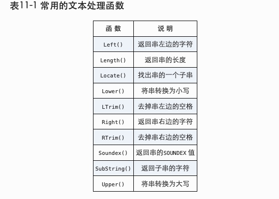
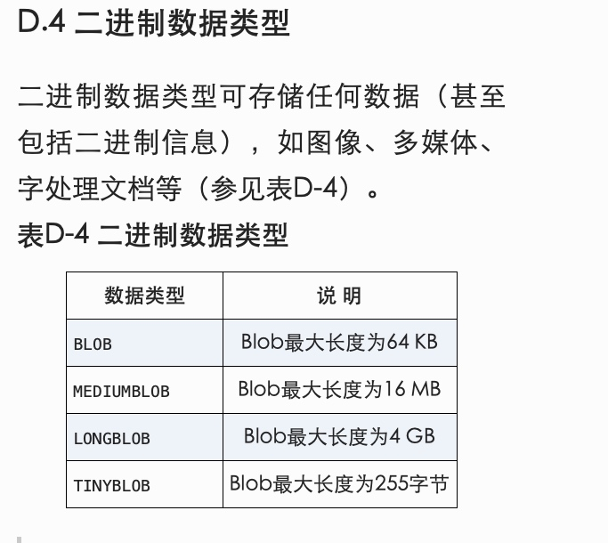

## 第三章 使用MySQL

```SQL
use <table_name>;
show databases;
show tables;
show columns from <table_name>;
describe <table_name>; -- 同 show columns
show status;
show create database <database>;-- 建库语句
show create table <table_name>;-- 检表语句
show grants;-- 权限
show errors; 
show warnings;
```
tips: `\g`结尾或`;`

## 第九章 用正则表达式进行搜索

```SQL
regexp -- 正则表达式
regexp '1|2'
regexp '[123]'
regexp '[1|2|3]'
regexp '[0-9|a-z|A-Z]'
-- .匹配任意字符串
-- \\ 前导查找点
regexp '[\\.]'
-- 测试正则
select <table_name> regexp '[0-9]';
```


```SQL
SELECT prod_name
FROM products
WHERE prod_name REGEXP '\\([0-9] sticks?\\)'
ORDER BY prod_name;
```


### 第十一章 使用函数处理




### 第十二章 聚合函数


### 第十五章 联结表

inner join
内连接，等值链接，默认方式

left /right out join 外链接


### 第十七章组合查询

多个where和单独操作时间相同，多个where条件语句相当于字句都是一个select语句一个组合查询；

**union 过滤重复的行，union all不过滤重复**

union 和where一样，只能在最后一条select后有一个order by字句,不能存在分别排序；

```SQL
-- union
SELECT vend_id, prod_id, prod_price
FROM products
WHERE prod_price <= 5
UNION
SELECT vend_id, prod_id, prod_price
FROM products
WHERE vend_id IN (1001,1002);
```

### 第十八章 理解全文本搜索

mysiam支持全文搜索，innodb不支持；

>为了进行全文本搜索，必须索引被搜索的列，而且要随着数据的改变不断地重新索引。在对表列进行适当设计后，MySQL会自动进行所有的索引和重新索引。
在索引之后，SELECT 可与Match() 和Against() 一起使用以实际执行搜索

**启用全文本搜索支持**

```SQL
CREATE TABLE productnotes
(
  note_id    int           NOT NULL AUTO_INCREMENT,
  prod_id    char(10)      NOT NULL,
  note_date datetime       NOT NULL,
  note_text  text          NULL ,
  PRIMARY KEY(note_id),
  FULLTEXT(note_text) -- 搜索字段
) ENGINE=MyISAM;
```

>定以后MySQL自动维护该索引

>不要在导入数据时使用FULLTEXT 更新索引要花时间，虽然不是很多，但毕竟要花时间。如果正在导入数据到一个新表，此时不应该启用FULLTEXT 索引。应该首先导入所有数据，然后再修改表，定义FULLTEXT 。这样有助于更快地导入数据（而且使索引数据的总时间小于在导入每行时分别进行索引所需的总时间）。

```SQL
-- 在索引之后，使用两个函数Match() 和Against() 执行全文本搜索，其中Match() 指定被搜索的列，Against() 指定要使用的搜索表达式。

SELECT note_text
FROM productnotes
WHERE Match(note_text) Against('rabbit');
```

>使用完整的Match() 说明 传递给Match() 的值必须与FULLTEXT() 定义中的相同。如果指定多个列，则必须列出它们（而且次序正确）。
>搜索不区分大小写 除非使用BINARY 方式（本章中没有介绍），否则全文本搜索不区分大小写。

搜索结果根据优先级排序

#### 布尔文本搜索

> 即使没有FULLTEXT 索引也可以使用 布尔方式不同于迄今为止使用的全文本搜索语法的地方在于，即使没有定义FULLTEXT 索引，也可以使用它。但这是一种非常缓慢的操作（其性能将随着数据量的增加而降低）。


```sql
SELECT note_text
FROM productnotes
WHERE Match(note_text) Against('heavy' IN BOOLEAN MODE);
```


### 第十九章 插入数据

>总是使用列的列表 一般不要使用没有明确给出列的列表的INSERT 语句。使用列的列表能使SQL代码继续发挥作用，即使表结构发生了变化。

>仔细地给出值 不管使用哪种INSERT 语法，都必须给出VALUES 的正确数目。如果不提供列名，则必须给每个表列提供一个值。如果提供列名，则必须对每个列出的列给出一个值。如果不这样，将产生一条错误消息，相应的行插入不成功。
**省略列需要可以为空或者有默认值**

#### 提高性能

提高整体性能 数据库经常被多个客户访问，对处理什么请求以及用什么次序处理进行管理是MySQL的任务。INSERT 操作可能很耗时（特别是有很多索引需要更新时），而且它可能降低等待处理的SELECT 语句的性能。
如果数据检索是最重要的（通常是这样），则你可以通过在`INSERT`和`INTO`之间添加关键字`LOW_PRIORITY`，指示MySQL降低INSERT 语句的优先级，如下所示：
 ` INSERT LOW_PRIORITY INTO`;
 也适用于update和delete操作；
 
**insert多条比单条处理速度快** 

#### 导入查询结果

INSERT SELECT 中的列名 为简单起见，这个例子在INSERT 和SELECT 语句中使用了相同的列名。但是，不一定要求列名匹配。事实上，MySQL甚至不关心SELECT 返回的列名。它使用的是列的位置，因此SELECT 中的第一列（不管其列名）将用来填充表列中指定的第一个列，第二列将用来填充表列中指定的第二个列，如此等等。这对于从使用不同列名的表中导入数据是非常有用的。

```SQL
INSERT INTO customers(cust_id,
    cust_contact,
    cust_email,
    cust_name,
    cust_address,
    cust_city,
    cust_state,
    cust_zip,
    cust_country)
SELECT cust_id,
    cust_contact,
    cust_email,
    cust_name,
    cust_address,
    cust_city,
    cust_state,
    cust_zip,
    cust_country
FROM custnew;
```

### 第二十章 更新和删除数据

**更新和删除不要省略where条件，可先select 数据验证**

>IGNORE 关键字 如果用UPDATE 语句更新多行，并且在更新这些行中的一行或多行时出一个现错误，则整个UPDATE 操作被取消（错误发生前更新的所有行被恢复到它们原来的值）。为即使是发生错误，也继续进行更新，可使用IGNORE 关键字:  `UPDATE IGNORE customers ..`,清除值可设置为`NULL`;

#### 删除

更快的删除 如果想从表中删除所有行，不要使用DELETE 。可使用TRUNCATE TABLE 语句，它完成相同的工作，但速度更快（TRUNCATE 实际是删除原来的表并重新创建一个表，而不是逐行删除表中的数据）。

### 第二十一章  创建和操纵表

#### 关键词

- CREATE TABLE
- AUTO_INCREMENT
- ENGING=InnoDB
- PRIMARY KEY
- IF NOT EXISTS
- NULL NOT NULL
- COMMIT
- DEFAULT

#### 常见数据库引擎

- InnoDB 是一个可靠的事务处理引擎（参见第26章），它不支持全文本搜索；
- MEMORY 在功能等同于MyISAM ，但由于数据存储在内存（不是磁盘）中，速度很快（特别适合于临时表）；
- MyISAM 是一个性能极高的引擎，它支持全文本搜索（参见第18章），但不支持事务处理。

#### 其他

外键不能跨引擎 混用引擎类型有一个大缺陷。外键（用于强制实施引用完整性，如第1章所述）不能跨引擎，即使用一个引擎的表不能引用具有使用不同引擎的表的外键。

### 第二十二章  使用视图

#### 使用的理由：

- 重用SQL语句。
- 简化负责的SQL操作
- 使用表的组成部分而不是这个表
- 保护数据
- 格式化数据

复杂的视图或嵌套的视图会使性能下降的很厉害，应测试后使用

#### 规则和限制

- 命名唯一
- 数量无限制
- 可以嵌套
- order by可以在视图中，如果select中也有order by将覆盖视图中的
- 不能索引，也不能有关联的触发器或默认值


```SQL
create view
-- 查看创建语句
show create view viewname;
deop view viewname;

-- 更新可以先drop再create,也可以create or replace view.
```

### 第二十三章  使用存储过程

### 第二十四章  使用游标coursor

检索出的数据进行前进或后退多行，主要用于交互式应用滚动数据；


```SQL
-- 创建游标
CREATE PROCEDURE processorders()
BEGIN
   DECLARE ordernumbers CURSOR --declare关键字
   FOR
   SELECT ordernum FROM orders;
END;

-- 打开游标
OPEN ordernumbers;

-- 关闭游标
-- 隐含关闭，如果不明确关闭游标，则MySQL会在到达END语句时自动关闭
CLOSE ordernumbers；
```

#### 数据游标

游标打开后可以使用FETCH语句访问每一行


```SQL
CREATE PROCEDURE processorders()
BEGIN

   -- Declare local variables
   DECLARE done BOOLEAN DEFAULT 0;
   DECLARE o INT;

   -- Declare the cursor
   DECLARE ordernumbers CURSOR
   FOR
   SELECT order_num FROM orders;

   -- Declare continue handler
   DECLARE CONTINUE HANDLER FOR SQLSTATE '02000' SET done=1;

   -- Open the cursor
   OPEN ordernumbers;

   -- Loop through all rows
   REPEAT

      -- Get order number
      FETCH ordernumbers INTO o;

   -- End of loop
   UNTIL done END REPEAT;
    -- Close the cursor
   CLOSE ordernumbers;

END;
```

>DECLARE 语句的次序 DECLARE 语句的发布存在特定的次序。用DECLARE 语句定义的局部变量必须在定义任意游标或句柄之前定义，而句柄必须在游标之后定义。不遵守此顺序将产生错误消息。

>重复或循环？ 除这里使用的REPEAT 语句外，MySQL还支持循环语句，它可用来重复执行代码，直到使用LEAVE 语句手动退出为止。通常REPEAT 语句的语法使它更适合于对游标进行循环

### 第二十五章  触发器

- 触发器在每个表中唯一
- 每张表最多六个触发器 insert、update和delete的前后
- 单已出发起不能与多个事件或多个表关联
- 触发器失败不执行SQL操作

insert-new 触发器临时表
delete-old 触发器只读变量（删除订单前将订单数据存入archive_orders）
update-触发器的虚拟表old，访问之前的值（只读），new表为新的值


```SQL
-- 创建触发器
CREATE TRIGGER <tigger name> after insert <table_name> for each row <actions> ;
-- 例子：每次插入显示文本
CREATE TRIGGER newproduct after insert products for each row select 'Product added' ;

-- 删除触发器,触发器无更新，只能删除重建
drop trigger <name>;

```

### 第二十六章 事务

- 类似批处理机制，InnoDB支持,关键词commit 、rollback、transaction、savepoint
- 不能退回select,create,drop操作
- 一般的SQL语句是隐含commit,事务需要明确提交
- 部分退回需要保留点（savepoint）
- mysql链接可以设置是否自动提交更改`SET autocommit=0;`


```SQL
start transaction

// example:
SELECT * FROM ordertotals;
START TRANSACTION;
DELETE FROM ordertotals;
SELECT * FROM ordertotals;
ROLLBACK;
SELECT * FROM ordertotals;

savepoint <point-name>;
rollback to <point-name>;

```

### 第二十七章 全球化和本地化

>校对为不同语言字符串的排序顺序

- 字符集、编码、校对
- 字符集区分大小写由_cs表示
- 不区分大小写由_ci表示
- 如未指定校对，则使用字符集默认的校对,如`SHOW CHARACTER SET`显示
- 

```SQL
-- 查看字符集
SHOW CHARACTER SET;
-- 查看可用校对列表以及字符集
SHOW COLLATION;

-- 系统字符集和校对
SHOW VARIABLES LIKE 'character%';
SHOW VARIABLES LIKE 'collation%';

-- 建表制定字符集
CREATE TABLE mytable
(
   columnn1   INT,
   columnn2   VARCHAR(10)
) DEFAULT CHARACTER SET hebrew
  COLLATE hebrew_general_ci;
  
-- 设置字段字符集
CREATE TABLE mytable
(
   columnn1   INT,
   columnn2   VARCHAR(10),
   column3    VARCHAR(10) CHARACTER SET latin1 COLLATE latin1_general_ci SET latin1 COLLATE latin1_general_ci
) DEFAULT CHARACTER SET hebrew
  COLLATE hebrew_general_ci;
  
 -- 设置select语句字符集，对排序起作用
 
 SELECT * FROM customers
ORDER BY lastname, firstname COLLATE latin1_general_cs;

```

>SELECT 的其他COLLATE 子句 除了这里看到的在ORDER BY 子句中使用以外，COLLATE 还可以用于GROUP BY 、HAVING 、聚集函数、别名等。
最后，值得注意的是，如果绝对需要，串可以在字符集之间进行转换。为此，使用Cast() 或Convert() 函数。

### 第二十八章 安全管理

创建用户：

- 关键词：create user,grant,insert grant;
,直接插入user表；
- 用户定义为user@Host,如无主机名默认为"%";

权限

- REVOKE 降权（撤销的权限必须存在，否则报错）
- grant 加权
- 访问控制：
1. 整个服务器，grant all 和 revoke all;
2. 整个数据库 on database.*,
3. 特定的标表，on datebase.table;
4. 特定的列；
5. 特定的存储过程；


```SQL
-- 创建用户 IDENTIFIED BY明文转加密
CREATE USER ben IDENTIFIED BY 'p@$$w0rd';
-- 改名
rename user <username> to <new-username>;
drop user <username>;

-- 展示用户权限
SHOW GRANTS FOR <username>;

-- 加权限
GRANT SELECT ON <tablename>.* TO <user>;

-- 修改密码,不指定用户为修改自己
SET PASSWORD FOR <user> = Password('<new-pass>');

``` 

### 第二十九章 数据库维护

备份方式

- mysqldump
- mysqlhotcopy(并非所有引擎都支持)
- backup table / select into outfile 可以使用restore tabel复原

>首先刷新未写数据 为了保证所有数据被写到磁盘（包括索引数据），可能需要在进行备份前使用FLUSH TABLES 语句。

```SQL
-- 检查表键是否正确
analyze tabel <table>

-- CHECK TABLE 用来针对许多问题对表进行检查。在MyISAM 表上还对索引进行检查。CHECK TABLE 支持一系列的用于MyISAM 表的方式。CHANGED 检查自最后一次检查以来改动过的表。EXTENDED 执行最彻底的检查，FAST 只检查未正常关闭的表，MEDIUM 检查所有被删除的链接并进行键检验，QUICK 只进行快速扫描。如下所示，CHECK TABLE 发现和修复问题：

CHECK TABLE orders, orderitems;
 
 -- 修复表
 repair table
 
 -- 从一个表删除大量数据
 optimize table
```
#### 诊断启动问题

--help 显示帮助——一个选项列表；
--safe-mode 装载减去某些最佳配置的服务器；
--verbose 显示全文本消息（为获得更详细的帮助消息与--help 联合使用）；
日志文件

#### 日志

- 错误日志。它包含启动和关闭问题以及任意关键错误的细节。此日志通常名为hostname.err ，位于data 目录中。此日志名可用--log-error 命令行选项更改。
- 查询日志。它记录所有MySQL活动，在诊断问题时非常有用。此日志文件可能会很快地变得非常大，因此不应该长期使用它。此日志通常名为hostname.log ，位于data 目录中。此名字可以用--log 命令行选项更改。
- 二进制日志。它记录更新过数据（或者可能更新过数据）的所有语句。此日志通常名为hostname-bin ，位于data 目录内。此名字可以用--log-bin 命令行选项更改。注意，这个日志文件是MySQL 5中添加的，以前的MySQL版本中使用的是更新日志。
- 缓慢查询日志。顾名思义，此日志记录执行缓慢的任何查询。这个日志在确定数据库何处需要优化很有用。此日志通常名为hostname-slow.log ，位于data 目录中。此名字可以用--log-slow-queries 命令行选项更改。

在使用日志时，可用FLUSH LOGS 语句来刷新和重新开始所有日志文件。

### 第三十章 改善性能

1. 存储过程比一条一条执行的快；
2. 有的操作（包括INSERT ）支持一个可选的DELAYED 关键字，如果使用它，将把控制立即返回给调用程序，并且一旦有可能就实际执行该操作
3. 在导入数据时，应该关闭自动提交。你可能还想删除索引（包括FULLTEXT 索引），然后在导入完成后再重建它们。
4. 必须索引数据库表以改善数据检索的性能。确定索引什么不是一件微不足道的任务，需要分析使用的SELECT 语句以找出重复的WHERE 和ORDER BY 子句。如果一个简单的WHERE 子句返回结果所花的时间太长，则可以断定其中使用的列（或几个列）就是需要索引的对象。
5. 索引改善数据检索的性能，但损害数据插入、删除和更新的性能。如果你有一些表，它们收集数据且不经常被搜索，则在有必要之前不要索引它们。（索引可根据需要添加和删除。）
6. LIKE 很慢。一般来说，最好是使用FULLTEXT 而不是LIKE 。


```SQL
-- 查看当前设置
SHOW VARIABLES
SHOW STATUS;

-- 显示所有活动进程，kill命令终结
show process list;

```

### 关键字

```SQL
select 
update 
delete 
insert

limit
having
order by
group by -- with rollup每个分组及每个分组及别的值，聚合函数必须使用
distinct --去重
from
where

null
is null

or
between and
in
and
not
like -- %多个字符 _单个字符 通配符搜索花费时间长

concat -- 拼接字段
explain -- 分析SQL语句
as
count -- *包含空值 column 有值统计

```

### function

rtrim
ltrim
trim
upper
now


### sqls


```SQL
select trim('abc ');
select now();
-- 不需要考虑闰年比对时间
select <column> from <table> where year(date) = 2005 and month(date) = 9;
```
### others

#### where 和having的区别

1. 前者过滤行，后者过滤分组
2. 前者分组前过滤，后者分组后过滤

>select子查询顺序为由内至外；


### 语句样例

1、 更新字段

```sql
ALTER TABLE tablename
(
    ADD     column          datatype  [NULL|NOT NULL]  [CONSTRAINTS],
    CHANGE  column columns  datatype  [NULL|NOT NULL]  [CONSTRAINTS],
    DROP    column,
    ...
);
```

2、索引

```CREATE INDEX indexname
ON tablename (column [ASC|DESC], ...);
```

3、 存储过程


```SQL
CREATE PROCEDURE procedurename( [parameters] )
BEGIN
...
END;
```

4、 创建表


```SQL
CREATE TABLE tablename
(
       column    datatype    [NULL|NOT NULL]    [CONSTRAINTS],
       column    datatype    [NULL|NOT NULL]    [CONSTRAINTS],
       ...
);
```

5、 添加用户


```SQL
CREATE USER username[@hostname]
[IDENTIFIED BY [PASSWORD] 'password'];
```

6、 添加视图


```SQL
CREATE [OR REPLACE] VIEW viewname
AS
SELECT ...;
```

7、 删除表一行或多行


```SQL
DELETE FROM tablename
[WHERE ...];
”
```

8、 永久删除数据库对象，表 视图 索引等


```SQL
DROP DATABASE|INDEX|PROCEDURE|TABLE|TRIGGER|USER|VIEW
    itemname;
```


``` sql
-- insert
DROP DATABASE|INDEX|PROCEDURE|TABLE|TRIGGER|USER|VIEW
    itemname;

-- rollback
ROLLBACK [ TO savepointname];

-- savepoint
SAVEPOINT sp1;

-- select
SELECT columnname, ...
FROM tablename, ...
[WHERE ...]
[UNION ...]
[GROUP BY ...]
[HAVING ...]
[ORDER BY ...];

-- 事务
START TRANSACTION;

-- update
UPDATE tablename
SET columname = value, ...
[WHERE ...];
```

### 数据类型





### 知识点记录

- [ ] MySQL数据类型
- [ ] 系统表
- [ ] 配置
- [ ] 权限
- [ ] 分库分表
- [ ] 大数据
- [ ] 主从同步
- [ ] 前一复制
- [ ] 读写分离
- [ ] 索引
- [ ] 优化
- [ ] 全文搜索
- [ ] 视图场景
- [ ] 视图、存储过程区别
- [ ] 函数


