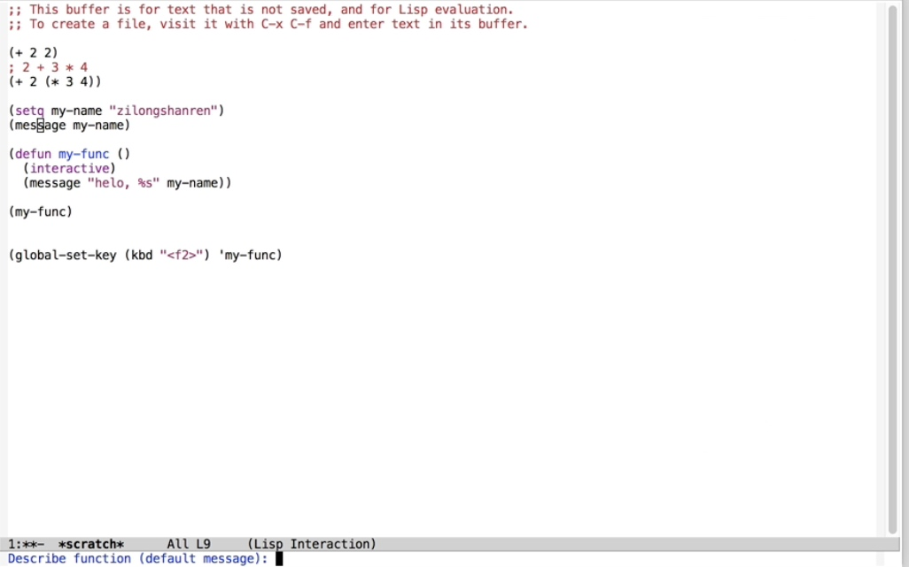

[Emacs Lisp 简明教程](http://smacs.github.io/elisp/)
[Emacs China](https://emacs-china.org)

## 函数和变量

```lisp
;定义函数
(defun function-name (arguments-list)
"document string"
body)
;例如
(defun hello-world (name)
"Say hello to user whose name is NAME.";其中函数的文档字符串是可以省略的
(message "Hello, %s" name))
  
;变量赋值
(setq foo "I'm foo")
(message foo)

;变量声明
(defvar varibale-name value
    "document string")

;区别：它与 setq 所不同的是，如果变量在声明之前，这个变量已经有一个值的话，用 defvar 声明的变量值不会改变成声明的那个值。另一个区别是 defvar 可以为变量提供文档字符串，当变量是在文件中定义的话，C-h v 后能给出变量定义的位置
```

**elisp**



