## 两小时10年linux emacs分享

* shell交互式补齐

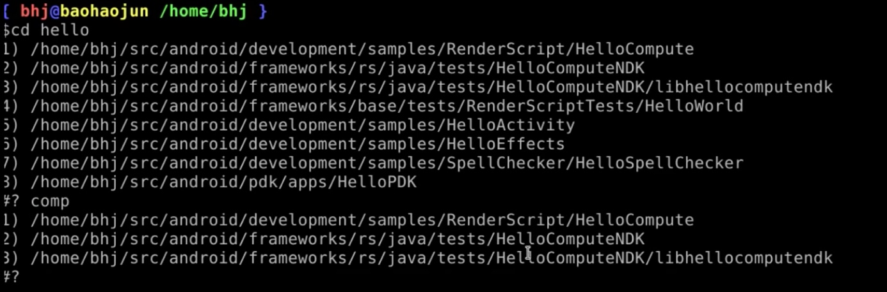


### pulgins

* clang auto-complate
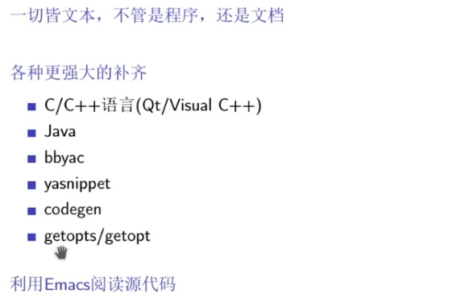

Ctrl+r
bing命令


## Spacemacs Rocks 第二季

### 第一集
[Learn X In Y Minutes](https://learnxinyminutes.com)


**补充**

major mode and minor mode
``

### 第二集

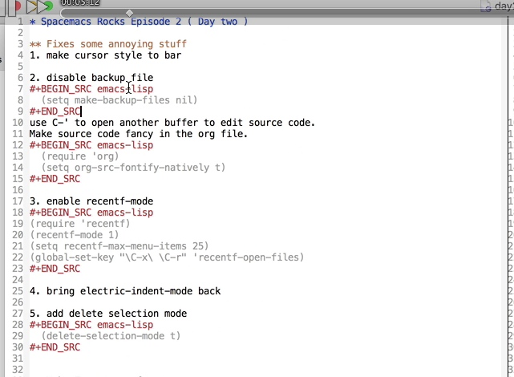

**进入编辑模式，修改代码**

M-x eval-buffer 状态机生效

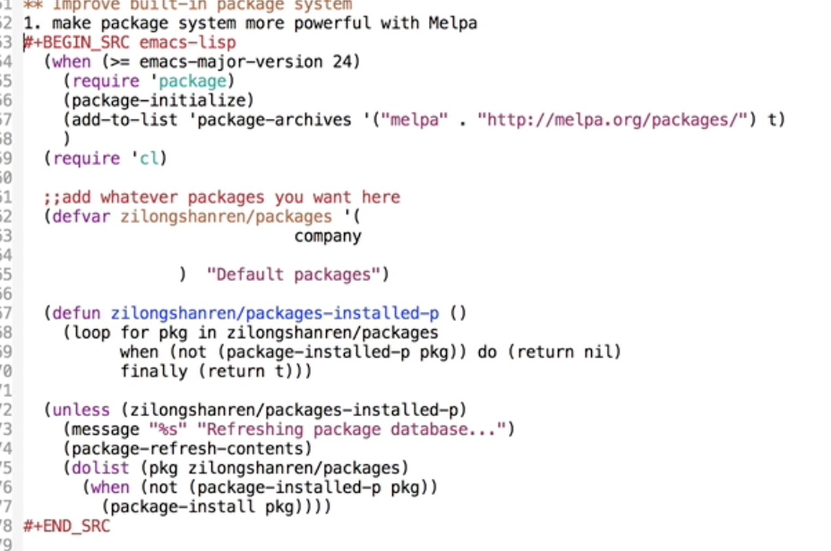


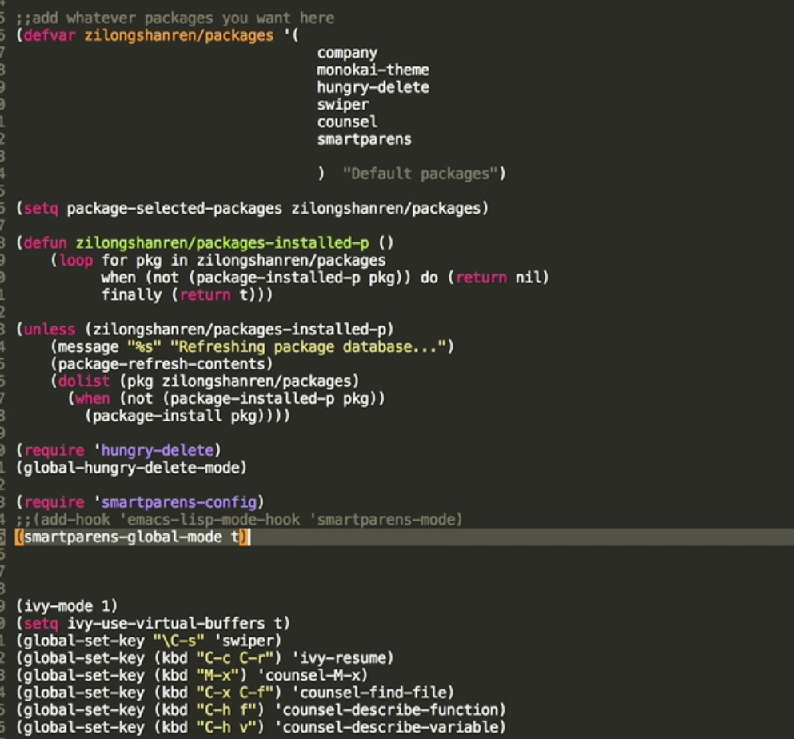

<!--js2-mode-->
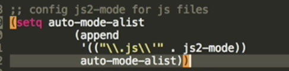

函数 nodejs-repl-send-buffer代码发动到buffer运行

org剩余10分钟

### 第三集


```lisp
M-x global-auto-revert-mode ;;外部修改后自动重新加载配置文件
(setq auto-save-default nil);;自动保存禁止
```

**魔法注释**
`;;;###autoload`
`;;插件名-autoloads.el`是自动生成的，遍历插件陌路所有文件的魔法注释生成

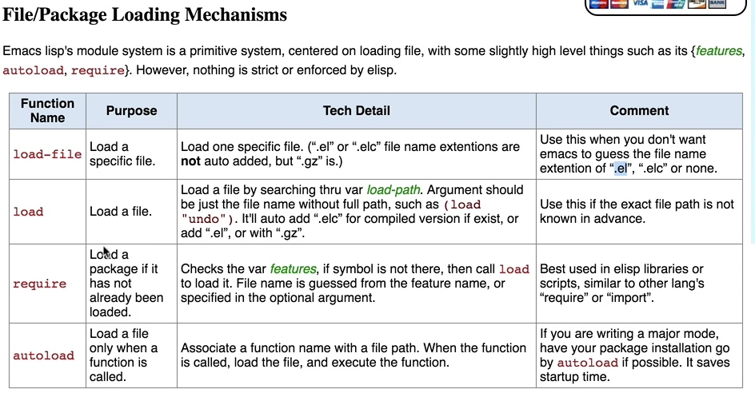

自定变量自动补全
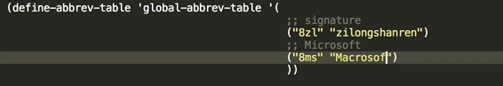
缩写+全称
lisp无namespace,vars全局可见

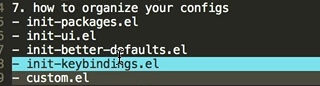

```lisp
(add-to-list `load-path "~/.emacs.d/lisp");;环境变量路径增加
```

**minor mode or major mode**

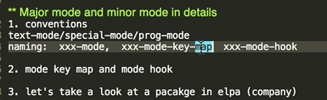

### 第四集

load-file 和 require

**dired mode**

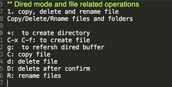
x 执行

删除和拷贝不询问
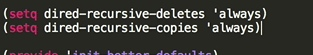

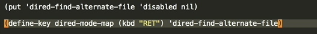

引入dired mode
`(requere `dired)`

**dired-x**

`(require `dired-x)

C-x C-z 打开当前文件所在buffer

`(require `dired-)
C-c 复制

open finder on Mac
Packages
reveal-in-osx-finder


### 第五集

emacs-lisp 不要补全单引号

```lisp
(sp-local-pair `emacs-lips-mode "'" nil :actions nil)
```

鼠标触碰代码中间高亮两侧括号


1、隐藏doc换行符`^M`
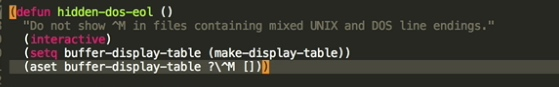

2、删除doc换行符`^M`
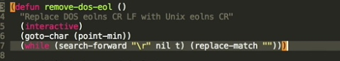

**前端插件：web-mode**

缩进设置、两个空格和四个空格缩进的切换
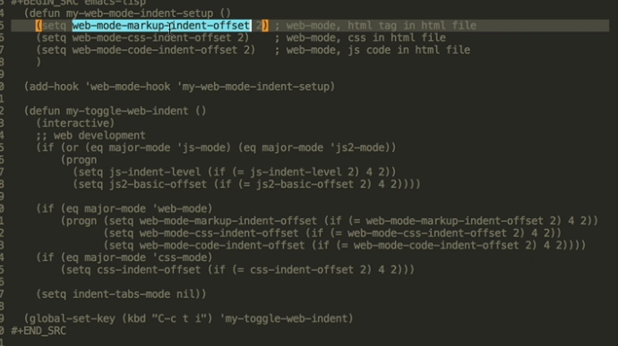


M-; 注释

**js2-refactor JS重构功能**
occur-mode 批量查询修改

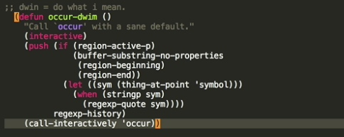

imenu 类似代码方法树状图，函数快捷跳转


正则表达式查找代码


**expand-region**
键盘快速选中字符串
C-=/-

**iedit-mode**
同时编辑多个区域

### 第六集

抓取chrom链接
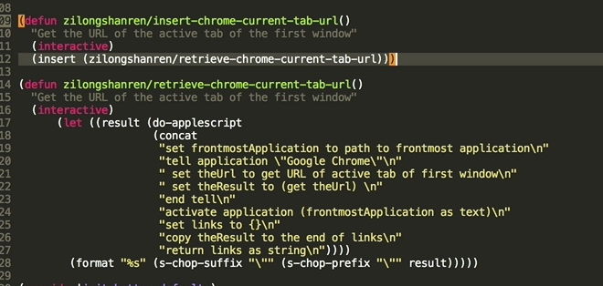

org-mode 模板
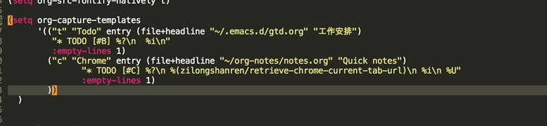

统一用户体验
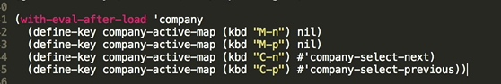

### 第七集

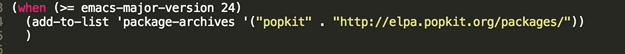
C-w

evil emacs2vim插件
windows-numbering 窗口快捷切换M-n 切换窗口
power-line
power-line-evil
evil-surround vi选中编辑
evil-nerd-commenter vi快捷键
which-key 快捷键提示插件
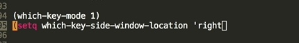
快捷键右侧buffer提示

command-log
pallet + cask管理插件包
macro  宏
use-package

### space emacs

**buffer**


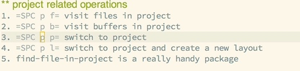


### others

插件

lispy vi-like Paredit
ctags 大型代码库索引自动补全
动态语言无法语义补全（lua/javascript）


elisp入门 叶文斌

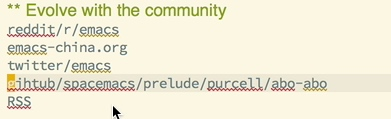

**blogs**
planet emacs
irrel emacs
abo abo emacs
chenbin emacs
emacs shacha
emacs sacha

<!--more-->

