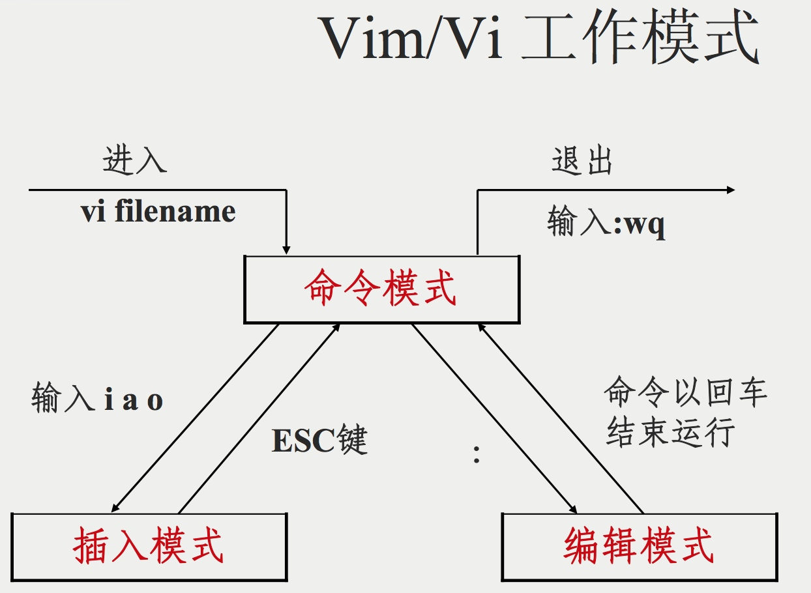
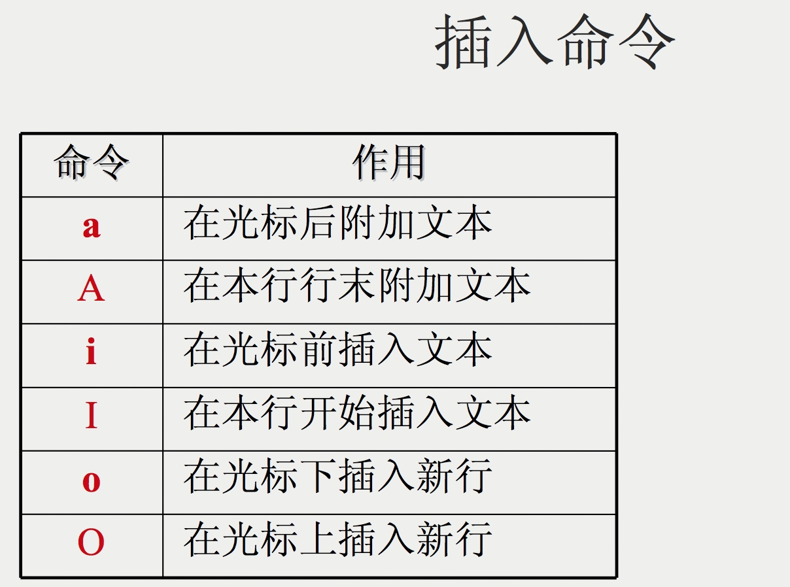
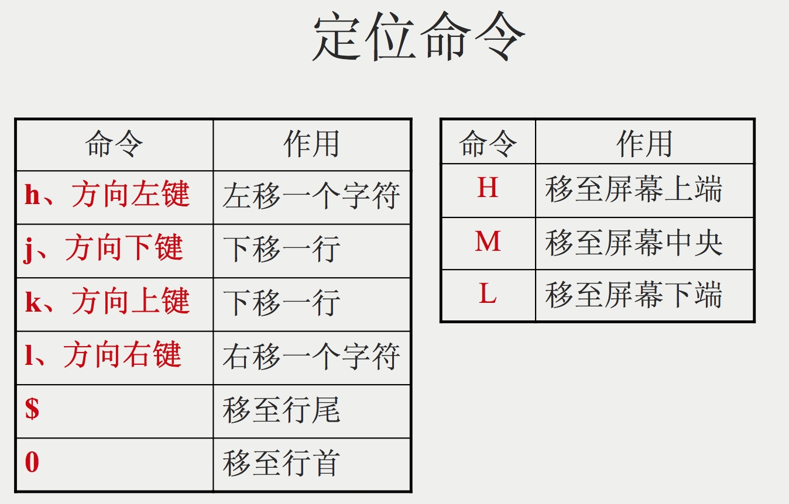
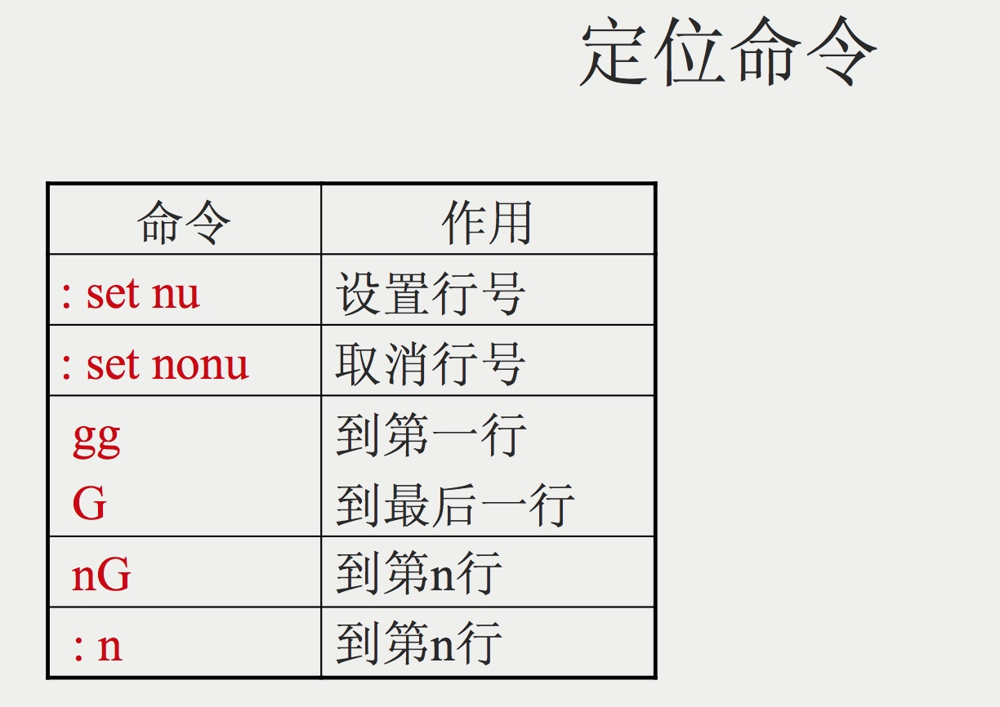
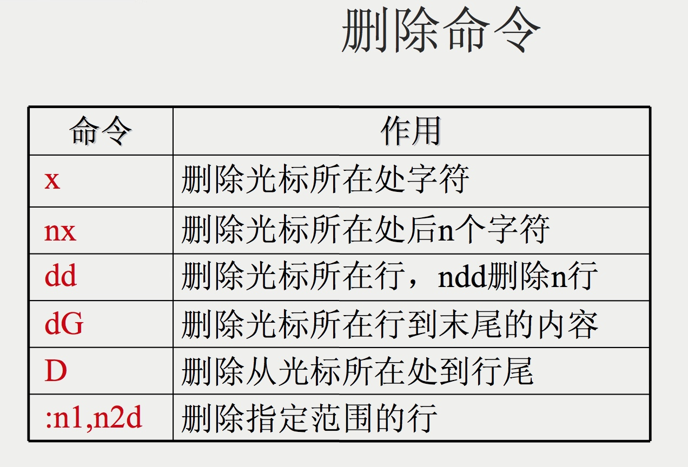
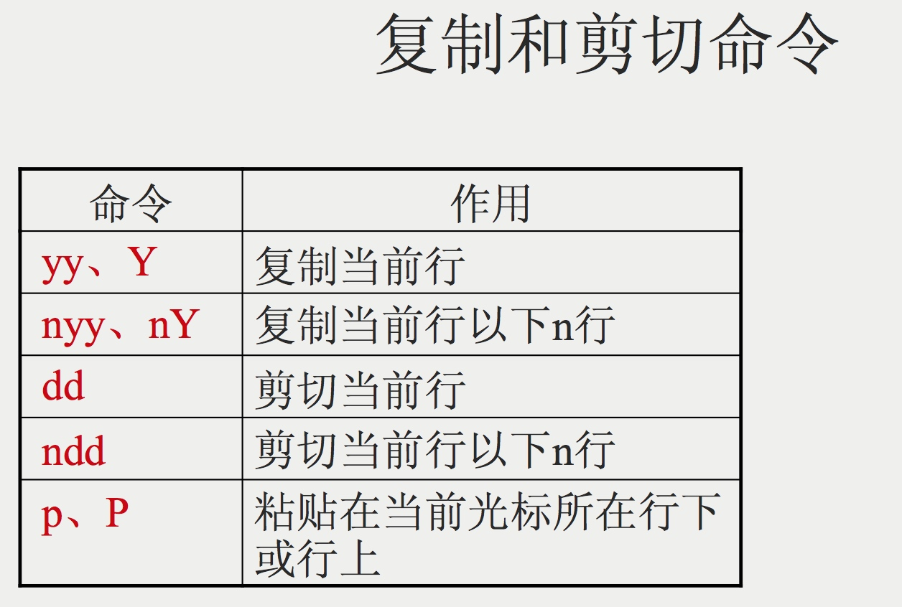
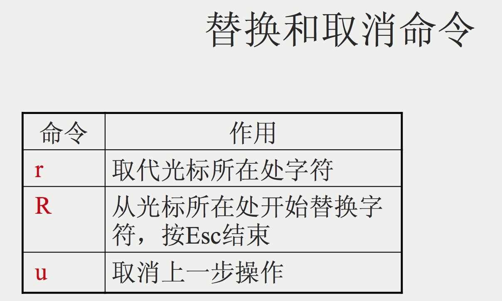
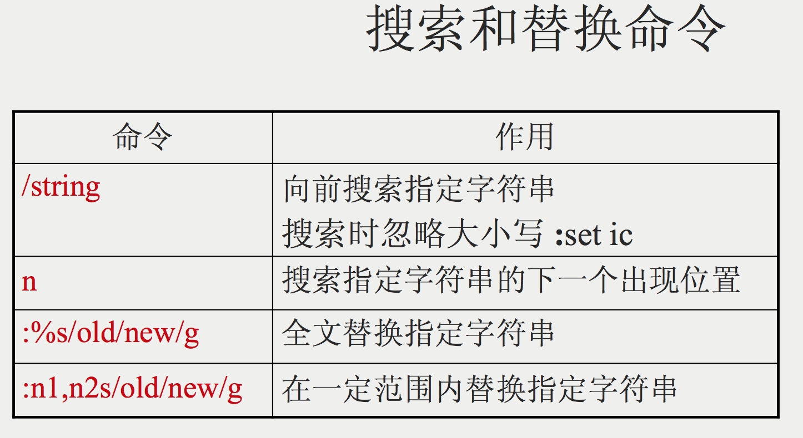
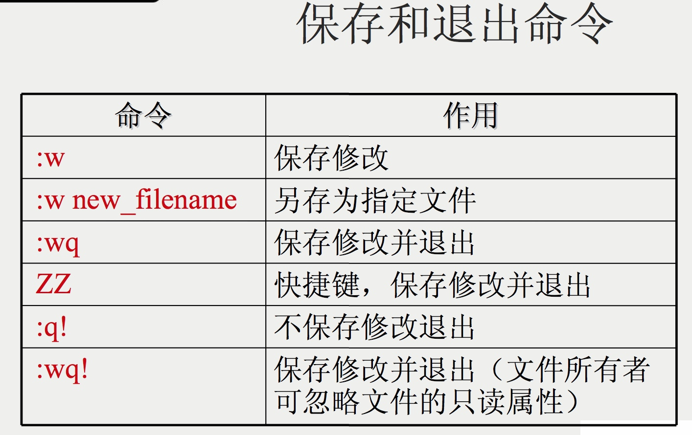
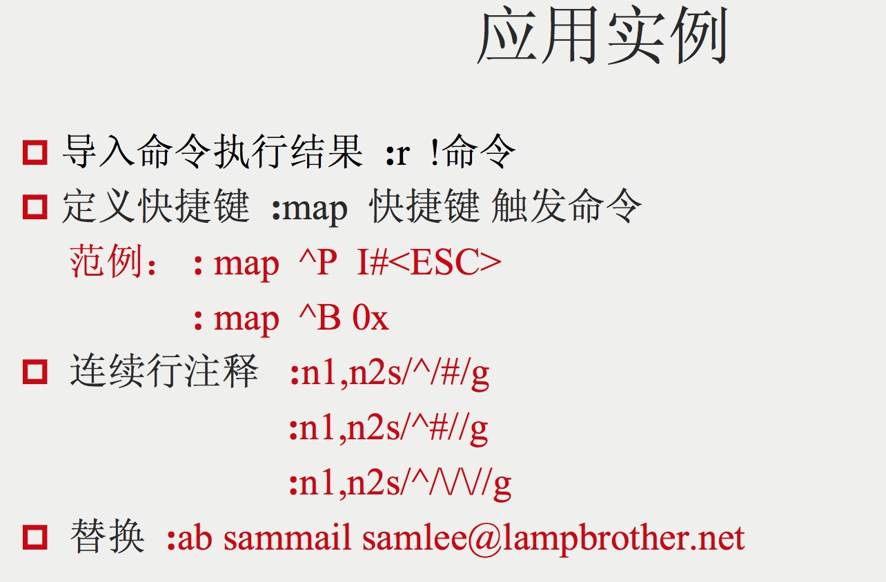

Plugins
    
    snipMate

命令模式

```
ZZ = :wq
```

编辑模式

```
# 设置行号
set nu/set number 

```
插入模式

>  vim/vi中的光标键会变成a,b,c,d的解决办法
> 在某些情况下， vi/vim中的编辑会出现一些很不愉快的情况， 比如在vi/vim中输入方向键有时被转化为A B C D， 或者按个Enter键， 却被转为为其他字母， 恼人得很， 该怎么办呢？ 方法如下（在命令行中执行）：
 
```     
 1. echo "set nocp" >> ~/.vimrc    
 （千万要注意，是>>, 而不是>, 否则把.vimrc清空了， 丢失了之前的内容）
 2. source ~/.vimrc

```


[gvim教程](media/15015622440293/gvim%E6%95%99%E7%A8%8B.pdf)

## VIM配置文件

```
set nocampatible"关闭兼容模式
"模仿快捷键，如：Ctrl+A 全选 Ctrl+C 复制、Ctrl+V粘贴等等
source $VIMRUNTIME/vimrc_example.vim
source $VIMRUNTIME/mswin.vim
behave mswin
set guifont=新宋体:h18:cGB2312"gvim字体设置
set encoding=utf-8"gvim内部编码
set fileencoding=utf-8"当前编辑的文件编码
set fileencodings=usc-bom,utf-8,gbk,cp936,gb2312,big5,euc-jp,euc-kr,latin1”gvim打开支持编码的文件
set langmenu=zh_CN
set $LANG = 'zh_CN.UTF-8'
language messages zh_CN.utf-8"决绝consle输出乱码
"解决菜单乱码
source $VIMRUNTIME/delmenu.vam
source $VIMRUNTIME/menu.vim
let &termecoding=&encoding"设置终端编码为gVim内部编码encoding
set ambiwidth=double"防止特殊符号无法正常显示
set sw=4 "缩进设置为4个空格
set ts=4 "tab宽度为4个字符
set et "编辑室将所有tab替换为空格
set smarttab  "按一次backspace就删除4个空格
set nobackup "不生成备份文件
set mumber "开启行号标记
colo desert"修改配色方案（根据系统名称修改）
set guioptions-=T "关闭上方工具栏
set guioptions-=r "关闭右侧滚动条
set autoindent "开启自动锁紧
```


vi编辑器的文字说明

模式：命令模式，编辑模式，末行模式。

切换方式：命令模式→i→编辑模式，编辑模式→Esc→命令模式，命令模式→：→末行模式。

功能：

    命令模式(Command Mode)：  控制光标移动，删除字符，段落复制。
    编辑模式(Insert Mode)：   新增文字及修改文字。
    末行模式(Last Line Mode)：保存文件，离开vi，以及其他设置。


命令模式命令

命令       说明
 h           将光标向左移动一格
 l           将光标向右移动一格
 j           将光标向下移动一格
 k           将光标向上移动一格
 0           数字0，将光标移动到该行的行首
 $           将光标移动到该行的行末
 H           将光标移动到该屏幕的顶端
 M           将光标移动到该屏幕的中间
 L           将光标移动到该屏幕的底端
 gg          将光标移动到文章的首行
 G           将光标移动到文章的尾行
w或W         将光标移动到下一单词
 x           删除光标所在处的字符
 X           删除光标前的字符
 dd          删除光标所在行
*dd          从光标所在行向下删除*行，*为数字
 D           删除光标所在处到行尾
 r           取代光标处的一个字符
 R           从光标处向后替换，按Esc结束
 u           取消上步的操作
 U           取消目前的所有操作
 yy          复制光标所在行
 p           将复制的内容放在光标所在行的下行


编辑模式命令

命令       说明
 a           在光标后插入文本
 A           在光标所在行后插入文本
 i           在光标前插入文本
 I           在光标所在行前插入文本
 o           在光标所在行下插入新行(小写字母o)
 O           在光标所在行上插入新行(大写字母O)


末行命令

命令       说明
 e           创建新文件
 n           加载新文件
 w           保存文件
 !           强行操作
 w!          强行保存文件
 q           退出
 q!          强行退出
 wq          保存退出
 wq!         强行保存退出
 set nu      显示行号
 set nonu    不显示行号
 /*          /搜索，*任意字符串
 ?           同上


 保存命令按ESC键 跳到命令模式，然后：

 :w   保存文件但不退出vi
 :w file 将修改另外保存到file中，不退出vi
 :w!   强制保存，不推出vi
 :wq  保存文件并退出vi
 :wq! 强制保存文件，并退出vi
 q:  不保存文件，退出vi
 :q! 不保存文件，强制退出vi
 :e! 放弃所有修改，从上次保存文件开始再编辑

