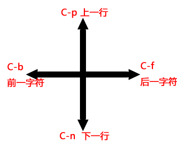

## 快捷键


```
Ctrl+p shell 中上一个命令，或者文本中移动到上一行
Ctrl+n shell 中下一个命令，或者文本中移动到下一行
Ctrl+r 往后搜索历史命令
Ctrl+s 往前搜索历史命令
Ctrl+f 光标前移
Ctrl+b 光标后退
Ctrl+a 到行首
Ctrl+e 到行尾
Ctrl+d 删除一个字符，删除一个字符，相当于通常的 Delete 键
Ctrl+h 退格删除一个字符，相当于通常的 Backspace 键
Ctrl+u 删除到行首
Ctrl+k 删除到行尾
Ctrl+l 类似 clear 命令效果
Ctrl+y 粘贴
```

```
M-x lisp-interaction-mode //切换到lisp解释器模式
C-x C-e //执行lisp程序to Minibuffer
C-h f  //查看帮助
C-h k  //关闭buffer
C-g //退出当前命令
C-x n //分屏 1/0 关闭其他 2下 3 右
emacs -nw //终端模式打开emacs
C-h t//进入新手教程
/sudo::/path //提权编辑
切换buffer  "C-x <left>" 和 "C-x <right>"
```

##配置


cC-x C-f     按提示输入文件名，如果文件不存在则新建文件，如果文件存在则打开文件
C-x C-s    保存
C-x C-w    按提示输入文件名，另存为
M-x customize-variable 回车 make-backup-files 回车     关掉文件备份


emacs最简单入门：只要记住一个按键就行了： M-x . 按住Alt键再按x，在窗口最底下出现M-x的提示，在这里输入left-几个字符，按Tab键，出现两行提示 left-char, left-word，再输入一个c，再按Tab键，这时自动补全为left-char，按回车，如果有内容的话，当前的光标点向左移动，就像按了一个向左的方向键一样。  就这样？就这样！

就这样，发挥你的想象力，想象你现在需要做什么，把它翻译成英文单词，按 M-x，先输入几个字母，按Tab，看是否存在你想象中的指令。要取消当前操作的指令，多按几次ESC键或Ctrl-g键就取消了。

现在假设下emacs有100条指令吧，你如果想做什么事都去执行指令的话，虽然也可以，但是总比不上为常用的指令设置一个快捷键方便。现在看下默认的各种快捷键：

先来看几个简单的 forward-char  backward-char  previous-line  next-line , 很直白的命令，向前后移一个字符或向上下移一行，对应4个方向键。默认绑定的快捷键就是Ctrl加指令首字母 C-f/b/p/n。简洁直白合理极致吧。 复制一些内容到窗口上去，多按几次按键，多按几次手指上的肌肉就不会忘记了。就像用了十多年的五笔输入法一样，看着键盘时一个字也打不也来了，字根键码早忘光了。只有两只手都放在键盘上时，看着汉字，手指自然就打出来了。

再看下 forward-word  backward-word ，向前后一个单词，默认绑定快捷键为Alt加指令首字母 M-f/b。也很合理吧。


理解一些概念
buffer
  缓冲区，内存中的数据，打开文件时读入内容到内存，修改后保存才会修改到磁盘上的文件。

window
  窗口，缓冲区的一个展示区域

frame
  OS上的一个emacs程序窗口

mode 模式
  mode有主模式，辅助模式，主模式就像vim中设置当前filetype一样，当前编辑的是ruby或者python源代码，根据不同文件类型，设置按Tab缩进时缩进不同的字符数，把不同的词当作关键字时行语法高亮等等，同一时间只能选一个主模式。试着多开几个窗口，执行text-mode ruby-mode python-mode试下。emacs打开文件时会自动根据文件扩展名或内容检查并设置主模式。
  辅助模式就是窗口是否要自动换行，是否显示行号等，辅助模式可以多个同时启用。

undo
  在 EMACS 中想要将已经做过的动作放弃，以恢复原状。

  EMACS 所提供的 undo，可以连续恢复最近使用过的指令。
  undo 的顺序是最新使用过的指令最先被 undo ，第二次使用 undo 则恢复第二新的指令，任何指令的输入（除了 undo 本身之外） 都会使指令输入的顺序重整， 这也同时影响 undo 的顺序。
  使用 undo 有一个限制，就是 undo 只能 undo 对缓冲区内容造成改变的指令。对于只是改变游标动作的指令，是无法以 undo 来恢复旧观。若所有修改过内容的指令，都以 undo 恢复原状后， 再一次使用 undo 的指令，echo area 会出现如下的讯息：No further undo information.
当使用了 undo 之后，还想要在 redo 这个已被 undo 的动作时， 有一个技巧可以达成如此的效果。
 1.首先键入一个不会改变缓冲区内容的指令（如光标移动的指令），使原来
 2.存放指令的顺序因新指令的加入而改变。
 3.再使用一次 undo 的指令，就可以达到 redo 的效果了。

undo的行为很难描述，示例：
 新建一个文件
 执行几个修改内容的指令 <1回车2回车3回车>， 这时undo历史里有6条记录
 undo顺序为654321, 继续undo则提示No further undo information
 按下左右方向键（虽然移不动光标），这时undo历史里有12条记录了，前6条undo就变成redo了，顺序123456654321
 再按下方向键，undo历史记录数量再翻倍

emacs的undo不会丢失任何操作，你先做一些操作，undo，再做另一些操作，如果是其它编辑器，第一次undo的动作就失踪了，emacs里却一直存在着，原因同上。多试几次就明白了。


----完----


# Emacs快捷键
切换buffer    C-x b /C-x C-b
退出  
1. C-x C-c ，会问你是否保存。
2. 野蛮点的方法，调用函数kill-emacs，即M-x kill-emacs，直接退出，不管是否修改。
3. 不过直接退出后，Emacs会在相同目录下保留一个以#号开头结尾的相同文件名文件，下次启动可以使用M-x recover-file来恢复。如果是多次保存后，还会有个以~结尾的文件，保存了上次信息。

Emacs Tutorial


p-previous，n-next，b-backward，f-forward

另外两个使用较多的是C-v 往下翻页，M-v 往上翻页。呃，还有一个C-l 就是把当前行提到页面中间，感觉Emacs对页面中似乎情有独钟啊。

### mac note整理

M-s ： 新建一个buffer（缓冲区） C-x O ： 注意是大写的O，不是零，所以需要按住shift键再按o键。用于在缓冲区之间切换 C-g ： 取消当前操作 C-x u ： 回到上一步，相当于Undo C-x 3 ： 把缓冲区（buffer）分为左右两个，新的一个缓冲区是复制当前的缓冲区 （可以执行多次，来分割出很多小窗口） C-x 2 ： 把缓冲区（buffer）分为上下两个，新的一个缓冲区是复制当前的缓冲区 （可以执行多次，来分割出很多小窗口） M-w ： 选中文字的情况是复制文字，而如果没有选中文字则是复制当前的一行 C-w ： 选中文字的情况是剪切文字，而如果没有选中文字则是剪切当前的一行 M-x ： 调出命令输入，可以在后面接命令，比如man，svn-status，等 C-y ： 黏贴 C-x C-s ： 保存文本 C-x C-f ： 打开文件，如果文件不存在，则新建文件 C-x C-v ： 打开一个文件，取代当前缓冲区 C-x k ： 关闭当前缓冲区（buffer） C-s ： 向前搜索 C-r ： 向后搜索 C-x h ： 全选 C-v ： 向下翻页 M-v ： 向上翻页 C-f ： 前进一个字符 C-b ： 后退一个字符 M-f ： 前进一个单词 M-b ： 后退一个单词 C-@ ： 标记开始区域 C-a ： 移到行首 C-e ： 移到行尾 M-a ： 移到句首 M-e ： 移到句尾 M-< ： 缓冲区头部 M-> ： 缓冲区尾部 M-g M-g，再输入数字 ： 跳转到文本的第几行 C-x 0 ： 关闭当前缓冲区 C-x C-c ： 退出Emacs


作者：程序员联盟
链接：http://www.jianshu.com/p/732157b02ecc
來源：简书
著作权归作者所有。商业转载请联系作者获得授权，非商业转载请注明出处。


Emacs在保存时就会运行write-file-hooks中的time-stamp, 从而加 入修改时间, 结果类似下面所示
Time-stamp: 
或者
Time-stamp: "jerry 12/17/2003 12:00:54 (unidevel.com)"
   
要使用中文表示, 可以这样设置
(setq time-stamp-start "最后更新时间:[     ]+\\\\?")
(setq time-stamp-end: "\n")
(setq time-stamp-format: "%:y年%:m月%:d日")
   
上面设置了如果碰到"最后更新时间:"的字样, time-stamp就将其后 面的字符替换为当前时间的"XXXX年XX月XX日", 注意, time-stamp-end的结束符 为换行符, 所以"最后更新时间:"行后所有字符都将无条件被替换为"XXXX年XX月XX日" 格式的时间, 本文首页上的更新时间就是这样做出来的
4.4 我最最讨厌的
不要打入 TAB 时总是听到 PC 喇叭嘀嘀嘀的叫
(setq visible-bell t)
不要总是没完没了的问yes or no, 为什么不能用 y/n
(fset 'yes-or-no-p 'y-or-n-p)
为什么不能显示个时间什么的
(display-time)
为什么不显示当前所在的行号和列号
(column-number-mode t)
为什么不能像Windows下编辑器那样, 高亮显示要拷贝的区域
(transient-mark-mode t)
我要显示匹配的括号
(show-paren-mode t)
为什么使用语法显示的大文件在移动时如此之慢
(setq lazy-lock-defer-on-scrolling t)
(setq font-lock-support-mode 'lazy-lock-mode)
(setq font-lock-maximum-decoration t)
   
不要那个如此大的工具条
(tool-bar-mode -1)
   
在mozilla, openoffice等拷贝的中文文字无法正确粘贴在Emacs中(Emacs 21.3 发布版有此问题, 至少在我的FreeBSD下是这样的)
(set-clipboard-coding-system 'ctext)
   
启动Emacs报错, ~/.emacs中有问题, 如何忽略错误
 (condition-case err
     (progn
     (require 'xxx) )
   (error
    (message "Can't load xxx-mode %s" (cdr err))))
   
如上所示, 可以截获progn内部出错, 在mini-buffer下打出错误信息
不要生成临时文件
(setq-default make-backup-files nil)
   

https://www.jianshu.com/p/7432c3bfcc99

