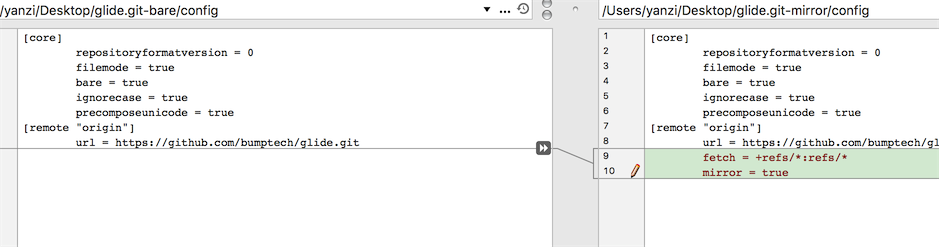

# git clone --mirror和git clone --bare有什么区别

我添加图片，显示镜像和裸机之间的config差异。

左边是裸露的，右边是镜子。 您可以清楚地知道，镜像的配置文件具有fetch密钥，这意味着您可以通过git remote update或git fetch --all git remote update

与--bare相比，-- --mirror不仅将源的本地分支映射到目标的本地分支，还映射所有引用（包括远程分支，注释等）并设置一个refspec配置，以使所有这些引用都被覆盖通过目标存储库中的git remote update 。

迁移用bare
镜像用mirror

remote会更新
