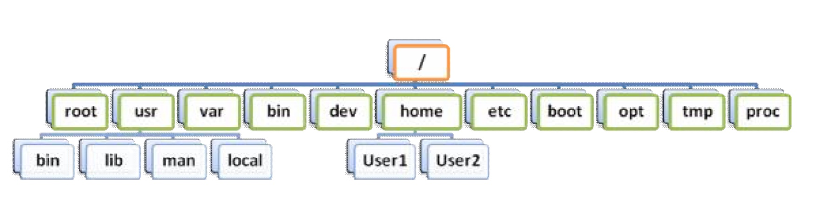
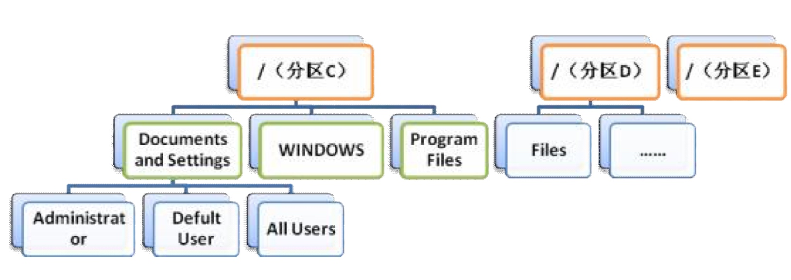

# linux学习记录

## linux零基础学习

### 分区

/dev/hda5
hd标识IDE接口硬盘，sd是SATA硬盘，字母代表第几个设备，阿拉伯数字表示硬盘第几个分区，分区顺序不能改变，1-4主分区或扩展分区，5则是第一个逻辑分区
filesysyem:linux一般使用ext3，如果想要win和linux都可以访问可以建立fat32

现在列举一些ReadLine的键绑定，您可以自行尝试。（运行 man readline 命令，来查看ReadLine手册）

### 先来了解一些约定：

\C-a 表示 Ctrl+a
\M-a 表示 Meta+a Meta键在PC中通常为ALT键
A 表示 Shift+a
（下面括号中的\A代表Alt，\S代表Shift）

移动命令：

\C-a 移动到行首 Aheah
\C-e 移动到行末 End
\C-f 向前移动一个字符 Forward
\C-b 向后移动一个字符 Backward
\M-f 向前移动一个单词
\M-b 向后移动一个单词
\C-l 清空屏幕 cLear

这两个命令也可以理解为移动命令

\C-p 上翻，前一条命令 Previous
\C-n 下翻，后一条命令 Next

编辑命令：

\C-d 删除光标后的一个字符 \M-d 删除光标后的一个单词 Delete
\BackSpace 删除光标前的一个字符 \M-BackSpace 删除光标前的一个单词
\C-k 删除光标至行末的部分 Kill
\C-u 删除光标至行首的部分 Unix-line-discard
\C-w 删除光标前的一个单词 Word
\C-y 粘贴（最后删除的对象） Yank
\C--撤消
\C-r 连续使用 ``C-r`` 可以查找下一个
\M-p
\M-n

#### 补全：

\Tab 使用频率最高的功能！
\C-o 遍历补全（未定义）
\M-? M-= 列出所有可能选项，相当于按两次Tab键（M-？实际按键为
\A+\S+/）
\M-# 注释掉当前命令，用于将当前命令暂存于历史纪录列表（\A+\S+3）
\M-! 补全命令，通常用来补全子命令，例如 ``sudo`` 的子命令（\A+\S+1）
\M-~ 补全用户名（\A+\S+`）
\M-@ 补全主机名（\A+\S+2）
\M-$ 补全变量（\A+\S+4）
\M-_ 补全历史纪录中的纪录（\A+\S+-）
\M-* 将所有可能选项放到命令行中（\A+\S+8）

软件目录：
bin -exec
ect-配置
lib-库文件
share-资源

第一位 d-文件夹 -普通文件 l-软链 b-块设备 c-字符设备 p-管道文件

### 通配符

使用 ? 代表任意单个字符。例如 ???lo ，表示 lo 前有三个字符，它可以匹配 Hello

使用 * 代表随意几个任意字符。例如 *.iso ，代表所有 iso 格式的文件。

说明：您可以将遍历补全和通配符结合使用，以提高效率。

例如：

cd */ 则遍历补全只补全文件夹

chmview *.chm 则遍历补全只补全 chm 文件

任务管理

&--------------------------------在命令的末尾加上一个 & 符号，表示背景任务，例如：

wget http://www.download.net/xxx/mp3 &

;----------------------------------使用 ; 将多个命令连结起来，则表示任务按顺序执行
 
&&------------------------------使用 && 将多个命令连结起来，则表示只有前面的命令执行成功，后面的命令

才能得以执行

``-----------------------------------`<命令>` ，如果一个命令中包含以 `` （Esc 键下方的按键）括起来的子命令，

那么子命令将被优先执行，执行结果被代入上一级命令继续执行，例如创建一个以当前时间命名的文件：

touch `date +%m.%d_%H:%M:%S`

touch 命令能够创建一个文件，它的操作对象，为 date +%m%d%H%M%S 命令的输出 06.06_06:06:60 这样，我们创建了一个名为 06.06_06:06:60 的文件（六月六日六时六分刚过六十秒-_-!）

Ctrl+z

将当前 Shell 中的任务挂起

这个时候任务的状态为

[1]+ Stopped xxx

Bg-------------------------------------------------将挂起的任务背景运行。这时它的状态为[1]+ xxx &

Fg-------------------------------------------------将背景任务调到前台执行 jobs

方括号中的数字为命令的任务编号，您可以使用 jobs 命令来查看所有背景任务

如果后台运行多个任务，您可以在 bg 或者 fg 后跟任务编号，作为操作对象，例如：bg 2

管道、重定向

>-----------------------重定向符号，它的作用是将命令的输出重定向到一个文件中。比如我们想把命令 ls 的

结果保存为 FileList 文件，作一个清单，我们可以使用重定向符号来完成它：

ls -l > FileList

>>----------------------作用与 > 基本相同，不同点在于， >> 以追加的方式，将命令的输出写入文件的末尾 。

<-----------------------是从文件到命令的重定向，将文件的内容作为命令的输入。

|------------------------为管道符号，它的作用是将前一个命令的输出，作为下一个命令的输入。假设一个目录

下的文件太多，使用 ls 命令不能够在屏幕中完全显示，这个时候您可以将 ls 命令的输出，通过管道符号，作为浏览器 less 的输入。就可以使用浏览器的功能翻页、查找：ls -al | less 说明： less 浏览器的键绑定几乎与 man 相同，请参阅 在线帮助系统

脱字符

Shell 中的一些功能是通过特殊符号作为控制字符来实现的，上面已经介绍了很多了。这产生一个问题，如果一个文件名中，刚好包含了这些字符，比如 ; ，就很难对它进行操作。使用 less 浏览这个文件

less ;xxx

less 会很快返回一个错误信息，因为并没有一个文件名作为操作对象。接着，Shell 会报告，系统中没有 xxx

这个命令。

这是因为 Shell 将文件名中的 ; 解析为按顺序执行命令。

或者您的文件名以空白起始，而在 Shell 中，无论多少个空格，都将被解析为一个分隔符。您甚至不是使用命令重命名此文件。

这个时候就要用到脱字符 \ 了，它能够将一个具有特殊涵义的字符转换普通字符。上面的两个任务，可以在文件名中每个特殊字符前加一个 \ ，像这样

less \;xxx

less \ \xxx

less \;\ \&\xxx

说明：也可以使用 " 将文件名括起来，例如 less "; &xxx" ，在很多情况下，这样甚至更方便。

脱字符在 Shell 中也可以作为换行符，在一个命令的末尾添加一个 \ ，然后回车，在下一行继续输入命令剩余的部分，将一个命令拆分为多行且不影响它的执行（如果执行一个很长的命令，请将它拆分为多行以便于阅读）
 
事实上换行符也符合脱字符的定义。回车键有两个涵义，一个是 执行（Enter），另一个 换行（折线箭头）。在 Shell 中它作为控制字符 执行，使用脱字符后，它便代表排版字符 换行了。

### Ubuntu 系统目录结构

以下为 Ubuntu 目录的主要目录结构，您稍微了解它们都包含了哪些文件就可以了，不需要记忆。

/	根目录
│
├boot/ 启动文件。所有与系统启动有关的文件都保存在这里
│ └grub/ Grub 引导器相关的文件
│
├dev/ 设备文件
├proc/ 内核与进程镜像
│
├mnt/ 临时挂载
├media/ 挂载媒体设备
│
├root/ root 用户的$HOME 目录
├home/
│	├user/ 普通用户的$HOME 目录
│	└.../
│
├bin/ 系统程序
├sbin/ 管理员系统程序
├lib/ 系统程序库文件
├etc/ 系统程序和大部分应用程序的全局配置文件
│	├init.d/ SystemV 风格的启动脚本
│	├rcX.d/ 启动脚本的链接，定义运行级别
│	├network/ 网络配置文件
│	├X11/ 图形界面配置文件
├usr/
│	├bin/ 应用程序
│	├sbin/ 管理员应用程序
│	├lib/ 应用程序库文件
│	├share/ 应用程序资源文件
│	├src/ 应用程序源代码
│	├local/
│	│ ├soft/ 用户程序
│	│ └.../ 通常使用单独文件夹
│	├X11R6/ 图形界面系统
│
├var/ 动态数据
│
├temp/ 临时文件
├lost+found/ 磁盘修复文件

## 启动流程

Linux 系统主要通过以下步骤启动：

1.读取MBR 的信息，启动Boot Manager

Windows 使用 NTLDR 作为 Boot

Manager，如果您的系统中安装多个版本的 Windows，您就需要在 NTLDR 中选择您要进入的系统。 Linux 通常使用功能强大，配置灵活的 GRUB 作为 Boot Manager，我们将在启动管理章节中向您介绍它的使用方式。

2.加载系统内核，启动init 进程

init 进程是 Linux 的根进程，所有的系统进程都是它的子进程。

3.init 进程读取 /etc/inittab 文件中的信息，并进入预设的运行级别，按顺序运行该运行级别对应文件夹下的脚本。脚本通常以 start 参数启动，并指向一个系统中的程序。

通常情况下， /etc/rcS.d/ 目录下的启动脚本首先被执行，然后是 /etc/rcN.d/ 目录。例如您设定的运行级别

为	3,那么它对应的启动目录为 /etc/rc3.d/ 。

4.根据 /etc/rcS.d/ 文件夹中对应的脚本启动Xwindow 服务器 xorg

Xwindow 为 Linux 下的图形用户界面系统。

5.启动登录管理器，等待用户登录

Ubuntu 系统默认使用 GDM 作为登录管理器，您在登录管理器界面中输入用户名和密码后，便可以登录系统。（您可以在 /etc/rc3.d/ 文件夹中找到一个名为 S13gdm 的链接）

更改运行级别

在	/etc/inittab 文件中找到如下内容：

    The default runlevel. id:2:initdefault:
这一行中的数字 2 ,为系统的运行级别，默认的运行级别涵义如下：
0 关机	1 单用户维护模式	2~5 多用户模式	6 重启

服务管理

更改启动服务

在运行级别对应的文件夹中，您可以看到许多文件名以 S## 和 K## 起始的启动脚本链接。例如：

/etc/rcS.d/S35mountall.sh 挂载文件系统

/etc/rcS.d/S40networking 启用网络支持

/etc/rc2.d/S13gdm 启动登录管理器

/etc/rc2.d/S20makedev 创建设备文件

/etc/rc2.d/S23xinetd 启动超级进程
init 进程将以 start 为参数，按文件名顺序执行所有以 S## 起始的脚本。脚本名称中的数字越小，它将被越早执行。例如在
/etc/rc2.d/ 文件夹中， S13gdm 文件名中的数字小于 S23xinetd , S13gdm 将比 S23xinetd 先执行。
如果一个脚本链接，以 K## 起始，表示它将以 stop 参数被执行。如果相应服务没有启动，则不执行该脚本。例如：
/etc/rc2.d/K20powernowd 针对某种硬件的电源管理支持
如果您想禁止某一服务在启动时自动运行，您可以将相应运行级别中的脚本由 S##xxx 重命名为 K##xxx。

### 手动控制服务
您也可以手动运行带有以下参数的启动脚本，来控制系统服务。
- start 启动	- stop 停止	- restart 重启
例如：
/etc/rc2.d/K20powernowd start
有时您并不清楚当前运行级别，该运行级别下未必有相应脚本；而且此类脚本的前三位字符并不固定，不便于记忆。这时，可以直接使用
/etc/init.d/ 文件夹中的启动脚本（ /etc/rcX.d/ 中的启动脚本链接到 /etc/init.d/
文件夹下相应脚本），这也是推荐的方式。
例如：
/etc/init.d/powernowd start
Note：以上命令的位置并没有包含在环境变量的搜索路径中，所以要输入完整路径

## 常用系统服务

acpi-support 高级电源管理支持
acpid acpi守护程序.这两个用于电源管理，非常重要
alsa 声音子系统
alsa-utils
anacron cron的子系统，将系统关闭期间的计划任务，在下一次系统运行时执行。
apmd acpi的扩展
atd 类似于cron的任务调度系统。建议关闭
binfmt-support 核心支持其他二进制的文件格式。建议开启
bluez-utiles 蓝牙设备支持
bootlogd 启动日志。开启它
cron 任务调度系统，建议开启
cupsys 打印机子系统。
dbus 消息总线系统(message bus system)。非常重要
dns-clean 使用拨号连接时，清除dns信息。
evms 企业卷管理系统（Enterprise Volumn Management system）
fetchmail 邮件用户代理守护进程，用于收取邮件
gdm gnome登录和桌面管理器。
gdomap
gpm 终端中的鼠标支持。
halt 别动它。
hdparm 调整硬盘的脚本，配置文件为 /etc/hdparm.conf。
hibernate 系统休眠
hotkey-setup 笔记本功能键支持。支持类型包括： HP, Acer, ASUS, Sony, Dell, 和IBM。
hotplug and hotplug-net 即插即用支持，比较复杂，建议不要动它。
hplip HP打印机和图形子系统
ifrename 网络接口重命名脚本。如果您有十块网卡，您应该开启它
inetd 在文件 /etc/inetd.conf 中，注释掉所有你不需要的服务。如果该文件不包含任何服务，那关闭它是很安全的。
klogd 重要。
linux-restricted-modules-common 受限模块支持。 /lib/linux-restricted-modules/ 文件夹中的模块为受限模块。
例如某些驱动程序，如果您没有使用受限模块，就不需要开启它。
lvm 逻辑卷管理系统支持。
makedev 创建设备文件，非常重要。
mdamd 磁盘阵列
module-init-tools 从/etc/modules加载扩展模块，建议开启。
networking 网络支持。按 /etc/network/interfaces 文件预设激活网络，非常重要。
ntpdate 时间同步服务，建议关闭。
pcmcia pcmcia设备支持。
powernowd 移动CPU节能支持
ppp	and ppp-dns 拨号连接 readahead 预加载库文件。 reboot 别动它。 resolvconf 自动配置DNS rmnologin 清除nologin

rsync rsync守护程序
sendsigs 在重启和关机期间发送信号
single 激活单用户模式
ssh ssh守护程序。建议开启
stop-bootlogd 在2，3，4，5运行级别中停止bootlogd服务
sudo 检查sudo状态。重要
sysklogd 系统日志
udev & udev-mab 用户空间dev文件系统（userspace dev filesystem）。重要
umountfs 卸载文件系统
urandom 随机数生成器
usplash 开机画面支持
vbesave 显卡BIOS配置工具。保存显卡的状态
xorg-common 设置X服务ICE socket。
adjtimex 调整核心时钟的工具
dirmngr 证书列表管理工具,和gnupg一起工作。
hwtools irqs优化工具
libpam-devperm 系统崩溃之后，用于修理设备文件许可的守护程序。
lm-sensors 板载传感器支持
mdadm-raid 磁盘陈列管理器
screen-cleanup 清除开机屏幕的脚本
xinetd 管理其他守护进程的一个inetd超级守护程序

## 全局配置文件

系统初始化

/etc/inittab 运行级别、控制台数量
/etc/timezone 时区
/etc/inetd.conf 超级进程

文件系统

/etc/fstab 开机时挂载的文件系统
/etc/mtab 当前挂载的文件系统

用户系统

/etc/passwd 用户信息
/etc/shadow 用户密码
/etc/group 群组信息
/etc/gshadow 群组密码
/etc/sudoers Sudoer列表（请使用“visudo”命令修改此文件，而不要直接编辑）

Shell

/etc/shell 可用Shell列表
/etc/inputrc ReadLine控件设定
/etc/profile 用户首选项
/etc/bash.bashrc bash配置文件

系统环境

/etc/environment 环境变量
/etc/updatedb.conf 文件检索数据库配置信息
/etc/issue 发行信息

/etc/issue.net
/etc/screenrc 屏幕设定

网络

/etc/iftab 网卡MAC地址绑定
/etc/hosts 主机列表
/etc/hostname 主机名
/etc/resolv.conf 域名解析服务器地址
/etc/network/interfaces 网卡配置文件

### 用户配置文件

/etc/ 目录下的文件，只有root用户才有权修改。应用软件的全局配置文件，通常普通用户也不能够修改，如果要通过配置软件，来适应特殊需求，您可以修改用户配置文件。
用户配置文件通常为全局配置文件的同名隐藏文件，放在$HOME目录下，例如：
/etc/inputrc /home/user/.inputrc
/etc/vim/vimrc /home/user/.vim/vimrc
也有少数例外，通常是系统程序
/etc/bash.bashrc /home/user/.bashrc

## 杂项命令

Groupdel

uname
-s 内核名称（默认参数）
-a 全部
-p CPU信息
-n 主机名
-r 内核发行信息（版本号）
-v 内核版本信息

userdel
cal
groupadd
file
uptime
who
whoami
last -n
### date
date
显示、设定系统时间

-u 显示格林尼洛时间（UTC）
MMDDhhmm[[CC]YY][.ss] 设定时间，需要管理员权限。例如： date 12292359

MM	月份 DD 天数 hh 小时 mm 分钟 CC 年份前两位 YY 年份后两位 ss 秒钟秒钟、年份为可选，例如： date 122923592006.59

+[%X]设定显示格式，以下为date默认输出格式：

date +%Y年%m月%d日%A%H:%M:%S%Z

格式控制
%n 换行
%t 制表符

小时

%H(00~23) %I(01~12) %k(0~23) %l(1~12) %p(AM|PM)

分、秒
%M分钟(00~59)
%S秒(00..61)

%T(hh:mm:ss) %r(hh:mm:ss [AM|PM])
%s 从1970年1月1日00:00:00 UTC到目前为止的秒数

%X(%H:%M:%S)
%Z时区

星期
%a(Sun~Sat) %A(Sunday~Saturday) %w : 一周中的第几天 (0..6)

年份
%Y(0000~9999) %y(00~99)

月份
%m(01~12) %b %h(Jan~Dec) %B(January~December)
 
日期
%d(01~31) %j(001~366)
%x(本地格式mm/dd/yy) %D(mm/dd/yy) %c

一年中的第几周
%U(00~53)以Sunday为一周的第一天 %W(00~53)以Monday为一周的第一天

less
more
pwd
cd
### ls [路径]
显示当前目录文件列表

--color 不同属性以不同颜色显示（默认参数）
-a 全部显示
-i 显示inode值
-l 详细信息
-F 显示文件类型后缀目录

/	链接@ 可执行文件* 端口文件= 管道文件| > -A 显示隐藏文件
-R 递归显示子目录文件列表 -S 按文件大小排序
-t 按修改时间排序 -u 按访问时间排序
-d 只显示目录，不递归显示目录下的文件
du [路径]
计算文件或目录空间占用

-h 人性化显示。自动以G、M、K为单位显示占用空间大小
-l 重复计算硬链接文件大小
-L 计算符号链接文件大小
-a 显示当前目录子目录中的文件
-c 显示文件数

less <文件名>
浏览文件，使用VI和Emacs两种风格的键绑定。以下为VI风格键绑定

Ctrl+f(orward) 向下翻一页 Ctrl+d(own) 向下翻半页
Ctrl+b(ackward) 向上翻一页 Ctrl+u(p) 向上翻半页
/ 查找 q(uit) 退出
split <源文件> [目标文件名前缀]
将源文件按一定规则分割成若干个目标文件。默认文件名前缀为 x

-<行数> 按行数分割文件
-l <行数> 同上

-b <字节> 按大小分割文件。可以使用b、k、m作单位，不指定单位的情况下，默认单位为b -C <字节> 按大小分割文件，并尽量保持每行的完整

示例：

split -C 100k file.split x

cat <文件名>
输出文件内容。用空格分隔多个文件名，可以将多个文件内容连接到一起输出。使用重定向合并为一个文
件

-n 在输出中添加行号
-b 在输出中添加行号，空行不编号
-s 将两行或以上的空行，合并为一个空行

示例：

cat xaa xab xac > file.split

sort [-o <输出文件>] [-t <分隔字符>] [+<起始字段> - <结束字段>] [文件]对文本内容排序

-m 合并文件
-c 检查文件是否已按规则排序
-b 忽略行首空格字符
-u 忽略内容重复行
-f 忽略大小写
-l 忽略非打印字符
-M 作为月份比较
-d 按字典顺序排序，按照字母、数字、空格、制表符排序
-r 逆序输出

sort [-o <输出文件>] [-t <分隔字符>] [+<起始字段> - <结束字段>] [文件]

对文本内容排序

-m 合并文件	-c 检查文件是否已按规则排序	-b 忽略行首空格字符

-u 忽略内容重复行	-f 忽略大小写	-l 忽略非打印字符	-M 作为月份比较

-d 按字典顺序排序，按照字母、数字、空格、制表符排序	-r 逆序输出

more
查看文件内容，我们建议您使用 less
diff <文件名>
比较文件
cksum [文件名]
计算文件的 CRC 值。不指定文件名则从标准输入设备读入数据，例如：
echo xxx | cksum
md5sum [文件名] 计算文件的 md5 值。同上

### 权限管理

SUID、SGID、Sticky bit

某些情况下，需要以可执行文件归属用户的身份执行该文件，可以为该文件设置 SUID。同样，设置 SGID 能够以该文件归属群组的身份执行它。

例如：用户自行设定密码。出于安全方面的考虑， /etc/shadow 只能由 root 用户直接修改。

-rw------- root root /etc/shadow

这个时候，可以为程序 /usr/bin/passwd

设置 SUID，当普通用户执行“passwd”命令时，便能够以该程序归属用户 root 的身份修改 /etc/shadow 文件。而“passwd”程序自身带有身份验证机制，不能通过验证时拒绝执行，从而保证了安全。

ls -l /usr/bin/passwd

-r-s--x--x root root /usr/bin/passwd

我们发现，归属用户的可执行权限位使用 s ，表示 SUID。同样，归属群组的可执行权限位使用 s ，表示SGID。任何用户或群组都拥有

其它用户 的权限，所以不需要以其它用户 身份执行文件，其它用户的可执行权限位便不会出现 s 。该权限位可能出现的属性为 t

，也就是粘着位 Sticky bit。

ls -ld /tmp

drwxrwxrwt root root /tmp

粘着位表示任何用户都可能具有写权限，但只有该归属用户或 root 用户才能够删除

SUID、SGID、Sticky bit 也可以像权限一样，使用一个八进制数表示，如下：

4 SUID
 

32
 
Ubuntu 完全教程(szyzln 于 2009 年 5 月 9 日整理)

2 SGID

1 Sticky bit

通过在“chmod”命令中使用 4 个八进制数的表达式，如 4755 ，用第一位表示 SUID、SGID、或 Sticky bit，便能够为文件设置这些特殊权限。示例：

chmod -R 4755 path

lsattr [路径]

查看文件的特殊属性

-a 全部显示	-d 只显示目录	-R 递归

特殊属性包括：

a：仅供附加用途	b：不更新最后存取时间	c：压缩后存放	d：排除在倾倒操作之外

i：不得任意更动文件或目录 s：保密性删除文件或目录 S：即时更新文件或目录u：预防以外删除

chattr +|-|=<属性> <路径>

更改文件特殊属性

-R 递归	-V 显示过程
## 咋
压缩解压

tar -c|x|u|r|t[z|j][v] -f <归档文件> [未打包文件]

将多个文件打包为一个归档文件，可以在打包的同时进行压缩。支持的格式为 tar（归档）、gz（压缩）、bz2（压缩率更高，比较耗时）

-c 创建	-x 解包		-u	更新		-r 添加	-t 查看	
-d 比较压缩包内文件和文件		-A	将 tar 文件添加到归档文件中	-z 使用 gz 压缩格式
-j 使用 bz2 压缩格式	-v 显示过程		-f <文件名> 归档文件的文件名	
-C <解压路径> 将压缩包中的文件解压到指定目录		
[未打包文件]	创建、更新时必须填写				
示例：								
tar -zcvf xxx.tar.gz xxx/ xxx1 xxx2 xxx3 多个待打包文件以空格分隔	
tar -zcvf xxx.tar.gz /home/user/xxx/ 使用绝对路径打包，解包也使用绝对路径	
tar -zxvf xxx.tar.gz 按相对路径解包到当前目录下，或按绝对路径解包	
tar -zcvf xxx.tar.gz xxx | split -b 1m 打包后，使用 split 分割为 1m 大小的多个文件	
其它参数								
-P 使用绝对路径压缩时，保留根目录“/”	-W 校验	-p 还原文件权限
-w 询问用户	--totals	统计			-T <表达式> 处理符合条件的文件	
-X <表达式> 排除符合条件的文件					
zip [参数] <压缩包> <源文件>					
使用 zip 格式打包文件							
-r 递归，将指定目录下的所有文件和子目录一并处理	-S 包含系统和隐藏文件
-y 直接保存符号连接，而非该连接所指向的文件	-X 不保存额外的文件属性
-m 将文件压缩并加入压缩文件后，删除源文件		
-<压缩级别> 1~9，数字越大，压缩率越高			
-F 尝试修复已损坏的压缩文件	-T	检查备份文件内的每个文件是否正确无误
-q 不显示指令执行过程		-g	将文件压缩后附加在既有的压缩文件之后，而非另行建立新的压缩文件
 

33
 
Ubuntu 完全教程(szyzln 于 2009 年 5 月 9 日整理)

-u	更新压缩包内文件								
-f	更新压缩包内文件。如果符合条件的文件没有包含在压缩包中，则压缩后添加	
-$	保存第一个被压缩文件所在磁盘的卷标	-j	只保存文件名称及其内容	
-D 压缩文件内不建立目录名称	-i <表达式>	压缩目录时，只压缩符合条件的文件
-x <表达式> 排除符合条件的文件	-n <文件名后缀> 排除指定文件名后缀的文件
-b <缓存路径> 指定临时文件目录	-d <表达式> 从压缩文件内删除指定的文件
-t <日期时间>	把压缩文件的日期设成指定的日期				
-o	以压缩文件内拥有最新更改时间的文件为准，将压缩文件的更改时间设成和该文件相同
-A 调整可执行的自动解压缩文件	-c	替每个被压缩的文件加上注释	
-z 替压缩文件加上注释		-k	使用 MS-DOS 兼容格式的文件名称。		
-l 压缩文件时，把LF 字符置换成 LF+CR 字符。	-ll 压缩文件时，把LF+CR 字符置换成 LF 字符 。
unzip [参数] <压缩文件> [压缩包中将被释放的文件]			
解压 zip 压缩包文件								
-P <密码> zip 压缩包的密码		-d <路径> 指定解压路径	-n 解压缩时不覆盖原有文件
-f	覆盖原有文件	-o	不经询问，直接覆盖原有文件			
-u	覆盖原有文件，并将压缩文件中的其他文件解压缩到目录中			
-l	显示压缩文件内所包含的文件	-t 检查压缩文件是否正确	-z 显示压缩包注释
-Z unzip -Z 等于执行 zipinfo 指令	-j 不处理压缩文件中原有的目录路径		
-C 压缩文件中的文件名称区分大小写	-L 将压缩文件中的全部文件名改为小写
-s 将文件名中的空格转换下划线	-X 解压缩时保留文件原来的 UID/GID	
-q	执行时不显示任何信息		-v	执行是时显示详细的信息		
-c	将解压缩的结果显示到屏幕上，并对字符做适当的转换			
-p	与-c 参数类似，会将解压缩的结果显示到屏幕上，但不会执行任何的转换	
-a	对文本文件进行必要的字符转换	-b 不要对文本文件进行字符转换	
-x <表达式> 处理里排除压缩包中的指定文件		-M 将输出结果送到 more 程序处理
7z|7za <子命令> [参数] <压缩包> [文件]				
子命令										
a	添加	d 删除  e	解压	x	带路径解压	l	列表查看	t 测试	u 更新	
参数										
-m<压缩方式>	-m0=<压缩算法> 默认使用 lzma	-mx=<1~9> 压缩级别
-mfb=64 number of fast bytes for LZMA = 64	-md=<字典大小> 设置字典大小，例如 -md=32m
-ms=<on|off> 是否固实压缩		-o<输出目录> 设置输出目录	-p[密码] 使用密码
-r[数字] 递归，使用数字定义递归子目录的深度	-sfx[<模块名称>] 使用自解压模块
-si 从标准输入设备读入数据		-so 将数据写入标准输出设备	-y 所有询问均回答 Yes
-w<工作目录>									
rar <子命令> [参数] <压缩包> [文件|文件列表|路径]			
子命令										
x	带路径解压	e	解压到当前目录	a	将文件添加到压缩包内	d	从压缩包中删除文件
u 更新压缩包内文件	f 更新压缩包内文件，并添加压缩包内不存在的文件	m 添加并删除源文件
r	修复		l 列表查看压缩包内文件信息 lt 更详细信息 lb 简短信息	c	添加压缩包注释
cf <文件名> 将文件内容添加为注释					
cw <文件名> 将注释保存为文件						
 

34
 
Ubuntu 完全教程(szyzln 于 2009 年 5 月 9 日整理)

t 测试压缩包	rr 添加恢复纪录	rv 恢复到文件

参数

-p<密码> 设置密码

-m<0~5> 设置压缩级别，数字越大，压缩级别越高

搜索

whereis <程序名称>

查找软件的安装路径

-b 只查找二进制文件	-m 只查找帮助文件	-s 只查找源代码	-u 排除指定类型文件

-f 只显示文件名	-B <目录> 在指定目录下查找二进制文件

-M <目录> 在指定目录下查找帮助文件	-S <目录> 在指定目录下查找源代码

locate <文件名称>

在文件索引数据库中搜索文件

-d <数据库路径> 搜索指定数据库

updatedb 更新文件索引数据库

find [路径] <表达式>

查找文件

-name <表达式> 根据文件名查找文件

-iname <表达式> 根据文件名查找文件，忽略大小写

-path <表达式> 根据路径查找文件

-ipath <表达式> 根据路径查找文件，忽略大小写

-amin <分钟> 过去 N 分钟内访问过的文件

-atime <天数> 过去 N 天内访问过的文件

-cmin <分钟> 过去 N 分钟内修改过的文件

-ctime <天数> 过去 N 天内修改过的文件

-anewer <参照文件> 比参照文件更晚被读取过的文件

-cnewer <参照文件> 比参照文件更晚被修改过的文件

-size <大小> 根据文件大小查找文件，单位 b c w k M G

-type <文件类型> 根据文件类型查找文件。b 块设备 c 字符设备 d 目录 p 管道文件 f 普通文件 l 链接

s	端口文件

-user <用户名> 按归属用户查找文件

-uid <uid> 按 UID 查找文件

-group <群组名> 按归属群组查找文件

-gid <gid> 按 GID 查找文件

-empty 查找空文件

grep <字符串>|"<正则表达式>" [文件名]

其它

echo <字符串>

回显。较复杂的字符串，可以使用 " 括起来。

-n 输出内容不换行	-E 不解析脱字符	-e 解析脱字符
 

35
 
Ubuntu 完全教程(szyzln 于 2009 年 5 月 9 日整理)

控制字符

\ 反斜线	a 警告	b 退格	n 换行	r 回车	t 水平制表符

clear

消除屏幕

alias <输入内容> <实际内容>

别名，为命令指定一个别名，以简化输入。例如：

alias ls='ls --color=auto'

alias ls="l -CF"

可以将您的定义保存在 ~/.bashrc 文件中。

export <变量名称>

将变量导出为环境变量，常写变量赋值一同使用，例如：

export PATH="$PATH:xxx"

其中 $PATH 表示变量 PATH 原值

shutdown

关闭计算机，向根进程 init 发送信号，更改 runlevel 为 0 (halt)

-h 关闭电源	-r 重启	-n 强行关机，不向 init 进程 发送信号

-k 模拟关机，向登录者发送关机警告	-t <秒> N 秒后关机	time <时间> 定时关机

-c [说明信息] 取消关机	-f 重启时忽略检测文件系统	-F 重启时强制检测文件系统

halt

关闭计算机。 调用 shutdown -h ，结束系统进程，同步文件系统，停止内核。

-n 不同步文件系统	-w 模拟关机，写 /var/log/wtmp 纪录	-f 不调用 shutdown ,强行关机

-p 默认选项，关机时调用 poweroff	-i 关机前断开网络

reboot
重新启动计算机。参数与 halt 相似
chroot <路径>
Change Root 更改根目录，重新定义会话的运行环境。

### 用户管理

一些细节

root 用户为根用户，也就是 系统管理员拥有全部权限

一个用户只能拥有一个 GID ，但是还可以归属于其它附加群组用户管理的重要配置文件：

/etc/passwd 用户名密码位 UID 归属 GID 姓名 $HOME 目录登录 Shell /etc/shadow 用户名已加密密码 密码改动信息密码策略

/etc/group 群组名密码位 GID 组内用户

/etc/gshadow 群组密码相关文件，不重要

/etc/sudoers 用户名权限定义 权限

可以使用 pwconv 命令创建影子密码，将 /etc/passwd 文件中的密码转换到 /etc/shadow 文件
 

su [用户名]

切换到其它用户，默认切换到 root 用户。提示密码为将切换用户密码

-f 快速切换，忽略配置文件	-l 重新登录	-m ，-p 不更改环境变量

-c <命令> 切换后执行命令，并退出切换

sudo [命令]

以其它用户的身份执行命令，默认以 root 的身份执行。提示密码为当前用户密码

-s 切换为 root shell	-i 切换为 root shell，并初始化	-u <用户名|UID> 执行命令的身份

-l 显示自己的权限

passwd [用户名]

设定用户密码							
-d 清除密码	-l 锁定用户		-e 使密码过期，在下次登录时更改密码
-S 显示密码认证信息	-x <天数> 密码过期，最大使用时间	
-n <天数> 冻结密码，最小使用时间		-s 更改登录 Shell		-f 更改用户信息
示例：							
$passwd							
Changing password for user						
(current) UNIX password: 原密码						
Enter new UNIX password: 新密码					
Retype new UNIX password: 确认新密码				
chsh [-s <Shell>] [用户名]						
更改登录 Shell							
usermod <用户名>						
修改用户账号							
-d <目录> 设定$HOME 目录		-m 设定$HOME 目录时自动建立
-s <Shell> 修改用户登录 Shell		-l <新用户名> 修改为新用户名	
-u <UID> 修改用户 UID		-g <群组名> 修改用户归属群组	
-G <群组名> 修改用户归属附加群组		-L 锁定帐户	-U 解除锁定
-e <过期时间> 设定用户账号过期时间	-f <缓冲天数>	设定密码过期后多长时间关闭账号
-c <字符串> 修改用户备注						
useradd <用户名>							
新建用户							
-d <目录> 设定$HOME 目录		-m 自动建立$HOME 目录		-M 不自动建立$HOME 目录
-s <Shell> 修改用户登录 Shell		-l <用户名>	修改为新用户名	-u <UID> 修改用户 UID
-g <群组名> 修改用户归属群组		-G <群组名> 修改用户归属附加群组
-n 不建立以用户名为名称的群组		-e <过期时间> 设定用户账号过期时间
-f <缓冲天数> 设定密码过期后多长时间关闭账号	-c <字符串> 修改用户备注

-D [表达式] 更改预设值（预设值保存于 /etc/default/useradd 文件中）

新建用户规则保存于 /etc/login.defs 文件中

新建用户默认文件保存于 /etc/skel/ 目录中。新建用户时，系统自动拷贝此目录下的文件至新建用户的 $HOME 目录
 

userdel <用户名>

删除用户

-r 删除用户相关文件和目录

id [用户名]

显示用户 UID GID 归属附加群组

finger [用户名]

显示用户信息
## 进程管理

一些细节

进程一般分为交互进程、批处理进程和守护进程三类。

守护进程总是活跃，在系统启动时通过脚本自动启动，或由 root 启动，通常在后台运行。

一个进程可以拥有子进程。当父进程终止时，它的子进程也随之终止；而子进程终止时，父进程通常可以继续运行。

init 进程为根进程，所有进程都是它的子进程

ps

显示进程信息，参数可省略 -

aux 以 BSD 风格显示进程(常用)	-efH 以 System V 风格显示进程

-e , -A 显示所有进程	a 显示终端上所有用户的进程	x 显示无终端进程

u 显示详细信息	f 树状显示	w 完整显示信息	l 显示长列表

示例：

ps alx 另一种常用输出格式

ps aux | less 将输出通过管道，使用 less 查看			
ps aux | grep <关键字> 通过关键字查找进程			
输出字段				
USER 进程所有者	PID 进程 ID	PPID 父进程	%CPU CPU 占用率
%MEM 内存占用率	NI 进程优先级。数值越大，占用 CPU 时间越少	VSZ 进程虚拟大小
RSS 页面文件占用	TTY 终端 ID	STAT 进程状态		
D 不可中断 Uninterruptible sleep (usually IO)	R 正在运行，或在队列中的进程
S 处于休眠状态	T 停止或被追踪	Z 僵尸进程		
W 进入内存交换（从内核 2.6 开始无效）	X 死掉的进程	< 高优先级	N 低优先级
L 有些页被锁进内存	s 包含子进程	+ 位于后台的进程组；	
l 多线程，克隆线程 multi-threaded (using CLONE_THREAD, like NPTL pthreads do)	

pstree

树状显示进程信息

-a 显示完整命令及参数	-c 重复进程分别显示	-c 显示进程 ID PID	-n 按 PID 排列进程

pgrep <进程名>

显示进程的 PID

-l 显示进程名和进程 PID	-o 进程起始 ID	-n 进程终止 ID
 

38
 
Ubuntu 完全教程(szyzln 于 2009 年 5 月 9 日整理)

xkill

在图形界面中点杀进程。执行此命令后，鼠标指针变为骷髅图案（一定看过《加勒比海盗》吧）。在窗口中点击左键杀死进程，右键取消

pkill <进程名>

结束进程族。如果结束单个进程，请用 kill

kill [信号代码] <进程 PID>

根据 PID 向进程发送信号，常用来结束进程，默认信号为 -9 -l [信号数字] 显示、翻译信号代码

-9 , -KILL 发送 kill 信号退出

-6 , -ABRT 发送 abort 信号退出

-15 , -TERM 发送 Termination 信号

-1 , -HUP 挂起

-2 , -INT 从键盘中断，相当于 Ctrl+c

-3 , -QUIT 从键盘退出，相当于 Ctrl+d

-4 , -ILL 非法指令

-11 , -SEGV 内存错误

-13 , -PIPE 破坏管道

-14 , -ALRM

-STOP 停止进程，但不结束

-CONT 继续运行已停止的进程

-9 -1 结束当前用户的所有进程

renice <优先级表达式> <进程表达式>

重新设定进程优先级（无此必要）

优先级表达式：

+|-|= <nice 值>

nice 取值范围： -20~19

进程表达式：

-p <PID> 通过进程 ID 进行设定

-g <PGID> 通过进程群组 ID

-u <UID> 通过进程拥有者 UID 设定

top

动态、交互式进程管理器

-c 显示进程启动状态，包括参数、操作对象等；而不只是进程名

-d <秒> 刷新频率。 -d 5，表示 5 秒刷新一次

-n <次> 刷新次数，然后退出。 -n 5，表示刷新 5 次后退出；

-b 以批量模式运行，让输出能够使用管道或重定向。但不能进行交互，最好和 -n <次> 参数一同使用 -i 禁止显示空闲进程或僵尸进程；

-p PID 仅监视指定进程的 ID；PID 是一个数值；

-s 安全模式运行，禁用一些效互指令；

-S 累积模式，输出每个进程的总的 CPU 时间，包括已死的子进程；

交互命令：
 

39
 
Ubuntu 完全教程(szyzln 于 2009 年 5 月 9 日整理)

<space> 立即刷新

k 交互式杀死进程，提示输入进程 PID （默认发送信号 15）

r	设定 renice，提示输入 PID 和 renice 值

s	改变两次刷新时间间隔，以秒为单位

n 设定显示进程数， 0 为不作限制

i	隐藏空闲进程和僵尸进程

S	切换到累积时间模式

l 开关，在顶部显示 uptime 信息

t	开关，在顶部显示 进程和 CPU 状态

m 开关，在顶部显示 free 信息

c	显示方式切换：进程名/进程启动状态

A	按进程启动顺序进行排序。由新到旧

M	按内存占用排序。由大到小

N	以进程 ID 排序。由大到小

P	按 CPU 占用排序。由大到小

T	按时间／累积时间排序

f ，F 设定显示字段。设定完成后空格退出

o,O 设定显示字段的排序。大写向前移动，小写向后移动，空格退出 h,? 显示有关安全模式和累积模式的帮助信息

W	把当前的配置写到~/.toprc 中；

nohup <命令>

将任务提交到后台，输出附加到 ~/nohup.out 文件。即便用户退出登录，提交的命令仍继续执行。<命令> &

背景执行此命令，如果用户退出登录，则命令停止执行

<命令1> ; <命令2> ; ......

命令队列，从左向右，依次执行以 ; 分隔的命令

<命令1> && <命令2> && ......

命令队列，从左向右，依次执行以 && 分隔的命令。前一个命令执行成功，后一个命令才能执行<命令> <Ctrl+z>

<Ctrl+z> 挂起当前 Shell 中的任务

jobs

显示背景任务

bg [任务编号]

将挂起的任务背景执行

fg [任务编号]

将背景任务调到前台执行

计划任务

磁盘和内存管理

一些细节

Linux 中，设备用/dev/目录下的文件表示。例如
 
 
Ubuntu 完全教程(szyzln 于 2009 年 5 月 9 日整理)

/dev/hda1 第一块硬盘的第一主分区

/dev/hdb5 第二块硬盘的第一逻辑分区

/dev/sda4 第一块 SATA 硬盘的第四主分区，或者扩展分区

/dev/null 黑洞设备

关于磁盘设备，详见 分区概念

mount <设备文件> [挂载路径]

挂载文件系统

-t 指定文件系统的类型。通常不必指定，mount 自动检测。下面是常用的格式

reiserfs ReiserFS 3.6 版

jfs IBM 技术

xfs SGI 技术(适合高级服务器，桌面用户慎用)

ext3 Linux 传统文件系统

vfat fat fat32

ext2 不带日志的 ext3

ntfs WINNT

iso9660 光盘

smbfs Windows 文件共享

-o [选项 1] [选项 2] ......

loop 环设备。光盘、ISO 镜像等

ro | rw 只读 readonly；可读写 read-write

sync | async 同步模式|异步模式。决定修改是否立即写入文件系统

atime | noattime 读取时是否修改访问时间。对于写入敏感设备，例如闪存、软盘，建议使用 *noatime* auto | noauto 自动挂载模式

exec | noexec 是否允许可执行权限

defaults 使用预设的选项 rw, suid, dev, exec, auto, nouser, async iocharset=UTF-8 指定字符集，可简写为 utf8

codepage=936 指定代码页，可简写为 cp936 西文系统代码页为 437 umask=<权限掩码> 设定权限掩码

uid=<UID> 设定归属用户

gid=<GID> 设定归属群组

remount 以不同选项重新挂载

-L <卷标> 将带有特殊卷标的分区

Tip

权限掩码

权限=777-权限掩码（三位） | 7777-权限掩码（四位）

假如权限掩码为 022 ，则新建对象权限为 755 rwxr-xr-x

可以使用 umask 命令设置权限掩码

mount -a

挂载 /etc/fstab 文件中定义的所有设备

示例：

sudo mount -t iso9660 -o loop /dev/cdrom0 /media/cdrom

sudo mount -t vfat -o remount iocharset=utf8,codepage=cp936 /dev/hda5 /media/hda5
 

41
 
		Ubuntu 完全教程(szyzln 于 2009 年 5 月 9 日整理)	
umount <设备文件> | <挂载路径>				
卸载已挂载文件系统						
df							
查看已挂载文件系统的磁盘空间占用				
-a	显示所有文件系统的磁盘使用情况，包括 0 块（block）的文件系统，如/proc 文件系统	
-T	显示文件系统类型	-k 以 k 字节为单位显示	-i 显示 i 节点信息，而不是磁盘块
-t <文件系统类型> 显示指定类型的文件系统的磁盘空间使用情况		
-x <文件系统类型> 列出不是某一指定类型文件系统的磁盘空间使用情况（与 t 选项相反）。	
-l	只显示本地文件系统					
free						
查看内存、缓冲区、交换空间的占用				
-b 以字节为单位显示数值	-k 以千字节为单位显示数值	-m 以兆字节为单位显示数值
-g	以吉字节为单位显示数值	-l 显示内存占用峰值	-o 不显示缓冲区占用	-t 统计结
果							
-s <秒> 刷新频率						
sync						
同步文件系统。将缓冲区中的数据写入文件系统				
fdisk <磁盘设备文件>					
分区表修改工具						
交互命令：						
m 使用帮助	l 查看已知文件系统类型	p 显示分区信息		
n 新建分区（p:主分区 l:扩展分区参见 分区概念 )	d	删除分区	t 改变分区类型	
w 将改动写入分区表	q 放弃改动并退出				

*	磁盘设备名称为整块磁盘，而不是磁盘中的分区。例如 /dev/hda ，而不是 /dev/hda1

fdisk -l

查看所有磁盘分区信息

cfdisk

更加友善的分区表修改工具

mkfs.<文件系统类型> <分区设备文件>

将分区格式化为文件系统。 文件系统类型

示例：

sudo mkfs.reiserfs /dev/hda1

mkfs <分区设备文件>

-t <文件系统类型> 指定文件系统类型	-c 格式化前检查磁盘

mkisofs -o <镜像文件> [源文件目录]

用光盘或者文件制作 iso 镜像

-b 可启动镜像

hdparm <磁盘设备文件>

设置硬盘参数

-d <0|1> DMA 模式开关	-a <0|1> 预计模式开关	-t 性能测试	-T 缓存性能测试

-c <0|1|3> 32 位传输模式开关	-g 显示柱面，扇区等信息	-i -I 显示磁盘信息

网络和硬件管理

ifconfig

配置网络接口

-a 显示所有网络接口

ifconfig <网卡> up|down

激活|禁用网卡

示例： ::

sudo ifconfig eth0 up

ifconfig <网卡> add <IP 地址> [ netmask <子网掩码> ]

给网卡指定 IP 地址或子网掩码

route

配置路由及网关

route add -net <路由地址> gw <网关地址> [ netmask <子网掩码> ] dev <网卡>

指定路由及网关

route del -net <网关地址> gw <网关地址> [ netmask <子网掩码> ]

删除路由及网关

ip

配置网络							
子命令：							
link 网卡配置	address	配置地址。相当于 ifconfig		route 配置路由。相当于 route
参数：							
show 显示(默认)	set 设置	add 添加		del 删除	
示例：							
ip link show 显示网卡配置						
ip link set eth0 name xxx 重命名网络接口				
ping <IP 地址>							
向目标地址发送 ICMP 封包，常用来测试网络				
-b <广播地址> ping 整个网段		-c 发送封包次数		-s <封包大小> 默认为 64 字节
netstat							
网络连接状态							
-r 显示路由表，同 route	-a	所有连接	-t 只显示 TCP 协议	-U 只显示 UDP 协议
-l 只显示正在监听的端口	-p	显示 PID 和进程名		-c <秒> 刷新频率
* http/ftp/ssh…… 为应用层协议	* TCP/UDP 为传输层协议	* IP/ICMP 为网络层协议

lspci

查看 PCI 总线连接的设备

lsusb

查看 USB 接口连接的设备
 

lsmod

查看已加载模块

* /lib/modules/uname -r 目录下为所有可用模块

modprobe <模块名称>

### 引导管理器 Grub

硬件基础

一块硬盘，它起始的一部分扇区为主引导扇区，包括MBR（主引导纪录）和DPT（分区表，您可以阅读分区概念章节中相关内

容）

每个分区起始的一部分扇区，为分区引导扇区。

在分区引导扇区之后的部分，为文件系统的索引，文件系统通过它定位文件在硬盘上的位置。不同的文件系统采用不同的索引，

例如 FAT 文件系统使用文件分配表和目录区。

绝大多数操作系统，对硬盘的读写操作，通过文件系统来完成，因此引导扇区中的内容，我们不能够在文件系统中进行操作，

而需要专用软件，比如引导管理器。

我们对文件进行修改后，操作系统会将文件系统索引中的内容同步。

系统引导流程

1.系统启动时，首先引导至 MBR，将控制权移交安装在 MBR 中的引导管理器

（Windows 使用 NTLDR，Linux 通常用 Grub）

2.引导管理器读取分区表

3.引导管理器读取分区中的配置文件，并按配置文件中预设的参数运行

例如，Grub 读取“/boot/grub/menu.lst”文件中内容，将可引导系统通过菜单显示

4.引导管理器根据您的选择，可能会有如下活动

加载内核，启动 Linux 系统检查活动分区，并引导它（单一 Windows 系统）读取相应分区的引导扇区，将控制权移交该扇区中的引导管理器，Ubuntu 系统在安装 Grub 时，会提问您安装在 MBR 或者分区引导扇区中。如果将 Grub 安装在分区引导纪录中，您必须确保 MBR 中的引导管理器能够正确的引导至分区引导 

区。

如果您在 MBR 中使用的是 Windows 的引导管理器 NTLDR，完成这件工作会非常困难，因而我们推荐您使

用	Grub。

Grub 介绍

Grub 主要有以下功能：

菜单式选择

命令行模式

支持开机画面

支持大硬盘

其它的功能还有很多，就不一一介绍了。

您可以运行命令 grub 启动它。会显示一些版本信息和使用提示，当然还有命令提示符，如下：

GNU GRUB version 0.97 (640K lower / 3072K upper memory)

[ Minimal BASH-like line editing is supported. For

the first word, TAB lists possible command

completions. Anywhere else TAB lists the possible

completions of a device/filename. ]

grub>

您可以使用 TAB 键补全命令和路径，这非常重要，因为 Grub 中路径表示方式与操作系统是不同的，您可能比较陌生，所以尽量用 TAB 补全它，既方便，也不容易出错。

您可以在 grub> 提示符后按 TAB 键，会将所有可用的命令显示出来。

呵呵，是不是有点晕，命令可真不少啊！！！

其实我们会用到的命令只有两个，

root

setup

Grub 术语

在分区概念章节里，我们已经介绍了 Linux 系统中表示分区的方法 /dev/hda5 /dev/hdMN M 为 a 起始的小写字母，表示硬盘序号；N 为 1 起始的数字，表示分区序号 Grub 中使用的表示方法为 hd0,1

hdX,Y X 为 0 起始的数字，表示硬盘序号；Y 为 0 起始的数字，表示分区序号您得留意它们之间的区别：

N从1开始计数，X和Y从0开始计数

N 为 1~4，它是一个主分区；N 为 5 或大于 5，它是第(N-4)个逻辑分区。Y 按分区在硬盘上排列的顺序排

列，无论它表示的是主分区还是逻辑分区。

举例来说：

主主逻逻主

/dev/hdMN hda1 hda2 hda5 hda6 hda3

hdX,Y hd0,0 hd0,1 hd0,2 hd0,3 hd0,4

现在我们来看 root 和 setup 命令的使用：

grub>root (hd0,1)

这个命令将 Grub 的根分区定位为 “(hd0,1)”

grub>setup (hd0)

这个命令表示将 Grub 安装在“(hd0)”，因为没有指定安装的分区，所以安装位置为 MBR

Grub 的根分区为 Grub 配置文件 /boot/grub/menu.lst 所在分区。假如您单独为 /boot 目录挂载了一个分区，
 

那么 Grub 的根分区通常为您系统中 /boot 目录所在的分区。

搞错了根分区，Grub 就不能正确读取配置文件，自然不能正确引导。

引导分区 ，Windows 等系统的引导分区为它的安装分区，Linux 系统的引导分区为它的 /boot 目录所在的分区

系统根目录所在分区 ，Linux 根目录 / 的挂载分区。Linux 系统的分区挂载信息保存在文件系统分配表 /etc/fstab 文件中

Grub 首先读取根分区中的 /boot/grub/menu.lst

文件，并转到引导分区，如果是 Windows 等系统，则将控制权移动分区引导扇区中的启动管理器。如果是

Linux 系统，则加载内核和设备，并根据

/etc/fstab 文件的内容挂载文件系统。

看这个例子：（假设 Grub 安装在 MBR 中）

title Ubuntu

root (hd0,0)

kernel (hd0,1)/boot/vmlinuz-2.6.15-25-686 root=/dev/sda3 ro splash vga=0x31b initrd (hd0,1)/boot/initrd.img-2.6.15-25-686 boot

Grub 的安装位置为 (hd0)

root (hd0,0) ，这一行表示 Grub 的根分区为第一块硬盘的第一个分区 (hd0,0) ，它读取该分区中的配置文

件	grub/menu.lst

kernel 和 initrd 行中的 (hd0,1) ，表示当前系统的 /boot 目录挂载到第一块硬盘的第二个分区 (hd0,1) kernel 行的 root=/dev/sda3 ，表示当前系统的 / 目录挂载到第一块硬盘的第三个分区 (hd0,2) ，内核根据该分区中的 /etc/fstab 文件来挂载文件系统

Grub 配置文件

/boot/grub/menu.lst 文件，主要由一些下面这样的块构成的

title Ubuntu

root (hd0,2)

kernel (hd0,2)/boot/vmlinuz-2.6.15-25-686 root=/dev/sda3 ro splash vga=0x31b initrd (hd0,2)/boot/initrd.img-2.6.15-25-686 boot

title Windows xp

root (hd0,0)

makeactive

chainloader +1

每一块代表一个操作系统，包含下面里几个部分

title xxx 标题，title 和分隔符后的内容为 Grub 菜单中显示的条目

root (hdX,Y) 引导分区，可以留空，默认为 grub/menu.lst 所在分区（根分区），可以使用 grub>root (hdX,Y)

命令设置，或者在您安装系统时自动设置

如果您计划引导至分区引导扇区，如 Windows 或者 Unix 系统（Unix 和 Linux 系统，您需要选择将引导管理器安装到分区中），那么需要这样配置

makeactive 设置活动分区，系统默认设置，可以删除

chainloader +1 链式引导，不要动它。

如果以这种方式引导系统，上面 root (hdX,Y) 这一行通常需要配置， (hdX,Y) 为您的系统所在的分区。假如您的 Windows 在第一块硬盘的第一个分区，则这样写 root (hd0,0)

如果您引导的是 Linux 系统（没有在分区中安装引导管理器，而是安装到 MBR），则需要这样配置
 

kernel (hd0,2)/boot/vmlinuz-2.6.15-25-686 root=/dev/sda2 ro splash vga=0x31b initrd (hd0,2)/boot/initrd.img-2.6.15-25-686 设备镜像文件，与上一行保持一致 boot 不要动它

kernel 这一行最关键，它控制系统内核的加载。行末以 ro 起始的部分为参数（ro 只读，splash 显示启动

画面，vga 设定启动屏幕分辨率）

之前的部分可以写为这种形式：

kernel (hdX,Y)/boot/vmlinuz root=/dev/sdMN

(hdX,Y) 通常不是必须的，如果您安装了多个 Linux 系统，或者 /boot``目录与根目录 ``/ 不在一个分区，则应把它写为 /boot 目录所在分区。而后面的 root=/dev/sdMN 为系统根目录 / 所在的分区。

initrd 这一行的 (hdX,Y) 与上一行保持一致。

Grub 安装

上面已经向您介绍了 Grub 的安装，不过更多的侧重理论。现在我们来实践一下，假设您的系统不能引导，您可以尝试下面的方法：）

1.

1.	找一张 Ubuntu 的 LiveCD （Knoppix 也是不错的选择）

2.	也可以使用安装光盘，启动后在 boot 提示符后输入 linux rescue ，回车进入救援模式。

2.	如果您拥有 root 权限，命令行提示符为 # ，如果是普通用户，则为 $ 。

1.	在救援模式下，通常你已经具有了 root 权限

b.	如果是 LiveCD 且没有 root 权限，请在终端中输入 su

命令切换到 root，会提问你 root 的密码。如果不知道 root 密码，可以使用这个命令 sudo su ，只要你知道自己的密码，并且你在 ID 在 sudoer 列表中就可以了。

3.	在终端中输入 grub ，会进入到 Grub 的提示符界面

a. 输入命令 root (hd 后按 Tab 键，屏幕上就会列出所有可用选项。比如我的是这样的：

Possible disks are: hd0 hd1

这表示我装了两块硬盘，如果你只有一块硬盘的话，那么一定是 hd0。

在 root(hd 后输入 0 ,按 Tab ，会自动补上一个 , ，现在你输入的内容成为这样：

root(hd0,

再按 Tab 键，会列出所有可用选项，我的是这样的。

Possible partitions are:

Partition num: 0, Filesystem type unknown, partition type 0x7

Partition num: 1, Filesystem type is fat, partition type 0xc

Partition num: 2, Filesystem type is reiserfs, partition type 0x83

Partition num: 4, Filesystem type is reiserfs, partition type 0x83

Partition num: 5, Filesystem type unknown, partition type 0x82

Partition num: 6, Filesystem type unknown, partition type 0x7

Partition num: 7, Filesystem type is fat, partition type 0xc

输入你的选择，比如为 1 ， Tab 一次后，结果是这样的：

root (hd1,1)

现在回车

2.

输入命令

setup (hd0)

将	grub 安装在 mbr 中

3. quit 命令退出 GRUB
 

Grub 使用

命令行

在	Grub 启动菜单中，您可以选择您要的选项，按下 e 键，进入到命令行模式修改您的启动参数，完成后回车

按 b 键，Grub 将以您修改后的参数引导系统。其它

在	Grub 启动菜单中，按下 c 进入命令行模式

按下 d 删除当前选中的项

## linux入门宝典

setUid：这使得任意使用者在执行该文件时，都绑定了文件拥有者的权限
chmod 4755 your_program

setGid：它使得这使得任意使用者在执行该文件时，都绑定了文件所有组的权限
命令的用法为 chmod 2755 your_program

通常使用命令
chmod 6755 yourprogram

lsattr
chattr -i 1.txt
文件加保护 chattr +i filename

想要删除这个文件就要多一个步骤。同时，这样的文件也是不可以编辑和修改的。只有root用户才能使用chattr命令。此命令可以在Linux ext2或ext3系统上使用。

在分区的时候也是有一定的机巧的，根据磁盘的特点，我们知道越是靠磁盘外部的柱面，旋转越快，而且每次旋转时，磁盘读写头可以覆盖较多的区域，也就意味着靠外部的柱面可以得到较好的性能。所以在分区时，我们应该考虑将访问频率高的，对系统性能影响相对较大的分区置于磁盘的靠外部分。最好的方案从外到内应该是：
/boot->swap->/home->/var->/tmp->/srv->/opt->/usr->/usr/local->/

### vi

vi calculator.c

执行完上面的指令后，就进入了vi编辑界面。下面说说vi最基本的操作方法。进入编辑界面后，按i键就进入了“插入”模式，按Esc 键就退出了“插入”模式。如此可以来回切换。

不管哪种模式，都可以用光标键(←↑↓→)及Home、End、PageUp、PageDn键移动光标。这与图形方式下的操作习惯是一致的。在“插入”模式下就可以输入字符了。可以用Delete 和BackSpace键删除字符。在非“插入”模式下可以执行一些带冒号的指令。例如:w存盘，注意是输入一个冒号后面再跟一个字母w。还有一些其他指令，列举如下：

:wq 存盘并退出vi。

:q 退出vi。如果尚未保存，vi会提示，并拒绝退出。

:q! 不保存已做的修改，强制退出。

:g/str1/s//str2/g 寻找str2，并全都替换成str1。注意，s后面是两个斜杠(/)。如果斜杠(/)本身就是str1或str2中的字符，则加前导反斜杠(\)区别。这一点对用vi编辑html文件的操作尤为有用。

要进行复制、粘贴、查找等操作，也必须在非“插入”模式下输入指令完成，这时输入的指令不带冒号。现列举如下：

y5y 包括光标所在行，往下数，复制5 行到内存。若只复制一行，可以不写数字。

y3w 复制光标后面的3 个英文单词。

p	小写，把剪贴板内容粘贴到光标之后。

P	大写，把剪贴板内容粘贴到光标之前。

d3d 包括光标所在行，往下数，剪切3行到内存。若只剪切一行，可以不写数字。接下若不进行粘贴操作，就相当于删除操作。

/str1 寻找字符串str1，str1就是要寻找的字符串。如果斜杠(/)本身就是str1中的字符，则加前导反斜杠(\)区别。

### gdb

gdb calc

在调试环境下，可以输入下列指令来控制调试。

l 28 第一个字母是小写的L，列出第28行附近的源程序。

b sum 在sum函数处设断点

b	25 在第25行处设断点

r	运行程序

n	单步执行，不进入函数

s	单步执行，进入函数

c	继续连续执行

p choice 显示变量choice 的值

q	退出调试环境

k	杀死程序

### tar

1.作用

tar命令是Unix/Linux系统中备份文件的可靠方法，几乎可以工作于任何环境中，它的使用权限是所有用户。

2.格式

tar [主选项+辅选项] 文件或目录

3.主要参数

使用该命令时，主选项是必须要有的，它告诉tar要做什么事情，辅选项是辅助使用的，可以选用。

主选项：

-c 创建新的档案文件。如果用户想备份一个目录或是一些文件，就要选择这个选项。

-r 把要存档的文件追加到档案文件的未尾。例如用户已经做好备份文件，又发现还有一个目录或是一些文件忘记备份了，这时可以使用该选项，将忘记的目录或文件追加到备份文件中。 -t 列出档案文件的内容，查看已经备份了哪些文件。

-u 更新文件。就是说，用新增的文件取代原备份文件，如果在备份文件中找不到要更新的文件，则把它追加到备份文件的最后。

-x 从档案文件中释放文件。

辅助选项：

-b 该选项是为磁带机设定的，其后跟一数字，用来说明区块的大小，系统预设值为20（20×512 bytes）。

-f 使用档案文件或设备，这个选项通常是必选的。

-k 保存已经存在的文件。例如把某个文件还原，在还原的过程中遇到相同的文件，不会进行覆盖。

-m 在还原文件时，把所有文件的修改时间设定为现在。

-M 创建多卷的档案文件，以便在几个磁盘中存放。

-v 详细报告tar处理的文件信息。如无此选项，tar不报告文件信息。

-w 每一步都要求确认。

-z 用gzip来压缩/解压缩文件，加上该选项后可以将档案文件进行压缩，但还原时也一定要使用该选项进行解压缩。

## unzip
unzip

发布时间  :2006-11-16 12:34:35

1.作用

unzip命令位于/usr/bin目录中，它们和MS DOS下的pkzip、pkunzip及MSWindows中的Winzip软件功能一样，将文件压缩成.zip文件，以节省硬盘空间，当需要的时候再将压缩文件用unzip命令解开。该命令使用权限是所有用户。

2.格式

unzip [-cflptuvz][-agCjLMnoqsVX][-P <密码>][.zip文件][文件][-d <目录>][-x <文件>]

3.主要参数

-c：将解压缩的结果

-l：显示压缩文件内所包含的文件。

-p：与-c参数类似，会将解压缩的结果显示到屏幕上，但不会执行任何的转换。

-t：检查压缩文件是否正确。

-u：与-f参数类似，但是除了更新现有的文件外，也会将压缩文件中的其它文件解压缩到目录中。

-v：执行是时显示详细的信息。

-z：仅显示压缩文件的备注文字。

-a：对文本文件进行必要的字符转换。

-b：不要对文本文件进行字符转换。

-C：压缩文件中的文件名称区分大小写。

-j：不处理压缩文件中原有的目录路径。

-L：将压缩文件中的全部文件名改为小写。

-M：将输出结果送到more程序处理。

-n：解压缩时不要覆盖原有的文件。

-o：不必先询问用户，unzip执行后覆盖原有文件。

-P<密码>：使用zip的密码选项。

-q：执行时不显示任何信息。

-s：将文件名中的空白字符转换为底线字符。

-V：保留VMS的文件版本信息。

-X：解压缩时同时回存文件原来的UID/GID。

[.zip文件]：指定.zip压缩文件。

[文件]：指定要处理.zip压缩文件中的哪些文件。

-d<目录>：指定文件解压缩后所要存储的目录。

-x<文件>：指定不要处理.zip压缩文件中的哪些文件。

-Z unzip：-Z等于执行zipinfo指令。

在Linux中，还提供了一个叫zipinfo的工具，能够察看zip压缩文件的详细信息。unzip最新版本是5.50。

### gunzip

gunzip

1.作用

gunzip命令作用是解压文件，使用权限是所有用户。

2.格式

gunzip [-acfhlLnNqrtvV][-s <压缩字尾字符串>][文件...]
或者

gunzip [-acfhlLnNqrtvV][-s <压缩字尾字符串>][目录]

3.主要参数

-a或--ascii：使用ASCII文字模式。

-c或--stdout或--to-stdout：把解压后的文件输出到标准输出设备。

-f或-force：强行解开压缩文件，不理会文件名称或硬连接是否存在，以及该文件是否为符号连接。

-h或--help：在线帮助。

-l或--list：列出压缩文件的相关信息。

-L或--license：显示版本与版权信息。

-n或--no-name：解压缩时，若压缩文件内含有原来的文件名称及时间戳记，则将其忽略不予处理。

-N或--name：解压缩时，若压缩文件内含有原来的文件名称及时间戳记，则将其回存到解开的文件上。

-q或--quiet：不显示警告信息。

-r或--recursive：递归处理，将指定目录下的所有文件及子目录一并处理。

-S<压缩字尾字符串>或--suffix<压缩字尾字符串>：更改压缩字尾字符串。

-t或--test：测试压缩文件是否正确无误。

-v或--verbose：显示指令执行过程。

-V或--version：显示版本信息。

4.说明

gunzip是个使用广泛的解压缩程序，它用于解开被gzip压缩过的文件，这些压缩文件预设最后的扩展名为".gz"。事实上， gunzip就是gzip的硬连接，因此不论是压缩或解压缩，都可通过gzip指令单独完成。gunzip最新版本是1.3.3。

## unarj

1.作用

unarj解压缩格式为.arj格式的文件，使用权限是所有用户。

2.格式

unarj [eltx][.arj压缩文件]

3.主要参数

e：解压缩.arj文件。

l：显示压缩文件内所包含的文件。

t：检查压缩文件是否正确。

x：解压缩时保留原有的路径。

4.说明

带有.arj扩展名的文件是由用于MSDOS和Windows的ARJ实用程序创建的。因为ARJ是一种不能免费获得源代码的共享件程序，所以在Linux平台上几乎不存在与其功能匹配的工具，要解压缩.arj文件，就要使用unarj实用程序。unarj比ARJ慢，能力也不如ARJ，但至少能够顺利地抽取大多数.arj文件。unarj只能将文件抽取到当前的工作目录、列出档案内容，或者测试档案。

从ARJSoftware的站点或携带所需Linux发行版的FTP服务器上可以下载unarj源码。另外，unarj通常是基本Linux发行版的一部分，因此可以在主要发行版本的CD-ROM上找到它。如果需要可到所有Linux发行版链接的列表下载，ARJ软件网址为http://www.arjsoft.com，ARJ的下载页面为http://www.arjsoft.com/files.htm。

unarj最新版本是2.65，注意unarj选项不是以减号(-)开头的。
 

## mtools

1.作用

mtools实际上是一个命令集合，是DOS文件系统的工具程序，它可以模拟许多DOS命令，使用起来非常方便。使用权限是所有用户。Linux系统提供了一组称为mtools的可移植工具，可以让用户轻松地从标准的DOS软盘上读、写文件和目录。它们对DOS和Linux环境之间交换文件非常有用。mtools的使用非常简单，如果想把软盘里所有的文件都拷贝到硬盘上，那么就可以执行以下命令：

mcopy a:*.*

也就是说，只需要在相应的DOS命令之前加上一个字母"m"，就可以完成对应的功能了。一般Linux发行版本中都有这个软件，可以使用下面命令检查一下。

rpm -qa|grep mtools

如果没有安装，也没有关系，可以从网上下载(http://mtools.linux.lu/)一个最新版本来安装。目前可供下载的最新mtools版本是3.9.9，下载链接为http://mtools.linux.lu/mtools-3.9.9-3.i386.rpm。下载后安装一下即可。

2.包括的命令

mcd 目录名：改变MS DOS下的目录。

mcopy 源文件 目标文件：在MS DOS和Unix之间复制文件。

mdel 文件名：删除MS DOS下的文件。

mdir 目录名：显示MS DOS下的目录。

mformat 驱动器号：在低级格式化的软盘上创建MS DOS文件系统。

rnlabel 驱动器号：产生MS DOS下的卷标。

mmd 目录名：建立MS DOS下的目录。

mrd 目录名：删除MS DOS下的目录。

mren 源文件 目标文件：重新命名已存在的MS DOS文件。

mtype 文件名：显示MS DOS文件的内容。

请注意，这些命令和对应的MS

DOS命令非常相似。在mtools命令中，"/"和"\"是可以混用的。因为文件列表的是DOS系统下的文档，对大小写并不敏感，所以"CDE"和"cde"在这里是一样的。

3.应用实例

(1)如果把软盘进行快速格式化，可以使用命令mformat：

mformat A：

mtools当初发展的目的是用来处理DOS文件系统的 ，所以只能用在FAT文件格式的分区上。需要注意的是，如果用mount命令来挂载了FAT16/32分区，那么就不能使用mtools的指令来处理这些分区上的文件。这是因为一旦FAT16/32分区挂到了Linux文件目录下，Linux就会将其视为文件系统本身的一部分，这时如果要对其操作就必须使用Linux本身所附带的指令集。

(2)将DOS盘上的文件htca.c复制到当前目录下，并用ls命令进行验证。

$ mcopy a:\htca.c

$ ls -l htca.c

-rw-r- -r- - 1 xxq xxq 27136 Jan 1 01:80 htca.c
 

### man

1.作用

man命令用来提供在线帮助，使用权限是所有用户。在Linux系统中存储着一部联机使用的手册，以供用户在终端上查找。使用man命令可以调阅其中的帮助信息，非常方便和实用。

2.格式

man 命令名称

man [-acdfhkKtwW] [-m system] [-p string] [-C config_file] [-M

path] [-P pager] [-S section_list] [section] name ...

3.参数

-C config_file：指定设定文件man.conf，缺省值是/etc/man.conf。

-M path：指定了联机手册的搜寻路径, 如果没有指定则使用环境变数MANPATH的设定；如果没有使用MANPATH，则会使用/usr/lib/man.conf内的设定；如果MANPATH是空字串，则表示使用缺省值。

-P pager：指定使用何种pager.man会优先使用此选项设定，然后是依环境变数MANPAGER设定，然后是环境

变数PAGER；man缺省使用/usr/bin/less

-is。

-S section_list man：所搜寻的章节列表(以冒号分隔)，此选项会覆盖环境变数MANSECT的设定。

-a man：缺省情况是在显示第一个找到的手册之后，就会停止搜寻，使用此选项会强迫man继续显示所有符合name的联机手册。

-c：即使有最新的cat page，也继续对联机手册重新作排版，本选项在屏幕的行列数改变时或已排版的联机手册损坏时特别有意义。

-d：不要真的显示联机手册，只显示除错讯息。

-D：同时显示联机手册与除错讯息。

-h：显示求助讯息然后结束程式 。

-K：对所有的联机手册搜寻所指定的字串。请注意，本功能回应速度可能很慢，如果指定section（区域）会对速度有帮助。

-m system：依所指定的system名称而指定另一组的联机手册。

man：是manual（手册）的缩写。在输入命令有困难时，可以立刻得到这个文档。例如, 如果使用ps命令时遇到困难，可以输入man

ps得到帮助信息，此时会显示出ps的手册页（man page）。

由于手册页man page是用less程序来看的(可以方便地使屏幕上翻和下翻), 所以在man page里可以使用less的所有选项。

less中比较重要的功能键有:
[q]	退出；

[Enter] 一行行地下翻；

[Space] 一页页地下翻；
[b]	上翻一页；

[/]	后跟一个字符串和[Enter]来查找字符串； [n] 发现上一次查找的下一个匹配。

4.阅读手册页
 

博客：http://www.linux286.com/6/12/?3	79/170	制作于：2006-11-18 Powered by

 

红联的个人空间	Linux操作系统技术合集	作者：红联

 

手册页在很少的空间里提供了很多的信息，这里简单介绍一下大多数手册页中都有的部分内容。Linux手册页主要有九个部分：用户指令、系统调用、程序库、设备说明、文件格式、游戏、杂项、系统指令、内核。

5.应用实例

Linux命令中有一些基础的、重要的命令，例如ps、find、cat和ls等。下面来举一个综合应用的例子，由此可以看出man的地位在Linux中可谓至关重要。但是，man所显示的信息却不是普通的文本，如果直接将这些文字重定向到一个文本文件，就会发现在man中高亮显示的文字就变成了两个，而且有不计其数的制表符，使打印、编辑都变得非常不便。不过，使用下面这样一条语句就能得到ps命令打印。

    `# man ps | col -b | lpr`

这条命令同时运用了输出重定向和管道两种技巧，作用是将ps命令的帮助信息可以直接打印出来。

## unencode

1.作用

unencode命令可以把一个二进制文件表编码为一个文本文件，使用权限是所有用户。

2.格式

uuencode [-hv] [源文件] 目标文件

3.主要参数

－h：列出指令使用格式(help) 。

－v：列出版本信息。

4.应用说明

uuencode指令可以将二进制文件转化成可使用电子邮件发送的ASCII编码形式。uuencode编码后的资料都以begin开始，以end作为结束，且通常其中的每一行的开始均为"M"，中间部分是编码过的文件，编码后的文件比源文件要大一些。

### uudecode

1.作用

uudecode命令用来将uuencode编码后的档案还原，uudecode只会将begin与end标记之间的编码资料还原，程序会跳过标记以外的资料。它的使用权限为所有用户。

2.格式

uuencode [-hv] [file1 ...]

3.主要参数

－h：列出指令使用格式(help)。

－v：列出版本信息。

4.应用实例
使用下面命令一次还原几个文件：

uuencode file1.uud file2.uud file3.uud

## tar分卷

笔者想把一个378MB的文件压缩成多个63MB的文件（笔者的USB为64MB），使用下面命令：

$tar czvf - dir | split -d -b 63m

然后合并命令：

$cat x* > dir.tgz

以上例子实际是由三个命令组合完成的，即用tar打包，用split分割，用cat合并。"tar czvf - dir"的意思是把dir目录打包，并输出到标准输出（argv），这样就可以直接用管道输出给split。

部分解压 tar xvf GLvPro6.4_linux.tar readme.txt
子目录备份 tar cf --exclude home/cjh home/cao
## watch

使用watch命令，可以反复执行命令。如果和ls配合，可以达到观察某文件大小变化的效果。 $watch ls －l file.name

### 目录

/bin：存放着一百多个Linux下常用的命令、工具

/dev：存放着Linux下所有的设备文件！

/home：用户主目录，每建一个用户，就会在这里新建一个与用户同名的目录，给该用户一个自己的空间

/lost+found：顾名思义，一些丢失的文件可能可以在这里找到

/mnt：外部设备的挂接点，通常用cdrom与floppy两个子目录！它的存在简化了光盘与软盘的使用。你只需在塞入光盘后，运行：mount /mnt/ cdrom，就可以将光盘上的内容Mount到/mnt/cdrom上，你就可以访问了。不过你使用完成后，应该离开该目录，并执行umount /mnt/cdrom。同样 的，软盘就是mount /mnt/floppy和umount /mnt/floppy了。

/proc：这其实是一个假的目录，通过这里你可以访问到内存里的内容。

/sbin：这里存放着系统级的命令与工具

/usr：通常用来安装各种软件的地方

/usr/X11R6 X Window目录

/usr/bin与/usr/sbin 一些后安装的命令与工具

/usr/include、/usr/lib及/usr/share 则是存放一些共享链接库

/usr/local 常用来安装新软件

/usr/src Linux源程序

/boot：Linux就是从这里启动的

/etc：这里存放在Linux大部分的配置文件
/lib：静态链接库

/root：root用户的主目录，这就是特权之一！

/var：通常用来存放一些变化中的东西！

/var/log：存放系统日志

/var/spool：存放一些邮件、新闻、打印队列等

### Linux 内核主要五个子系统详解

Linux内核主要由五个子系统组成：进程调度，内存管理，虚拟文件系统，网络接口，进程间通信。

1.进程调度（SCHED）:控制进程对CPU的访问。当需要选择下一个进程运行时，由调度程序选择最值得运行的进程。可运行进程实际上是仅等待CPU资源的进程，如果某个进程在等待其它资源，则该进程是不可运行进程。Linux使用了比较简单的基于优先级的进程调度算法选择新的进程。

2.内存管理（MM）允许多个进程安全的共享主内存区域。Linux的内存管理支持虚拟内存，即在计算机中运行的程序，其代码，数据，堆栈的总量可以超过实际内存的大小，操作系统只是把当前使用的程序块保留在内存中，其余的程序块则保留在磁盘中。必要时，操作系统负责在磁盘和内存间交换程序块。内存管理从逻辑上分为硬件无关部分和硬件有关部分。硬件无关部分提供了进程的映射和逻辑内存的对换；硬件相关的部分为内存管理硬件提供了虚拟接口。

3.虚拟文件系统（VirtualFileSystem,VFS）隐藏了各种硬件的具体细节，为所有的设备提供了统一的接口，VFS提供了多达数十种不同的文件系统。虚拟文件系统可以分为逻辑文件系统和设备驱动程序。逻辑文件系统指Linux所支持的文件系统，如ext2,fat等，设备驱动程序指为每一种硬件控制器所编写的设备驱动程序模块。

4.网络接口（NET）提供了对各种网络标准的存取和各种网络硬件的支持。网络接口可分为网络协议和网络驱动程序。网络协议部分负责实现每一种可能的网络传输协议。网络设备驱动程序负责与硬件设备通讯，每一种可能的硬件设备都有相应的设备驱动程序。

5.进程间通讯(IPC) 支持进程间各种通信机制。

处于中心位置的进程调度，所有其它的子系统都依赖它，因为每个子系统都需要挂起或恢复进程。一般情况下，当一个进程等待硬件操作完成时，它被挂起；当操作真正完成时，进程被恢复执行。例如，当一个进程通过网络发送一条消息时，网络接口需要挂起发送进程，直到硬件成功地完成消息的发送，当消息被成功的发送出去以后，网络接口给进程返回一个代码，表示操作的成功或失败。其他子系统以相似的理由依赖于进程调度。
 

### 各个子系统之间的依赖关系

进程调度与内存管理之间的关系：这两个子系统互相依赖。在多道程序环境下，程序要运行必须为之创建进程，而创建进程的第一件事情，就是将程序和数据装入内存。

进程间通信与内存管理的关系：进程间通信子系统要依赖内存管理支持共享内存通信机制，这种机制允许两个进程除了拥有自己的私有空间，还可以存取共同的内存区域。

虚拟文件系统与网络接口之间的关系：虚拟文件系统利用网络接口支持网络文件系统(NFS),也利用内存管理支持RAMDISK设备。

内存管理与虚拟文件系统之间的关系：内存管理利用虚拟文件系统支持交换，交换进程(swapd)定期由调度程序调度，这也是内存管理依赖于进程调度的唯一原因。当一个进程存取的内存映射被换出时，内存管理向文件系统发出请求，同时，挂起当前正在运行的进程。

除了这些依赖关系外，内核中的所有子系统还要依赖于一些共同的资源。这些资源包括所有子系统都用到的过程。例如：分配和释放内存空间的过程，打印警告或错误信息的过程，还有系统的调试例程等等。
 

### 系统数据结构

在linux的内核的实现中，有一些数据结构使用频度较高，他们是：

task_struct.

Linux内核利用一个数据结构（task_struct）代表一个进程，代表进程的数据结构指针形成了一个task数组

(Linux中，任务和进程是相同的术语),这种指针数组有时也称为指针向量。这个数组的大小由NR_TASKS(默认

为512)，表明Linux系统中最多能同时运行的进程数目。当建立新进程的时候，Linux为新进程分配一个

task_struct结构，然后将指针保存在task数组中。调度程序一直维护着一个current指针，他指向当前正在运行
的进程。

Mm_struct

每个进程的虚拟内存由一个mm_struct结构来代表，该结构实际上包含了当前执行映像的有关信息，并且包含了一组指向vm_area_struct结构的指针，vm_area_struct结构描述了虚拟内存的一个区域。

Inode

虚拟文件系统(VFS)中的文件、目录等均由对应的索引节点(inode)代表。每个VFS索引节点中的内容由文件系统专属的例程提供。VFS索引节点只存在于内核内存中，实际保存于VFS的索引节点高速缓存中。如果两个进程用相同的进程打开，则可以共享inade的数据结构，这种共享是通过两个进程中数据块指向相同的inode完成。
 

### Linux 内核源代码的结构

http://lxr.linux.no/

Linux内核源代码位于/usr/src/linux目录下。
/include子目录包含了建立内核代码时所需的大部分包含文件，这个模块利用其他模块重建内核。
/init 子目录包含了内核的初始化代码，这是内核工作的开始的起点。
/arch子目录包含了所有硬件结构特定的内核代码。如：i386,alpha
/drivers子目录包含了内核中所有的设备驱动程序，如块设备和SCSI设备。
/fs子目录包含了所有的文件系统的代码。如:ext2,vfat等。
/net子目录包含了内核的连网代码。
/mm子目录包含了所有内存管理代码。
/ipc子目录包含了进程间通信代码。
/kernel子目录包含了主内核代码。

### 从何处开始阅读源代码

在Internet,有人制作了源代码导航器，为阅读源代码提供了良好的条件，站点为lxr.linux.no/source。

下面给出阅读源代码的线索:

系统的启动和初始化：

在基于Intel的系统上，当loadlin.exe或LILO把内核装入到内存并把控制权传递给内核时，内核开始启动。关于这一部分请看，arch/i386/kernel/head.S,head.S进行特定结构的设置，然后跳转到init/main.c的main()例程。

内存管理：

内存管理的代码主要在/mm，但是特定结构的代码在arch/*/mm。缺页中断处理的代码在/mm/memory.c ,而内存映射和页高速缓存器的代码在/mm/filemap.c 。缓冲器高速缓存是在/mm/buffer.c 中实现，而交换高速缓存是在mm/swap_state.c和mm/swapfile.c。

内核：

内核中，特定结构的代码在arch/*/kernel,调度程序在kernel/sched.c,fork的代码在kernel/fork.c,内核例程处理程序在include/linux/interrupt.h，task_struct数据结构在inlucde/linux/sched.h中。

PCI:

PCI伪驱动程序在drivers/pci/pci.c,其定义在inclulde/linux/pci.h。每一种结构都有一些特定的PCI BIOS代码，Intel的在arch/alpha/kernel/bios32.c中。

进程间通信：

所有的SystemVIPC对象权限都包含在ipc_perm数据结构中，这可以在include/linux/ipc.h中找到。SystemV消息是在ipc/msg.c中实现。共享内存在ipc/shm.c中实现。信号量在ipc/sem.c中，管道在/ipc/pipe.c中实现。

中断处理：

内核的中断处理代码几乎所有的微处理器特有的。中断处理代码在arch/i386/kernel/irq.c中，其定义在include/asm-i386/irq.h中。

### 命令
查看一个文件有多少行

wc -l usr.bin

查看一个文件有多少字节

wc -c usr.bin

查看文本文件的内容

cat usr.bin
 ### 文件的打包和解包 2

发布时间  :2006-11-15 11:19:39

解tar包

例：tar -xvzf gaim-0.77.tar.gz

tar -jxvf XXX.tar.bz2

生成tar包

例：tar cvf - /etc | gzip-9c > backup.tar.gz

生成rar包3

rar a test.rar file1.txt

rar a test.rar dir1

解rar包

rar x test.rar

解zip 包

unzip lumaqq_p3.zip

挂装一个iso 文件

mout -t iso9660 -o loop,iocharset=cp936 /data/myarc.iso /mnt/iso

---------------

2除iso文件外，其他各类型压缩包均可以在图形界面下使用“压缩工具”进行管理。从开始菜单的启动“压缩工具”的方法是：【开始】→【应用程序】→【附件】→【压缩工具】3需要安装RAR for Linux才能处理RAR格式的压缩文件，参见“软件的安装和升级”一章。

卸装iso文件

umout /mnt/iso

生成一个iso 文件

cp /dev/cdrom /home/gsh/TomJerry1.iso

### 磁盘信息的低级复制

把Linux分区引导扇区的信息提取出来生成一个文件bootsect.lnx，放到Windows的C 盘。
dd if=/dev/hda2 ōf=bootsect.lnx bs=512 count=1
把bootdisk.img写到软盘上。
dd if=bootdisk.img ōf=/dev/fd0
 

