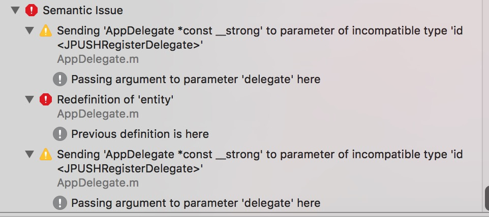
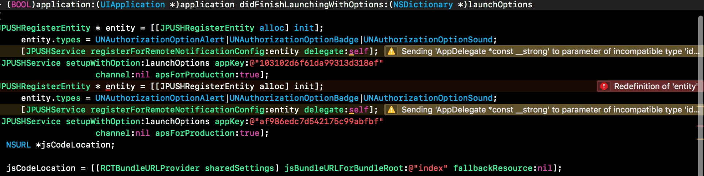

## 资料

[jpush-api-php-client](https://github.com/jpush/jpush-api-php-client/tree/master)
[jpush-react-native](https://github.com/jpush/jpush-react-native/)
[「使用心得」极光推送的设备唯一性标识 RegistrationID](https://community.jiguang.cn/t/registrationid/3810)

## 推送长度限制

>Android平台Notification+Message长度限制为4000字节； iOS Notification 中 “iOS”:{ } 及大括号内的总体长度不超过：2000个字节（包括自定义参数和符号），iOS 的 Message部分长度不超过 4000 字节； WinPhone平台Notification长度限制为1000字节

>PUSHRegisterEntity报错这个怎么破，npm装的插件，link过了，按照说明也引入进去了，真机调试编译失败

>感觉是跑RN 的时候,什么东西导出初始华了俩次
>删除另一个

