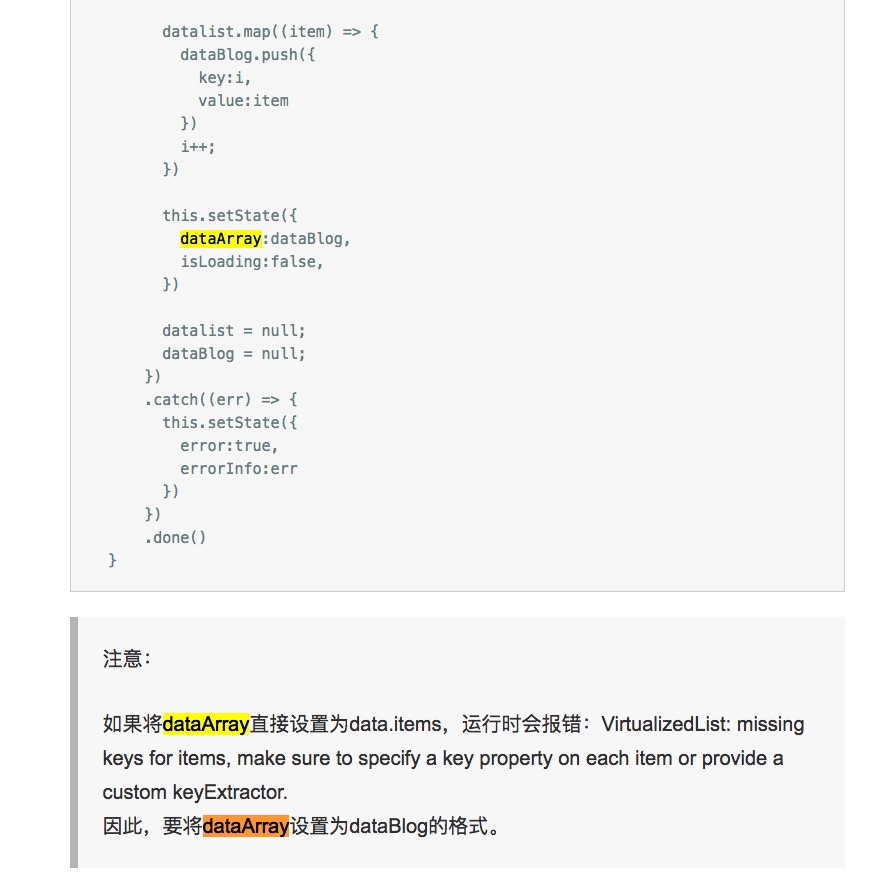

[贾鹏辉的技术博客](http://www.devio.org)
[React Native官网手册](http://facebook.github.io/react-native/docs/tutorial.html)
[Nuclide](https://nuclide.io/docs/quick-start/getting-started/)
[react-native-art-绘图入门](http://www.jianshu.com/p/8e6544ee647f)
[iOS9 & iOS10 HTTP 不能正常使用的解决办法](https://segmentfault.com/a/1190000002933776)
[Request手册](https://developer.mozilla.org/en-US/docs/Web/API/Request)
[React Navigation](https://reactnavigation.org/)
[React-Native中使用验证码倒计时的按钮](http://www.jianshu.com/p/51736baead49)
[react-native-art-绘图入门](http://www.jianshu.com/p/8e6544ee647f)
[React开发指南](https://www.jianshu.com/nb/6453420)
http://www.jianshu.com/p/ce71b4a8a246
http://blog.csdn.net/jiangbo_phd/article/details/53996112
http://blog.csdn.net/jiejiegua/article/details/54669309

**安装命令**

React Developer Tools

    npm install -g react-devtools
    react-devtools //启动
    
tips:

**console.log语句**

1. 在运行打好了离线包的应用时，控制台打印语句可能会极大地拖累JavaScript线程。注意有些第三方调试库也可能包含控制台打印语句，比如redux-logger，所以在发布应用前请务必仔细检查，确保全部移除。

    这里有个小技巧可以在发布时屏蔽掉所有的console.*调用。React Native中有一个全局变量__DEV__用于指示当前运行环境是否是开发环境。我们可以据此在正式环境中替换掉系统原先的console实现。

```
if (!__DEV__) {
  global.console = {
    info: () => {},
    log: () => {},
    warn: () => {},
    debug: () => {},
    error: () => {},
  };
}
```

#升级

>安装react-native-git-upgrade工具模块

    $ npm install -g react-native-git-upgrade

>运行更新命令


```
$ react-native-git-upgrade
# 这样会直接把react native升级到最新版本

# 或者是：

$ react-native-git-upgrade X.Y.Z
# 这样把react native升级到指定的X.Y.Z版本
```


yarn npm expo exp node
https://expo.io/tools

	defaults write com.apple.finder AppleShowAllFiles TRUE
	killall Finder


**问题待解决**

* 项目根目录
* IOS打包命令，缺少的文件夹
* 手机内网访问不了项目





##  Q&A

1. Overlay permissions needs to be granted in order for react native apps to run in dev mode

> 除了打开usb调试模式外，还有一项设置“usb调试应用”，于是我先运行我要调试的app，然后在“设置”-》“开发者模式”-》“usb调试应用”中，选择了自己要调试的此应用，然后再杀死此app应用进程，重新打开

> 于是我又接着找和“权限”有关的设置项，最终，在设置中，找到已安装的应用，选择进入到此应用，在此应用使用到的权限的地方，都将“询问”或“禁止”的选项全部打开，改成“允许”，这时再次打开app，终于正常了，和之前开发4.4.1手机调试模式无异

# Expo XDE

[Expo](https://expo.io/)

配置完毕之后在应用目录内使用 exp start 命令来启动 Expo 打包工具，然后选择使用 exp build:android 或者 exp build:ios 分别构建 Android 或者 iOS 独立应用。


