# 软件测试的综述

## 软件缺陷（software bug）

1. 软件未实现产品说明书要求的功能。
2. 软件出现了产品说明书指明不应该出现的错误。
3. 软件实现了产品说明书未提到的功能。
4. 软件未实现产品说明书虽未明确提及但应该实现的目标。
5. 软件难以理解、不宜使用、运行缓慢或者——从测试员的角度看——最终用户会认为不好。

**没有看见就不能说存在软件缺陷，尚未发现或微观察到的软件缺陷只能说是潜在缺陷**

## 为什么会出现软件缺陷

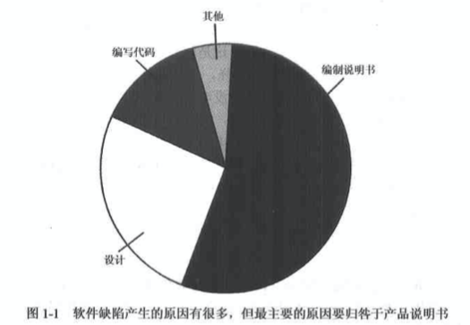
## 软件缺陷的修复费用

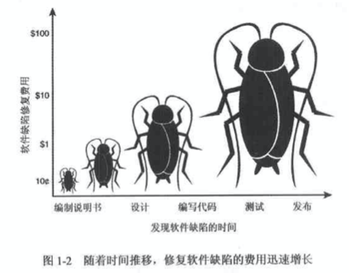

## 软件测试员究竟做些什么

**软件测试员的目标是尽早地找出、发现软件缺陷**

经常遇到有产品开发小组要测试员仅仅证明软件可以运行，而不是找出缺陷。

**注意：要记住，“修复”缺陷并非指一定要改正软件、可以是指在用户手册中增加一段注释或者为用户提供特殊的培训。这可能需要改变市场部门广告宣传的数据或者甚至推迟缺陷部分功能的发布。从本书中将了解到，软件测试人员虽然在追求完美，确保缺陷都被修复，单软件测试的实质则是另外一回事。千万不要在无法达到的完美上就纠缠和兜圈子。**

# 软件的开发过程

## 测试文档

- 测试计划（test plan）:描述用于验证软件是否符合产品说明书和客户需求的整体方案。包括质量目标、资源需求、进度表、任务分配、方法等。
- 测试用例（test cases）:猎取测试的项目，描述验证软件的详细步骤。
- 缺陷报告（bug reports）：描述执行测试用例找出的问题。可以记录在纸上，但通常记录在数据库中。
- 测试工具和自动测试（test tools and automation）：不管是购买的还是自己编写的工具，都必须有文档记录。
- 度量、统计和总结（merrics,statistics.summaries）：测试过程的汇总。采用图表、表格和报告等形式。

## 软件项目成员

- 项目经理、程序经理或者监制人员知识之中驱动整个项目。他们通常负责便携产品说明书、管理进度、进行重大决策。
-  体系架构师或者系统工程师是产品小组中的技术专家。他们一般经验丰富，可以胜任涉及整个系统的体系架构或软件。他们的工作与程序员关系紧密。
-  程序员、开发人员或者代码制作者设计、编写软件并修复软件中的缺陷。他们与项目经理和设计师密切合作制作软件，然后与项目经理和测试员密切合作修复缺陷。
-  测试员或质量保障（Quatlity Assurance,QA）员负责找出并报告软件产品的问题。他们与开发小组全部成员在开发过程中密切合作，进行测试并报告发现的问题。
-  技术作者、用户协助专员、用户培训专员、手册编写员或者文案专员编写软件产品附带的文件和联机文档。
-  配置管理员或构建元负责把程序员编写的代码及技术作者写的全部文档资料组合在一起，合称为一个软件包。

## 软件开发生命周期模式

### 大爆炸模式

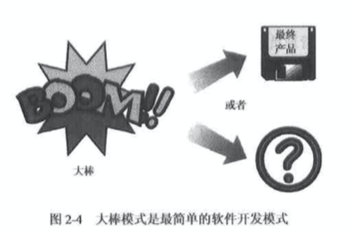

关于宇宙的形成有一种大爆炸说，软件开发大爆炸模式与宇宙的形成一样。一大堆东西（人力和资金）放在一起，巨大的能领释放——通常很也慢——产生了优秀的软件产品——或者一堆废品。

### 边写变改模式


采用这种方式的小组通常最初只有粗略的想法，借着进行一些简单的设计，然后开始漫长的来汇编写、测试和修改缺陷的过程。等到觉得足够了，就发布产品

### 瀑布模式

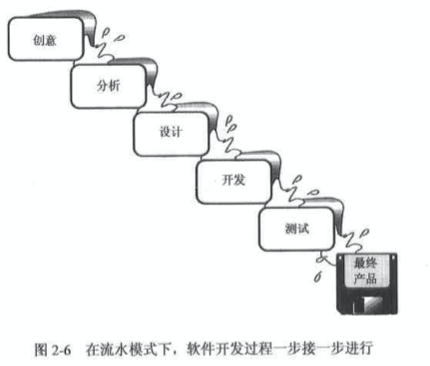

- 瀑布模式非常巧雕产品的定义。注意，开发或者代码编制阶段只是其中单独的一块。
- 瀑布模式各步骤是分立的、没有交叉。
- 瀑布模式无法回溯。一旦进入某一个步骤，就要完成该步骤的任务，然后才能向下继续——无法回溯。

### 螺旋模式

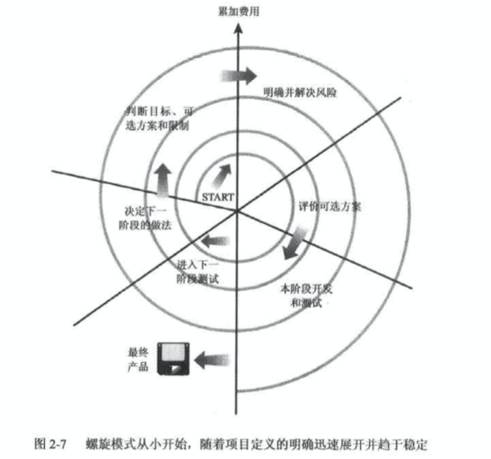

螺旋模式的总体思想是一开始不必详细定义所有细节。从小开始、定义重要功能。努力实现这些功能，接受客户反馈，然后进入下一阶段。重复上诉过程，直至的到最终产品。

螺旋模式每一次循环包括6个步骤：

1. 确定目标、可选方案和限制条件。
2. 明确并化解风险。
3. 评估可选方案
4. 当前阶段开发和测试。
5. 计划下一阶段。
6. 确定进入下一阶段的方法。

# 软件测试的实质

## 测试的原则

1. 完全测试程序是不可能的
    1. 输入量太大
    2. 输出结果太多
    3. 执行的路径太多
    4. 软件说明书是主观的。可以说从旁观者来看是缺陷。
2. 软件测试是有风险的行为
3. 测试无法显示潜伏的软件缺陷<br/>
    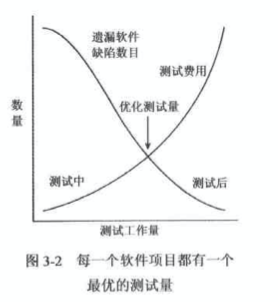
4. 找到的软件缺陷越多，就说明软件缺陷越多
   1. 程序员也有心情不好的时候
   2. 程序员往往犯同样的错误
   3. 某些软件缺陷实乃冰山一角。

## 并非所有的软件缺陷都要修复

- 没有足够的时间
- 不算真正的软件缺陷：很多情况下，理解错误、测试错误或者说明书变更会把可能的软件缺陷当做功能来对待。
- 修复风险太大：软件本身是脆弱的，修复一个软件缺陷可能导致其他软件缺陷出现。在紧迫的产品发布进度压力下，修改软件将冒很大的风险。不去理睬一指的软件缺陷，以免造成新的、未知的缺陷的做法也许是安全之道。
- 不值得修复：不常出现的软件缺陷和在不常用功能中出现的软件缺陷都是可以放过的。

# 测试基础

## 黑盒测试和白盒测试

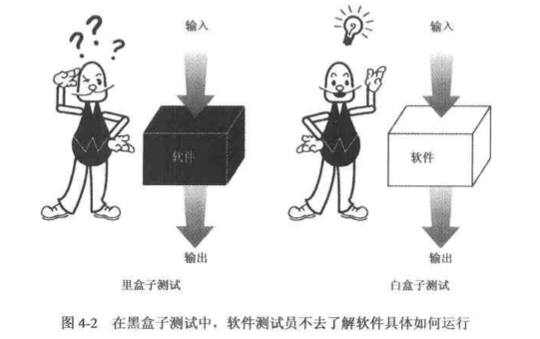

### 黑盒测试（black-box testing） 

有时又称为功能性测试（functional testing）或行为测试(begavioral testing)。软件测试员只需知道软件要做什么——而无法看到盒子里的软件如是何运行的。只要进行一些输入，就能得到某种结果。他不知道软件如何运行，为什么会这样，只知道程序做了什么。

### 白盒测试（white-box testing） 

在白盒测试（有时称为透明盒测试（clear-box testing））中，软件测试员可以访问程序员的代码，并通过检查代码的线索来协助测试——可以看到盒子里面。测试员跟进代码检查结果判断或多或少可能出错的数目，并根据此定制测试。

**进行白盒测试要冒一些风险。因为要以适应代码操作来定制测试，所以很容易形成偏见而无法进行客观测试。**

## 静态测试和动态测试

- 静态测试（static testing）:是指测试部运行的部分———只是检查和审核；
- 动态测试（dynamic testing）:是指通常意义上的测试——使用和运行软件

**静态测试和动态测试类比：检查二手汽车的过程，踢一下轮胎、看看车漆、打开引擎盖检查都属于静态测试技术。发动汽车、听听发动机声音、上路行驶都属于动态测试技术。**

### 静态黑盒测试，测试产品说明书

测试产品说明书属于静态黑测测试。产品说明书是书面文档，而不是可执行程序，因此是静态的。它是利用各种资源而获得的数据——诸如易用性研究、焦点人群、销售收入等建立的。不必了解怎样和为什么要获取这些信息，以及获取的具体途径，只需要他们最终构成产品说明书就可以了。软件测试员可以利用书面文档进行静态黑盒测试，认真查找其中的缺陷。

**技巧**：无论产品说明书的格式如何，都可以利用静态黑盒技术测试。产品说明书是书面文字文档或图形文档，或者两者兼而有之。通过询问软件设计者编制者甚至可以测试没有写出来的产品说明书。


### 动态黑盒测试：带上眼罩测试软件

不深入代码细节测试软件的防范成为**动态黑盒测试**。它是动态（dynamic）的,因为程序在运行——软件测试员像用户一样使用它；同事他是黑盒子（black-box）,因为测试时不知道程序如何工作——戴胜了眼罩。测试员输入数据、接受输出、检查结果。动态黑盒测试常被称为**行为测试**，因为测试的是软件在使用过程中的实际行为。

有效的动态测试需要关于软件行为的一些定义——也即需求文档或者产品说明书。不必了解软件“盒子”内发生的事情——而只需知道输入A输出B或者执行操作C得到结果D.好的产品说明书会提供这些细节信息。

#### 通过性测试和时效性测试

测试软件有两种基本方法：通过性测试（test-to-pass）和时效性测试（test-to-fail）。在进行通过性测试时，实际上是确认软件至少能做什么，而不会考验其能力。软件测试员并不需要想尽办法让软件崩溃，仅仅运用最简单、最直观的测试用例。

#### 等价类划分

选择测试用例是软件测试员最重要的任务。选择测试用例的方法是**等价类划分（equivalence partitioning）**,有时称为等价分类（equivalence calssing）。等价类划分是指分步骤地把海量（无限）的测试用例极简得很小，但过程同样有效。

等价类划分的目的是吧可能的测试用例集缩减到可控制且任然足以测试软件的小范围内。因为选择了不完全测试，就要毛一定的风险，所以选择分类时必须谨慎。

#### 数据测试

对软件最简单的人事就是将其分成两部分：数据（或其范围）和程序。

- 数据包括：键盘输入、鼠标单击、磁盘文件、打印输出等。
- 程序是指可执行的流程、转换、逻辑和运算。

使数据测试的技巧（如果称得上的话）是，跟进一些关键的原则进行等价类划分，以合理的减少测试用例，这些关键的原则是：边界条件、次边界条件、空值和无效数据。

#### 边界测试

编辑诶套件是指软件运行在计划操作界限的边界清开。类似以下数据类型：

```
数值    速度
字符    地点
位置    尺寸
数量
```

同事考虑这些类型的下述特征：

```bash
第一个/最后一个  最小值/最大值
开始/完成       超过/在内
空/满          最短/最早
最慢/最快       最早/最迟
最大/最小       最高/最低
相邻/最远
```

月结测试的做法通常是最简单低对最大值加1或者很小的数，以及对于最小值减1或者很小的数，例如：

- 第一个减1/最后一个加1
- 开始减1/完成加1
- 空了再减/满了再加
- 慢上加慢/快上加快
- 最大数加1/最小数减1
- 最小值减1/最大值加1
- 刚好超过/刚好在内
- 短了更短/长了再长
- 早了更早/晚了更晚
- 最高加1/最低减1

### 测试软件的逻辑流程

#### 建立状态转换图

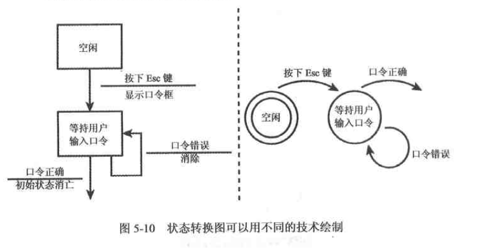

绘制状态转换图有集中技术，一个是使用方框和箭头。另一个使用圆圈（泡泡）和箭头。

**状态转换图应该表示出以下项目：**

1. 软件可能进入的每一种独立状态
2. 从一种状态转入另一种状态所需的输入和条件
3. 进入或者退出某种状态时的设置条件及输出结果。

#### 减少要测试的状态及转换的数量

正如对数据进行等价划分一样，需要将大量的可能性减少到可以操作的测试用例结合，有以下5中实现方法。

1. 每种状态至少访问呢一次：如何到达的没有关系，但是每一种状态都必须测试。
2. 测试看起来是最常见和最皮鞭的状态转换：尽管听起来很主观，但是其根据市进行产品说明书的静态黑盒分析时收集到的信息。某些用户的情况很可能比其他更常见。
3. 测试状态之间最不常用的分支：这些分支是最容易被产品设计者和程序员忽视的。软件测试员也许是第一个测试他们的人。
4. 测试所错误无状态及其返回值：出错条件通常难以建立，程序员尝尝编写代码处理某些错误，但不会测试自己的代码。错误没有得到正确处理，错误提示信息不正确、修复错误时未正确恢复到软件等情况时有发生。
5. 测试随机状态转换：可以借助自动化测试工具进行状态随机转换测试。

#### 竞争条件和时序错乱

竞争条件测试难以设计，最好是首先仔细查看状态转换图中的每一个状态，以找出那些外部影响会中断该状态。考虑要使用数据如果没有准备好，或者在用到时发生了变化，状态会怎样。数条弧线或者直线同事相连的情形如何？

以下是可能会面临竞争条件的例子情形：

- 两个不同的程序同事保存和打开同一个文档。
- 共享同一台打印机、通信端口或者其他微微设备。
- 当软件处于读取或者改变状态时按键或者单击鼠标。
- 同时关闭或者启动软件的多个实例。
- 同时使用不同的程序访问一个共同的数据库。

#### 重复、压迫和重负

- 重复测试（repetition testing）是不断执行同样的操作。进行这种反复测试的主要原因是检查是否存在内存泄漏（memory leaks）。
- 压迫测试（tress testing）是使软件再不够理想的条件下运行——内存小、磁盘空间少、CPU速度慢、调制解调器速率低等。压迫测试就是将植萃降到最低限度，目的在于尽可能低喜安智软件的必要条件。这有像边界条件测试。
- 重负测试（load testing）与压迫测试相反。压迫测试是尽量限制软件，而重负测试是尽量提供条件任其发挥。最大限度地发觉软件的能力，让它不堪重负。

### 其他黑盒测试技术

1. 像笨拙的用户那样做:为了礼貌一些，正确的说法也许应该是无经验的用户（inexperienced user）或新用户（new user）
2. 在已经找到软件缺陷的地方再找找
3. 像黑客一样思考问题
4. 凭借经验、直觉和预感

### 静态白盒测试：检查设计和代码

白盒（或者成为透明盒）测试是指访问代码、能够查看和审查。

静态白盒测试是指再不执行软件的条件下有条理地仔细审查软件设计、体系结构和代码、从而找出软件设计缺陷的过程，有时成为结构化分析。

#### 正式审查（formal review）

- 确定问题：审查的目的是找出软件的问题——不仅是出错的项目，还包括遗漏项目。全部的批评应该直指代码或这几，而不是其设计实现者。
- 遵守规则：审查要遵守一套固定的规则，规则可能设定要审查的代码量（通常有数百行），花费多少时间（数小时），哪些内容要做评价等。其重要性在于参与者了解自己的角色，目标是什么。这有助于使审查进展得更加顺利。
- 准备：每一个参与者都未审查做准备，并尽自己的力量。更加审查的类型，参与者可能扮演不同的角色。他们需要了解自己的责任和衣物，并积极参与审查。在审查过程中找出的问题大部分是在准备期间发现的，而不是实际审查期间。
- 编写报告：审查小组必须做出审查结果的书面总结报告，并使报告便于开发小组的成员使用。审查会议结果必须尽快告诉别人——诸如发现了多少问题，在哪里发现的等等。

#### 坚持正式审查间接效果

- 交流:正式报告的未包含的信息得以交流。例如，黑盒测试员可以洞察问题所在。缺少经验的程序员可以向有经验的程序员学习新技术。管理员对于项目如何跟上进度更加心中有数。
- 质量:程序员的代码经过逐个功能、逐行代码仔细复查，常常会使程序员变得更加仔细。这不是说他粗心大意——只是说如果他知道自己的工作要被他人仔细审查，就会多花一些心思保证正确性。
- 小组同志化:如果审查正确进行，就会建立软件测试员和程序员对双方技艺的相互尊重，并且更好地了解相互的工作及需求。
- 解决方案:晶是否讨论解决方案取决于审查的规则。但是解决方案应该用于处理严重的问题。在审查的范围之外讨论就决方案也许更有效。

#### 同事审查

##### 走查

走查(Walkthrough)是比同时审查更正规划的下一步。走查中编写代码的程序员想5人小组或者其他程序员和测试员组成的小组作出正式陈述。审查人员应该在审查之前街道软件拷贝，以边检查并编写备注和问题，在审查过程中提问。审查人员之中至少有一位资深程序员是很重要的。

陈述者逐行或者逐个功能地通读代码解释代码为什么且如何工作。审查人员聆听叙说，提出有疑议的问题。由于公开陈述的参与人数要多与同事审查，因此，委审查做好准备和遵守规则是非常重要的。同样重要的是审查之后，表述者边写报告说明发现了哪些问题，计划如何解决发现的软件缺陷。

##### 检验

检验(inspections)是最正式的审查类型，具有高度组织化，要求每一个参与者都接受训练。检验与同事审查和走查的不同之处在于表述代码的人——表述者（presenter）或者宣读者（reader）——不是原来的程序员。折旧迫使他学习和了解要表达的材料，从而有可能在检验会议上提出不同的看法和解释。

其余的参与者成为检验员（inspector）,其职责是从不同的角度，例如用户，测试员或者产品支持人员的角度审查代码。这有助于从不同视角来审查产品，通常可以指出不同的软件缺陷，检查员甚至要担负着倒过来审查代码的测人——也就是说，从尾至头——确保材料的彻底和完整。

有些检验员还同事呗委任为会议协调员（moderator）和会议记录员（recorder）,以保证检验或成遵守规则及审查有效进行。

### 动态白盒测试：戴上X光眼睛测试软件

动态白盒测试是指利用查看代码功能（做什么）和实现方式（怎么做）得到的信息来确定那些需要测试、那些不要测试、如何开展测试。动态白盒测试的另一个常用名称是结构化测试（structural testing）,因为软件测试员可以查看并使用代码的内部结构从而设计和执行测试。

#### 动态白盒测试和调试

### 静态白盒测试：检查设计和代码

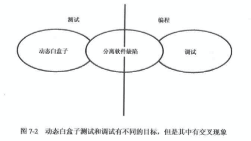

- 动态白盒测试的目标是寻找软件缺陷。
- 调试（debugging）的目标是修复缺陷。

### 单元测试和集成测试

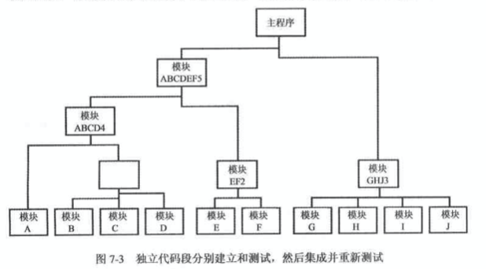

在底层进行的测试成为单元测试（unit testing）或者模块测试（module testing）单元经过测试，底层软件缺陷被找出并修复之后，就集成在一起，对模块的组合进行集成测试（integration testing）。这个不断增加的测试过程继续进行，加入越来越多的软件片段，直至整个产品——至少是产品的主要部分——在称为系统测试（system testing）的过程中一起测试。

### 自底向上和自顶向下

采用单元测试这种测试策略很容易隔离软件缺陷。在单元级发现问题时，问题肯定就在那个单元中。如果再多个单元及城市发现软件缺陷。那么它一定在模块之间的交互有关。当然也有例外，但是总的说来，测试和调试比一起测试所有内容要有效得多。

这种递增测试有两条途径：自底向上（bottom-top）和自顶向下（top-bottom）。

在自底向上测试中，要编写成为测试驱动的模块调用正在测试的模块。测试驱动模块以和将来真正模块同样的方式挂接，向处于测试的模块发送测试用例数据，接收返回结果，验证结果是否正确。采用这种方式，相处与测试的模块发送测试用例数据，接收返回结果，验证结果是否正确。采用这种方式，可以对整个软件进行非常全面的测试，为他提供全部类型和数量的数据，甚至高层难以发送的数据。

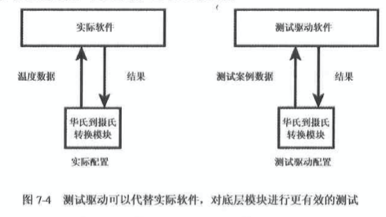

紫丁香写测试有点像小规模的大爆炸测试。毕竟，如果更高层软件已经完成，测试旗下层的模块就一定太晚了，对吗？其实并不完全正确。从下图的例子中，底层接口模块用于从电子温度及采集温度数据。显示模块正好在此接口模块上面，从该接口读取数据，向用户显示数据。为了测试高层闲事莫，就需要借助火把、水、冰和深度的冻结来改变传感器的温度，并将数据传递到导线上。

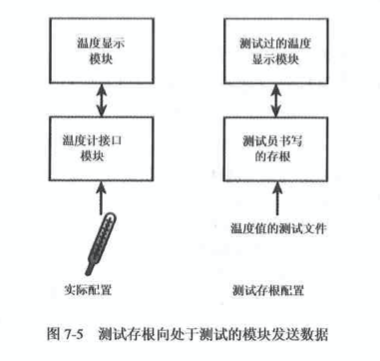

