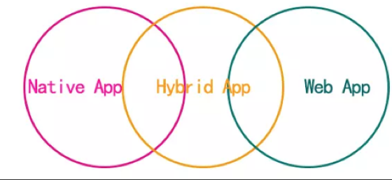
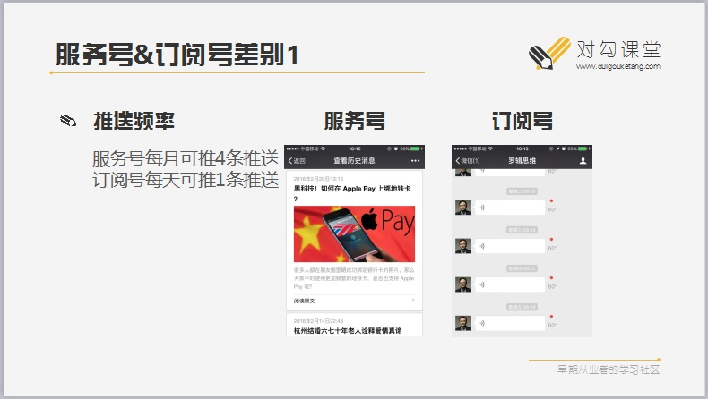
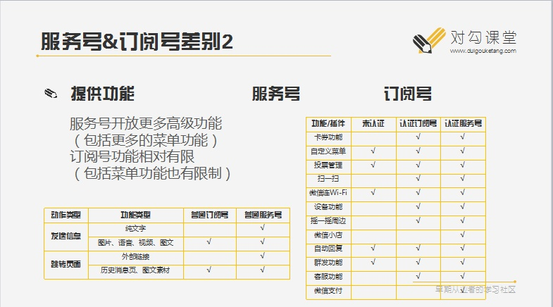
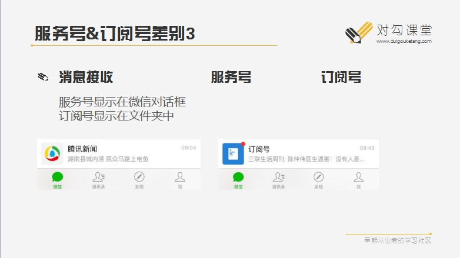
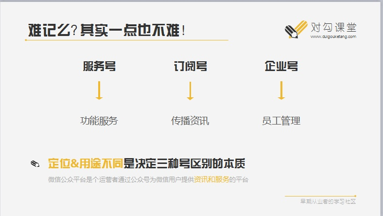

给朋友写的产品经理入门知识点，原来跟他说过，他也记录下来了，无奈着2傻子笔记忘记保存就重启电脑了，我就给他整理了一份。。。
<!-- more -->
## 公司架构

### 常见职位

CEO：首席执行官   一般是老大
COO：首席运营官 管运营的
CFO： 首席金融官，管理钱的
CTO：首席技术官，管理开发的
运营：负责软件的日常运行，售前售后服务
BD：业务人员，线上线下业务洽谈
HR：Human Resource （人力资源）
HRD：Human Resource Director （人力资源总监）
PM：Production Manager（生产经理）、Product Manager（产品经理）、Project Manager（项目经理)
UED：User Experience Design（用户体验设计师）一般公司没有，工资贼高

### 产品部

- 产品总监-把控产品方向，管理岗不干活
- 产品经理-小喽喽若干，干活的执行的
- 产品助理-实习生或者打杂

公司可能有产品部门，或只有一个产品经理或者归入到开发部门归开发老大管理、也有可能归运营管

### 技术部

- 测试-多数为黑盒测试
- 开发-程序猿、程序媛
- ui-美术设计
- 后端-API（Application Programming Interface，简称：API）接口开发
- 前端:H5手机站、页面视图开发
- 手机端（Android、IOS）：APP开发，Android安装包.apk，IOS为.ipa

## 基础知识

> 能接触到的多数测试为黑盒测试，一测页面，图片舒不舒服，有没有错别字等等，二测试功能流程对不对

### 测试生命周期

开发自测->内测->预发布->公测（回归测试）
开发自测：开发团队内部测试
内测：开发+测试+需求方内部测试，和线上数据不同
预发布：使用线上数据和环境测试
公测（回归测试）：
    上线后测试和需求方进行最后一次测试叫做回归测试，用户使用相当于公测
    
### 测试分类

- 黑盒测试-和用户一样不能看到代码和数据库，软件对测试就像一个黑盒子；
- 灰盒测试-能看到少量代码和修改数据，像一个不太黑的灰色盒子；
- 白盒测试-代码数据库完全开放

>以下为开发自测，不是测试需要做的

- 压力测试-代码多少人同时访问会崩溃
- 单元测试-写代码测试代码

### APP分类

- native app：原生语言开发的APP
- web app：使用web技术开发的APP，速度不如原生，组件可能不足
- hybird APP:原生web混编

### 常见软件

- PC-电脑网站，百度淘宝
- H5-手机网站
- APP（IOS、Android）
- TV：电视应用
- watch APP ：苹果婊应用
- ipad：pad应用
- mac：mac软件
- PC软件：win软件，360、QQ等

### 产品周期

需求采集->需求评审->PRD原型输出->需求评审*2->UI出图->开发->测试->上线运营

- 需求采集：老板、运营、客服、客户提的需求汇总
- 需求评审：和大家一起进行需求评选，删减或增加细节，确定最终需求、优先级，和版本迭代
- PRD原型输出：原型图文档编写绘制
- 需求评审*2：给大家你看一下有啥问题没有，估时间
- UI出图：设计给图，可能还要UI评审开会
- 最后：开发、测试、上线运营

### 软件架构

C/S:（Client/Server）结构，即客户端和服务器结构,例如：QQ，迅雷
    优点：运行速度块，资源大也比较流程（游戏）
    缺点：需要安装，更新也需要安装
B/S:Browser/Server，浏览器/服务器模式，百度淘宝等网站
    优点：刷新即是最新版
    缺点：速度受服务器和用户网络影响

## 术语-装B用

### 产品必备
- BRD：Business Requirements Document （商业需求文档）
- MRD：Market Requirements Document （市场需求文档）
- PRD：Product Requirements Document （产品需求文档）

> PRD常用要写，其他两个不常用

### 知识扩充

去中心化：数据放到每个人电脑里，不让你瞎JB改数据骗我
区块链：比特币底层技术
供应链：卖菜的自己建中央厨房，卖手机的自己生产手机+自己做物流，就是想全包
 IP：“Intellectual Property”的缩写，即知识产权，就是版权啦
生态：多搞几个东西多捞钱，小米生态
UI：User Interface（用户界面）
UGC：User Generated Content（用户生产内容），论坛、哔哩哔哩、快手，你看你也传
SKU：Stock Keeping Unit（库存量单位），指电商库存，这衣服各种颜色和尺码分别库存多少

### 商业模式

C2C：Consumer to Consumer（顾客对顾客）例：咸鱼互相买东西
B2B：Business to Business（商家对商家）例：阿里巴巴批发
O2O：Online to Offline（线上线下电子商务），干掉中介
P2P：person to person，例：拍拍贷金融
B2C：Business to Consumer（商家对个人），例：天猫
UCD：User Centered Design（以用户为中心的设计），例：噱头而已
SNS：Social Networking
Services（社会性网络服务），例：交友APP卖东西
KPI：Key Performance
Indicator（关键绩效指标），扣BD工资的好东西
IM：Instant Messaging（即时通信），例：QQ、钉钉
LBS：Location Based Service（基于位置的服务），要定位的APP，例：饿了么，滴滴，OFO

### 常见系统

 ERP：（Enterprise Resource Planning），企业资源计划，管理公司各种订单工单啥的：
 CMS：Content Management System（内容管理系统）；发文章，视频，图片的网站
 CRM：（Customer Relationship Management），客户关系管理；
 SAAS（Software-as-a-Service），软件即服务。例如邮件发送平台，做软件让你用
 OA：办公自动化（Office Automation，简称OA），钉钉，网上请假，打卡；

### 偏向技术

SDK：Software Development Kit（软件开发工具包），厂家写好的DEMO让你抄
URL：Uniform Resoure Locator（统一资源定位器），就是网址的意思

### 运营与推广

IP： IP地址-去重
PV：page view（页面浏览量），就是总次数
UV：unique visitor-独立设备

>题目：我和小也用自己的手机在一个网络下浏览了百度总记10次，则IP为1，PV为10，UV为2：

RSS：Really Simple，订阅网站，要灭亡
SEO：Search Engine Optimization（搜索引擎优化），穷逼站长首选，自己改代码让搜索引擎多抓点页面
SEM:Search Engine Marketing(搜索引擎营销),百度360开账号氪金，你就是大爷

> APP相关

DAU：Daily Active User（日活跃用户量）
OTA：Online Travel Agent（在线旅行社）
UX：User Experience Design（用户体验）
 
### 推广类

 CPA（Cost Per Action），每次行动的费用。根据每个访问者对网络广告所采取的行动收费的定价模式。对于用户行动有特别的定义，包括形成一次交易、获得一个注册用户、或者对网络广告的一次点击等。

CPC（Cost Per Click），以每点击一次计费。

CPS（Cost Per Sale），每购买成本，以实际销售产品数量来换算广告投放金额。

CPM（Cost Per Mille），千人成本指由某一媒介或媒介广告排期表所送达1000人所需的成本。

CPR（Cost Per Response），每回应成本，以浏览者的每一个回应计费。

CPP（Cost Per Purchase），每购买成本，广告主为规避广告费用风险，只有在网络用户点击旗帜广告并进行在线交易后，才按销售笔数付给广告站点费用。

## 微信相关

微信登陆拿不到用户微信号或手机号！！！

### 基础知识

appid:每个公众号都有一个唯一的APPid,例如：wx3344a7cdb488936a
opendi:用户微信号+访问的公众号的appid算出来的openid，腾讯就是不给你真实的，给你算
unionid:因为一个公司有多个公众号，用户访问不同的会算出不同的值（openid），要确定多个公众号唯一用户,需要怕判断unionid,把多个公众号、网站、APP的微信登陆绑定到一个公司下（300块开通开放平台）

### 微信公众号类型对比

小程序：用腾讯语言写的应用程序，相当于微信插件
企业号：OA系统

### 微信认证

个人不能认证,公司认证300，开通支付300，如果转移账号300

### 微信登陆

公众号：
    静默授权：无感登陆，只有openid
    授权登陆：弹出确认页面，返回openid,昵称、头像、性别、地区等信息
小程序：授权登陆
PC网站：扫码登陆
APP：跳转微信点击确定返回商家APP

